
### 1 [主存储器概述](#1)
#### 1.1 [定义与作用](#1)
#### 1.2 [在计算机系统中的地位](#1)
#### 1.3 [主要性能指标](#1)
### 2 [主存储器的分类](#2)
#### 2.1 [按存储介质分类](#2)
#### 2.2 [按存取方式分类](#2)
### 3 [半导体存储器的基本结构](#3)
#### 3.1 [存储单元](#3)
#### 3.2 [存储矩阵](#3)
#### 3.3 [地址译码器](#3)
#### 3.4 [读写控制电路](#3)
#### 3.5 [数据缓冲器](#3)
### 4 [随机存取存储器 RAM](#4)
#### 4.1 [静态RAM SRAM](#4)
#### 4.2 [动态RAM DRAM](#4)
#### 4.3 [RAM的技术发展](#4)
### 5 [只读存储器 ROM](#5)
#### 5.1 [掩模ROM](#5)
#### 5.2 [可编程ROM PROM](#5)
#### 5.3 [可擦除可编程ROM EPROM](#5)
#### 5.4 [电可擦除可编程ROM EEPROM](#5)
#### 5.5 [闪存 Flash Memory](#5)
### 6 [主存储器与CPU的接口](#6)
#### 6.1 [地址总线](#6)
#### 6.2 [数据总线](#6)
#### 6.3 [控制总线](#6)
#### 6.4 [时序关系](#6)
#### 6.5 [存储器映射](#6)
### 7 [存储器扩展技术](#7)
#### 7.1 [位扩展](#7)
#### 7.2 [字扩展](#7)
#### 7.3 [字位同时扩展](#7)
#### 7.4 [多体交叉存储器](#7)
#### 7.5 [存储器的层次结构](#7)
### 8 [主存储器的性能优化](#8)
#### 8.1 [高速缓存技术](#8)
#### 8.2 [虚拟存储器](#8)
#### 8.3 [存储器访问局部性原理](#8)
#### 8.4 [预取技术](#8)
### 9 [主存储器的可靠性](#9)
#### 9.1 [奇偶校验](#9)
#### 9.2 [海明码](#9)
#### 9.3 [循环冗余校验 CRC](#9)
#### 9.4 [错误纠正码 ECC](#9)
### 10 [新型存储器技术](#10)
#### 10.1 [相变存储器 PCM](#10)
#### 10.2 [磁阻存储器 MRAM](#10)
#### 10.3 [铁电存储器 FRAM](#10)
#### 10.4 [电阻式存储器 ReRAM](#10)
#### 10.5 [D XPoint技术](#10)
### 11 [主存储器的测试与维护](#11)
#### 11.1 [存储器测试方法](#11)
#### 11.2 [故障诊断技术](#11)
#### 11.3 [维护策略](#11)
#### 11.4 [数据备份与恢复](#11)
### 12 [主存储器的发展趋势](#12)
#### 12.1 [容量增长趋势](#12)
#### 12.2 [速度提升技术](#12)
#### 12.3 [功耗优化](#12)
#### 12.4 [新型存储材料的研发](#12)
#### 12.5 [量子存储技术展望](#12)




### 1 主存储器概述

---
### 1 主存储器概述
___
#### 1.1 定义与作用
___
#### 1.2 在计算机系统中的地位
___
#### 1.3 主要性能指标
### 2 主存储器的分类
  - 半导体存储器
  - 磁存储器
  - 光存储器
  - 随机存取存储器（RAM）
  - 只读存储器（ROM）
  - 顺序存取存储器
  - 直接存取存储器

---
### 2 主存储器的分类
___
#### 2.1 按存储介质分类
___
#### 2.2 按存取方式分类
### 3 半导体存储器的基本结构
  - 静态RAM存储单元
  - 动态RAM存储单元
  - ROM存储单元

---
### 3 半导体存储器的基本结构
___
#### 3.1 存储单元
___
#### 3.2 存储矩阵
___
#### 3.3 地址译码器
___
#### 3.4 读写控制电路
___
#### 3.5 数据缓冲器
### 4 随机存取存储器 RAM
  - 工作原理
  - 电路结构
  - 特点与应用
  - 工作原理
  - 刷新机制
  - 特点与应用
  - 同步DRAM（SDRAM）
  - 双倍数据速率SDRAM（DDR SDRAM）
  - 图形DDR（GDDR）
  - 低功耗DDR（LPDDR）

---
### 4 随机存取存储器 RAM
___
#### 4.1 静态RAM SRAM
___
#### 4.2 动态RAM DRAM
___
#### 4.3 RAM的技术发展
### 5 只读存储器 ROM
  - NOR Flash
  - NAND Flash

---
### 5 只读存储器 ROM
___
#### 5.1 掩模ROM
___
#### 5.2 可编程ROM PROM
___
#### 5.3 可擦除可编程ROM EPROM
___
#### 5.4 电可擦除可编程ROM EEPROM
___
#### 5.5 闪存 Flash Memory
### 6 主存储器与CPU的接口

---
### 6 主存储器与CPU的接口
___
#### 6.1 地址总线
___
#### 6.2 数据总线
___
#### 6.3 控制总线
___
#### 6.4 时序关系
___
#### 6.5 存储器映射
### 7 存储器扩展技术

---
### 7 存储器扩展技术
___
#### 7.1 位扩展
___
#### 7.2 字扩展
___
#### 7.3 字位同时扩展
___
#### 7.4 多体交叉存储器
___
#### 7.5 存储器的层次结构
### 8 主存储器的性能优化
  - 时间局部性
  - 空间局部性

---
### 8 主存储器的性能优化
___
#### 8.1 高速缓存技术
___
#### 8.2 虚拟存储器
___
#### 8.3 存储器访问局部性原理
___
#### 8.4 预取技术
### 9 主存储器的可靠性

---
### 9 主存储器的可靠性
___
#### 9.1 奇偶校验
___
#### 9.2 海明码
___
#### 9.3 循环冗余校验 CRC
___
#### 9.4 错误纠正码 ECC
### 10 新型存储器技术

---
### 10 新型存储器技术
___
#### 10.1 相变存储器 PCM
___
#### 10.2 磁阻存储器 MRAM
___
#### 10.3 铁电存储器 FRAM
___
#### 10.4 电阻式存储器 ReRAM
___
#### 10.5 D XPoint技术
### 11 主存储器的测试与维护

---
### 11 主存储器的测试与维护
___
#### 11.1 存储器测试方法
___
#### 11.2 故障诊断技术
___
#### 11.3 维护策略
___
#### 11.4 数据备份与恢复
### 12 主存储器的发展趋势

---
### 12 主存储器的发展趋势
___
#### 12.1 容量增长趋势
___
#### 12.2 速度提升技术
___
#### 12.3 功耗优化
___
#### 12.4 新型存储材料的研发
___
#### 12.5 量子存储技术展望


### 1 主存储器概述{#1}

{}
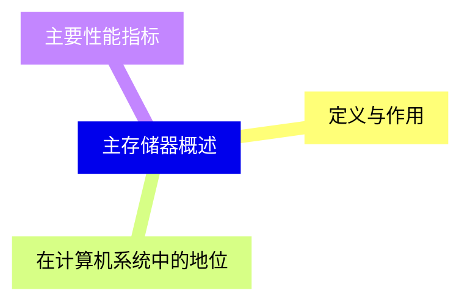

<--->
{}
{}
{}
{}
{}
{}
{}

### 2 主存储器的分类{#2}
  - 半导体存储器
  - 磁存储器
  - 光存储器
  - 随机存取存储器（RAM）
  - 只读存储器（ROM）
  - 顺序存取存储器
  - 直接存取存储器

{}
{}
{}
{}
{}
<--->
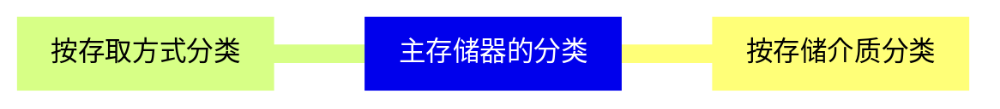

{}

### 3 半导体存储器的基本结构{#3}
  - 静态RAM存储单元
  - 动态RAM存储单元
  - ROM存储单元

{}
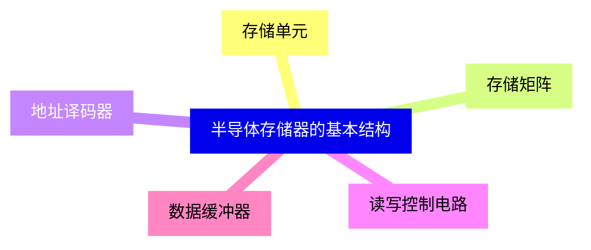

<--->
{}
{}
{}
{}
{}
{}
{}
{}
{}
{}
{}

### 4 随机存取存储器 RAM{#4}
  - 工作原理
  - 电路结构
  - 特点与应用
  - 工作原理
  - 刷新机制
  - 特点与应用
  - 同步DRAM（SDRAM）
  - 双倍数据速率SDRAM（DDR SDRAM）
  - 图形DDR（GDDR）
  - 低功耗DDR（LPDDR）

{}
{}
{}
{}
{}
{}
{}
<--->
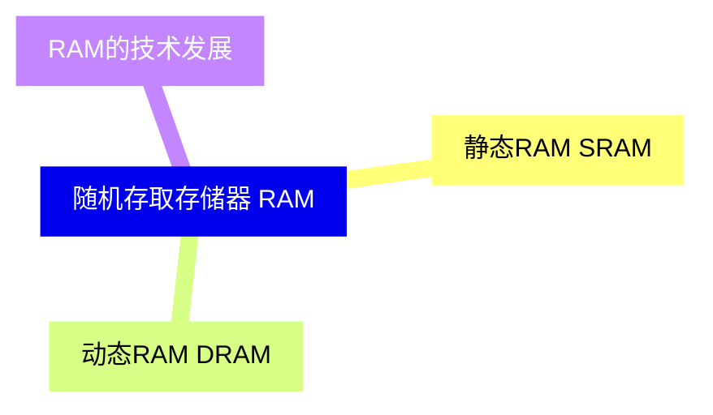

{}

### 5 只读存储器 ROM{#5}
  - NOR Flash
  - NAND Flash

{}
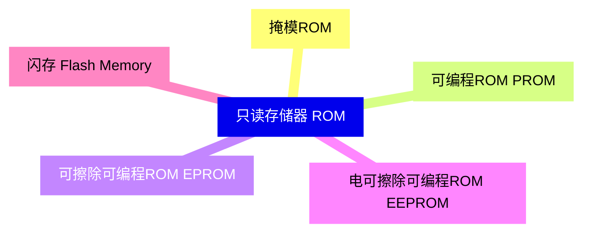

<--->
{}
{}
{}
{}
{}
{}
{}
{}
{}
{}
{}

### 6 主存储器与CPU的接口{#6}

{}
{}
{}
{}
{}
{}
{}
{}
{}
{}
{}
<--->
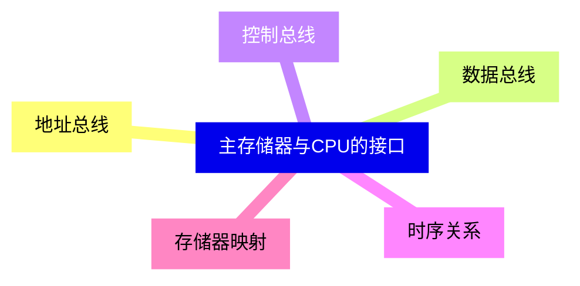

{}

### 7 存储器扩展技术{#7}

{}
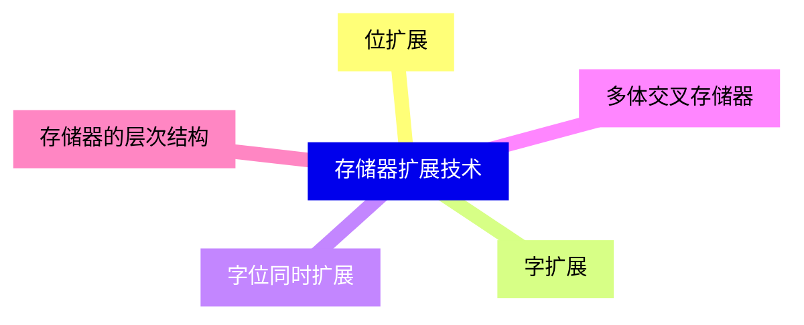

<--->
{}
{}
{}
{}
{}
{}
{}
{}
{}
{}
{}

### 8 主存储器的性能优化{#8}
  - 时间局部性
  - 空间局部性

{}
{}
{}
{}
{}
{}
{}
{}
{}
<--->
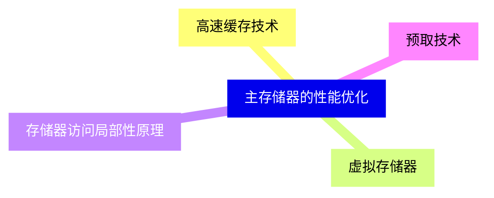

{}

### 9 主存储器的可靠性{#9}

{}
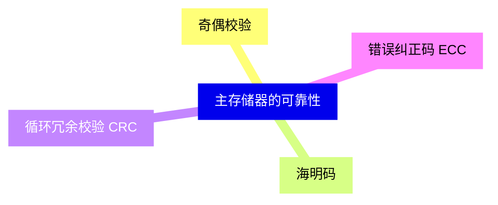

<--->
{}
{}
{}
{}
{}
{}
{}
{}
{}

### 10 新型存储器技术{#10}

{}
{}
{}
{}
{}
{}
{}
{}
{}
{}
{}
<--->
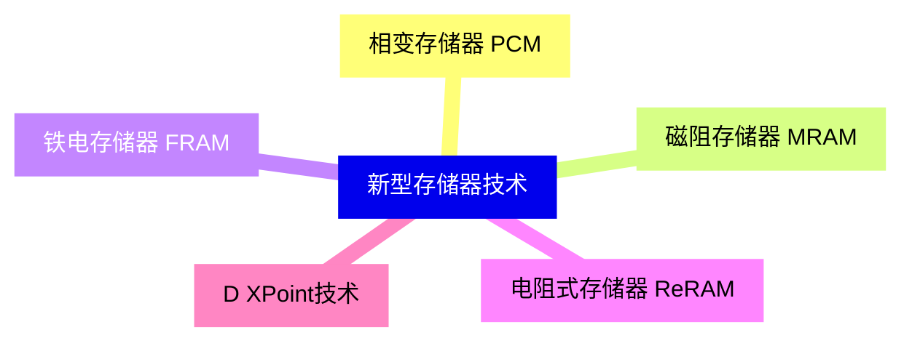

{}

### 11 主存储器的测试与维护{#11}

{}
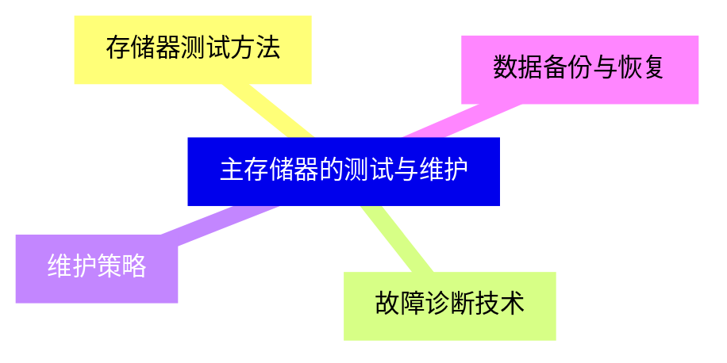

<--->
{}
{}
{}
{}
{}
{}
{}
{}
{}

### 12 主存储器的发展趋势{#12}

{}
{}
{}
{}
{}
{}
{}
{}
{}
{}
{}
<--->
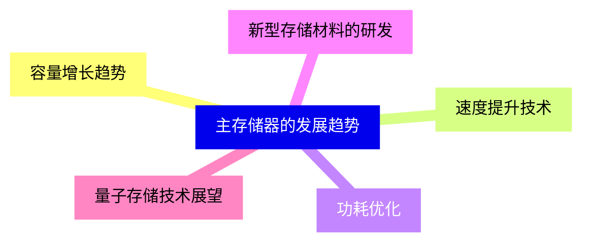

{}
