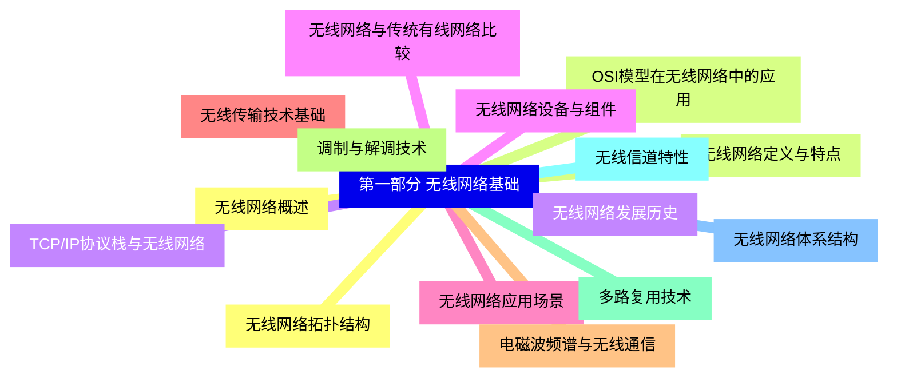
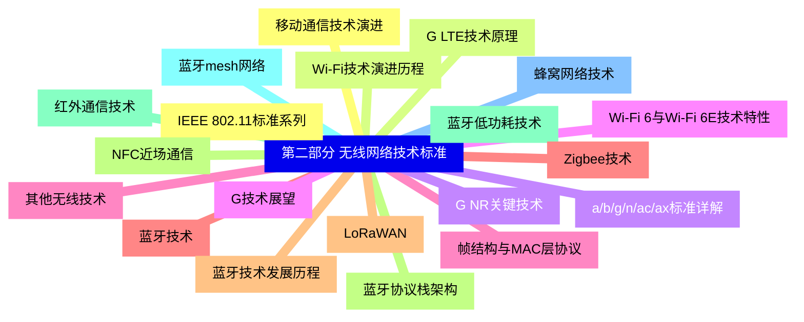
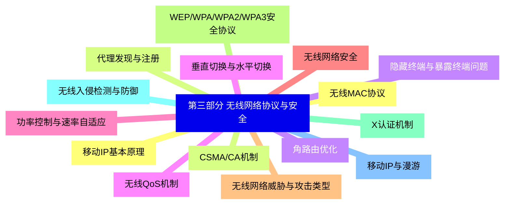
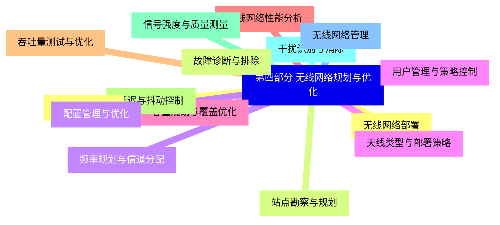
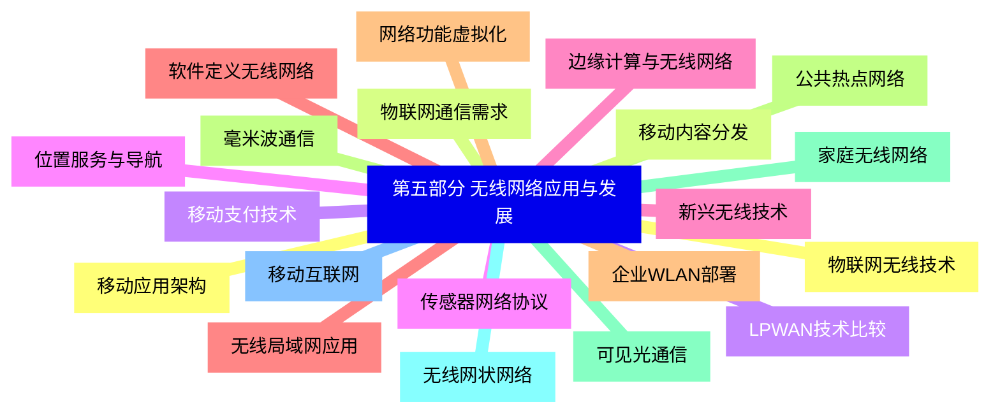
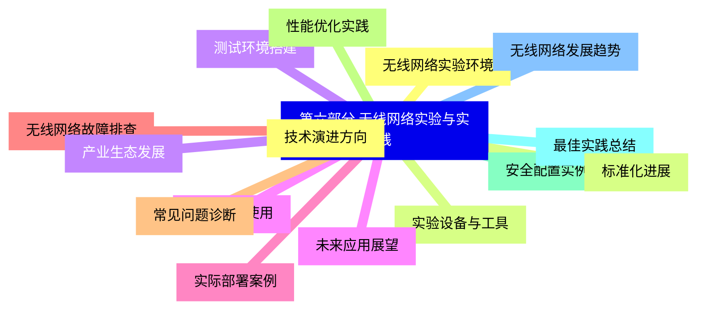


### 1 [第一部分 无线网络基础](#1)
#### 1.1 [无线网络概述](#1)
#### 1.2 [无线网络定义与特点](#1)
#### 1.3 [无线网络发展历史](#1)
#### 1.4 [无线网络与传统有线网络比较](#1)
#### 1.5 [无线网络应用场景](#1)
#### 1.6 [无线传输技术基础](#1)
#### 1.7 [电磁波频谱与无线通信](#1)
#### 1.8 [调制与解调技术](#1)
#### 1.9 [多路复用技术](#1)
#### 1.10 [无线信道特性](#1)
#### 1.11 [无线网络体系结构](#1)
#### 1.12 [无线网络拓扑结构](#1)
#### 1.13 [OSI模型在无线网络中的应用](#1)
#### 1.14 [TCP/IP协议栈与无线网络](#1)
#### 1.15 [无线网络设备与组件](#1)
### 2 [第二部分 无线网络技术标准](#2)
#### 2.1 [IEEE 802.11标准系列](#2)
#### 2.2 [Wi-Fi技术演进历程](#2)
#### 2.3 [a/b/g/n/ac/ax标准详解](#2)
#### 2.4 [Wi-Fi 6与Wi-Fi 6E技术特性](#2)
#### 2.5 [帧结构与MAC层协议](#2)
#### 2.6 [蓝牙技术](#2)
#### 2.7 [蓝牙技术发展历程](#2)
#### 2.8 [蓝牙协议栈架构](#2)
#### 2.9 [蓝牙低功耗技术](#2)
#### 2.10 [蓝牙mesh网络](#2)
#### 2.11 [蜂窝网络技术](#2)
#### 2.12 [移动通信技术演进](#2)
#### 2.13 [G LTE技术原理](#2)
#### 2.14 [G NR关键技术](#2)
#### 2.15 [G技术展望](#2)
#### 2.16 [其他无线技术](#2)
#### 2.17 [Zigbee技术](#2)
#### 2.18 [LoRaWAN](#2)
#### 2.19 [NFC近场通信](#2)
#### 2.20 [红外通信技术](#2)
### 3 [第三部分 无线网络协议与安全](#3)
#### 3.1 [无线MAC协议](#3)
#### 3.2 [CSMA/CA机制](#3)
#### 3.3 [隐藏终端与暴露终端问题](#3)
#### 3.4 [无线QoS机制](#3)
#### 3.5 [功率控制与速率自适应](#3)
#### 3.6 [无线网络安全](#3)
#### 3.7 [无线网络威胁与攻击类型](#3)
#### 3.8 [WEP/WPA/WPA2/WPA3安全协议](#3)
#### 3.9 [X认证机制](#3)
#### 3.10 [无线入侵检测与防御](#3)
#### 3.11 [移动IP与漫游](#3)
#### 3.12 [移动IP基本原理](#3)
#### 3.13 [代理发现与注册](#3)
#### 3.14 [角路由优化](#3)
#### 3.15 [垂直切换与水平切换](#3)
### 4 [第四部分 无线网络规划与优化](#4)
#### 4.1 [无线网络部署](#4)
#### 4.2 [站点勘察与规划](#4)
#### 4.3 [频率规划与信道分配](#4)
#### 4.4 [天线类型与部署策略](#4)
#### 4.5 [容量规划与覆盖优化](#4)
#### 4.6 [无线网络性能分析](#4)
#### 4.7 [吞吐量测试与优化](#4)
#### 4.8 [延迟与抖动控制](#4)
#### 4.9 [信号强度与质量测量](#4)
#### 4.10 [干扰识别与消除](#4)
#### 4.11 [无线网络管理](#4)
#### 4.12 [网络监控工具](#4)
#### 4.13 [故障诊断与排除](#4)
#### 4.14 [配置管理与优化](#4)
#### 4.15 [用户管理与策略控制](#4)
### 5 [第五部分 无线网络应用与发展](#5)
#### 5.1 [物联网无线技术](#5)
#### 5.2 [物联网通信需求](#5)
#### 5.3 [LPWAN技术比较](#5)
#### 5.4 [传感器网络协议](#5)
#### 5.5 [边缘计算与无线网络](#5)
#### 5.6 [无线局域网应用](#5)
#### 5.7 [企业WLAN部署](#5)
#### 5.8 [公共热点网络](#5)
#### 5.9 [家庭无线网络](#5)
#### 5.10 [无线网状网络](#5)
#### 5.11 [移动互联网](#5)
#### 5.12 [移动应用架构](#5)
#### 5.13 [移动内容分发](#5)
#### 5.14 [移动支付技术](#5)
#### 5.15 [位置服务与导航](#5)
#### 5.16 [新兴无线技术](#5)
#### 5.17 [软件定义无线网络](#5)
#### 5.18 [网络功能虚拟化](#5)
#### 5.19 [毫米波通信](#5)
#### 5.20 [可见光通信](#5)
### 6 [第六部分 无线网络实验与实践](#6)
#### 6.1 [无线网络实验环境](#6)
#### 6.2 [实验设备与工具](#6)
#### 6.3 [测试环境搭建](#6)
#### 6.4 [仿真软件使用](#6)
#### 6.5 [实际部署案例](#6)
#### 6.6 [无线网络故障排查](#6)
#### 6.7 [常见问题诊断](#6)
#### 6.8 [性能优化实践](#6)
#### 6.9 [安全配置实例](#6)
#### 6.10 [最佳实践总结](#6)
#### 6.11 [无线网络发展趋势](#6)
#### 6.12 [技术演进方向](#6)
#### 6.13 [标准化进展](#6)
#### 6.14 [产业生态发展](#6)
#### 6.15 [未来应用展望](#6)




### 1 第一部分 无线网络基础

---
### 1 第一部分 无线网络基础
___
#### 1.1 无线网络概述
___
#### 1.2 无线网络定义与特点
___
#### 1.3 无线网络发展历史
___
#### 1.4 无线网络与传统有线网络比较
___
#### 1.5 无线网络应用场景
___
#### 1.6 无线传输技术基础
___
#### 1.7 电磁波频谱与无线通信
___
#### 1.8 调制与解调技术
___
#### 1.9 多路复用技术
___
#### 1.10 无线信道特性
___
#### 1.11 无线网络体系结构
___
#### 1.12 无线网络拓扑结构
___
#### 1.13 OSI模型在无线网络中的应用
___
#### 1.14 TCP/IP协议栈与无线网络
___
#### 1.15 无线网络设备与组件
### 2 第二部分 无线网络技术标准

---
### 2 第二部分 无线网络技术标准
___
#### 2.1 IEEE 802.11标准系列
___
#### 2.2 Wi-Fi技术演进历程
___
#### 2.3 a/b/g/n/ac/ax标准详解
___
#### 2.4 Wi-Fi 6与Wi-Fi 6E技术特性
___
#### 2.5 帧结构与MAC层协议
___
#### 2.6 蓝牙技术
___
#### 2.7 蓝牙技术发展历程
___
#### 2.8 蓝牙协议栈架构
___
#### 2.9 蓝牙低功耗技术
___
#### 2.10 蓝牙mesh网络
___
#### 2.11 蜂窝网络技术
___
#### 2.12 移动通信技术演进
___
#### 2.13 G LTE技术原理
___
#### 2.14 G NR关键技术
___
#### 2.15 G技术展望
___
#### 2.16 其他无线技术
___
#### 2.17 Zigbee技术
___
#### 2.18 LoRaWAN
___
#### 2.19 NFC近场通信
___
#### 2.20 红外通信技术
### 3 第三部分 无线网络协议与安全

---
### 3 第三部分 无线网络协议与安全
___
#### 3.1 无线MAC协议
___
#### 3.2 CSMA/CA机制
___
#### 3.3 隐藏终端与暴露终端问题
___
#### 3.4 无线QoS机制
___
#### 3.5 功率控制与速率自适应
___
#### 3.6 无线网络安全
___
#### 3.7 无线网络威胁与攻击类型
___
#### 3.8 WEP/WPA/WPA2/WPA3安全协议
___
#### 3.9 X认证机制
___
#### 3.10 无线入侵检测与防御
___
#### 3.11 移动IP与漫游
___
#### 3.12 移动IP基本原理
___
#### 3.13 代理发现与注册
___
#### 3.14 角路由优化
___
#### 3.15 垂直切换与水平切换
### 4 第四部分 无线网络规划与优化

---
### 4 第四部分 无线网络规划与优化
___
#### 4.1 无线网络部署
___
#### 4.2 站点勘察与规划
___
#### 4.3 频率规划与信道分配
___
#### 4.4 天线类型与部署策略
___
#### 4.5 容量规划与覆盖优化
___
#### 4.6 无线网络性能分析
___
#### 4.7 吞吐量测试与优化
___
#### 4.8 延迟与抖动控制
___
#### 4.9 信号强度与质量测量
___
#### 4.10 干扰识别与消除
___
#### 4.11 无线网络管理
___
#### 4.12 网络监控工具
___
#### 4.13 故障诊断与排除
___
#### 4.14 配置管理与优化
___
#### 4.15 用户管理与策略控制
### 5 第五部分 无线网络应用与发展

---
### 5 第五部分 无线网络应用与发展
___
#### 5.1 物联网无线技术
___
#### 5.2 物联网通信需求
___
#### 5.3 LPWAN技术比较
___
#### 5.4 传感器网络协议
___
#### 5.5 边缘计算与无线网络
___
#### 5.6 无线局域网应用
___
#### 5.7 企业WLAN部署
___
#### 5.8 公共热点网络
___
#### 5.9 家庭无线网络
___
#### 5.10 无线网状网络
___
#### 5.11 移动互联网
___
#### 5.12 移动应用架构
___
#### 5.13 移动内容分发
___
#### 5.14 移动支付技术
___
#### 5.15 位置服务与导航
___
#### 5.16 新兴无线技术
___
#### 5.17 软件定义无线网络
___
#### 5.18 网络功能虚拟化
___
#### 5.19 毫米波通信
___
#### 5.20 可见光通信
### 6 第六部分 无线网络实验与实践

---
### 6 第六部分 无线网络实验与实践
___
#### 6.1 无线网络实验环境
___
#### 6.2 实验设备与工具
___
#### 6.3 测试环境搭建
___
#### 6.4 仿真软件使用
___
#### 6.5 实际部署案例
___
#### 6.6 无线网络故障排查
___
#### 6.7 常见问题诊断
___
#### 6.8 性能优化实践
___
#### 6.9 安全配置实例
___
#### 6.10 最佳实践总结
___
#### 6.11 无线网络发展趋势
___
#### 6.12 技术演进方向
___
#### 6.13 标准化进展
___
#### 6.14 产业生态发展
___
#### 6.15 未来应用展望


### 1 第一部分 无线网络基础{#1}

{}

<--->
{}
{}
{}
{}
{}
{}
{}
{}
{}
{}
{}
{}
{}
{}
{}
{}
{}
{}
{}
{}
{}
{}
{}
{}
{}
{}
{}
{}
{}
{}
{}

### 2 第二部分 无线网络技术标准{#2}

{}
{}
{}
{}
{}
{}
{}
{}
{}
{}
{}
{}
{}
{}
{}
{}
{}
{}
{}
{}
{}
{}
{}
{}
{}
{}
{}
{}
{}
{}
{}
{}
{}
{}
{}
{}
{}
{}
{}
{}
{}
<--->

{}

### 3 第三部分 无线网络协议与安全{#3}

{}

<--->
{}
{}
{}
{}
{}
{}
{}
{}
{}
{}
{}
{}
{}
{}
{}
{}
{}
{}
{}
{}
{}
{}
{}
{}
{}
{}
{}
{}
{}
{}
{}

### 4 第四部分 无线网络规划与优化{#4}

{}
{}
{}
{}
{}
{}
{}
{}
{}
{}
{}
{}
{}
{}
{}
{}
{}
{}
{}
{}
{}
{}
{}
{}
{}
{}
{}
{}
{}
{}
{}
<--->

{}

### 5 第五部分 无线网络应用与发展{#5}

{}

<--->
{}
{}
{}
{}
{}
{}
{}
{}
{}
{}
{}
{}
{}
{}
{}
{}
{}
{}
{}
{}
{}
{}
{}
{}
{}
{}
{}
{}
{}
{}
{}
{}
{}
{}
{}
{}
{}
{}
{}
{}
{}

### 6 第六部分 无线网络实验与实践{#6}

{}
{}
{}
{}
{}
{}
{}
{}
{}
{}
{}
{}
{}
{}
{}
{}
{}
{}
{}
{}
{}
{}
{}
{}
{}
{}
{}
{}
{}
{}
{}
<--->

{}
