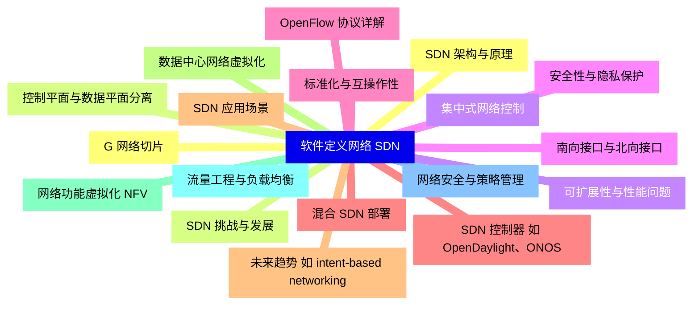
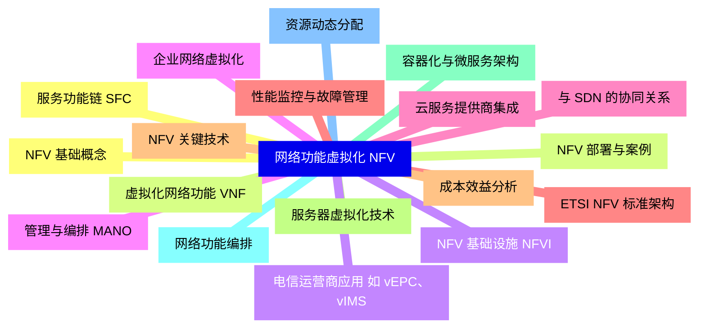
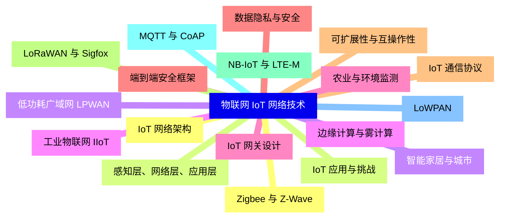
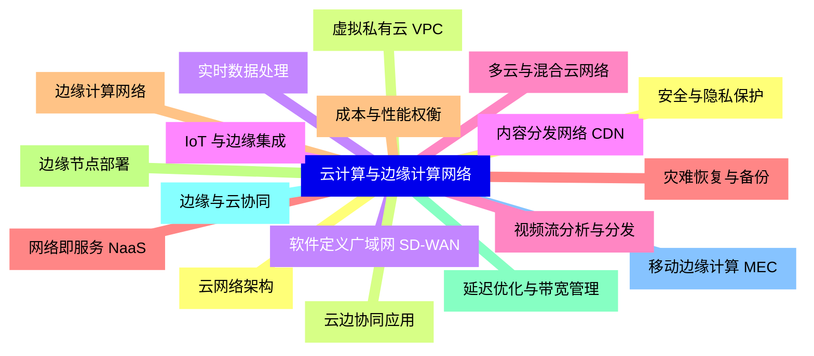
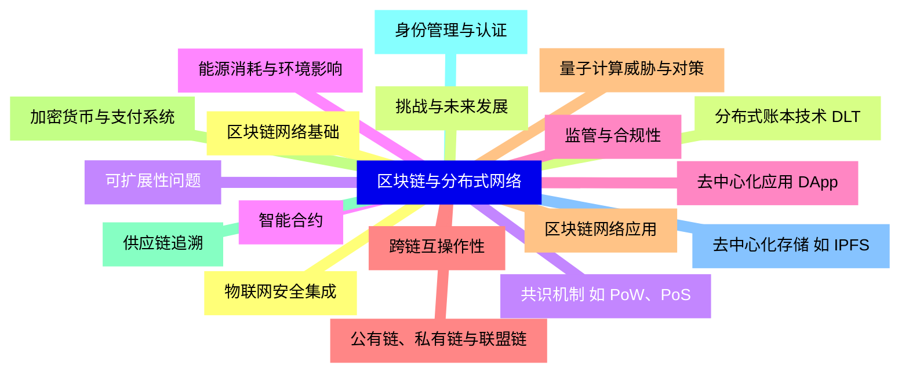
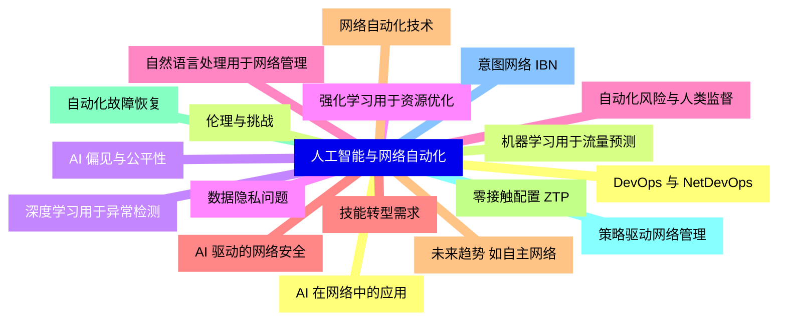
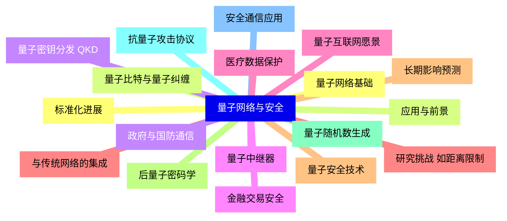
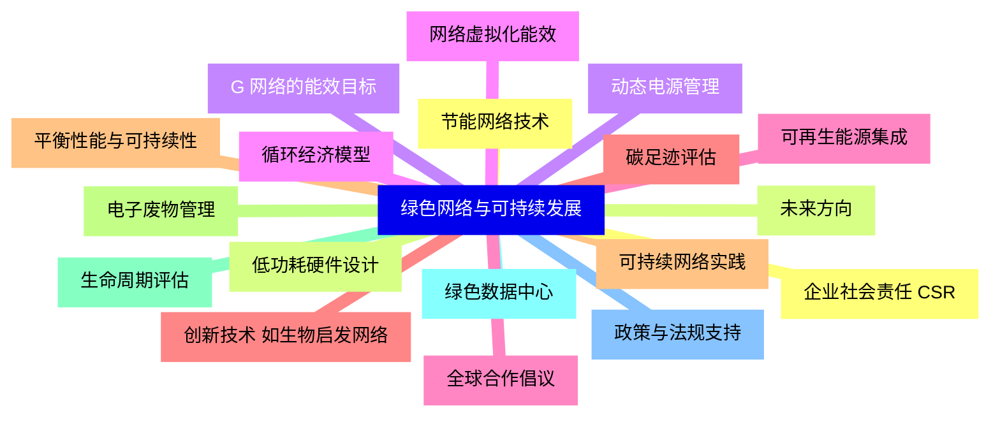


### 1 [软件定义网络  SDN](#1)
#### 1.1 [SDN 架构与原理](#1)
#### 1.2 [控制平面与数据平面分离](#1)
#### 1.3 [集中式网络控制](#1)
#### 1.4 [南向接口与北向接口](#1)
#### 1.5 [OpenFlow 协议详解](#1)
#### 1.6 [SDN 控制器 如 OpenDaylight、ONOS](#1)
#### 1.7 [SDN 应用场景](#1)
#### 1.8 [数据中心网络虚拟化](#1)
#### 1.9 [网络功能虚拟化  NFV](#1)
#### 1.10 [流量工程与负载均衡](#1)
#### 1.11 [网络安全与策略管理](#1)
#### 1.12 [G 网络切片](#1)
#### 1.13 [SDN 挑战与发展](#1)
#### 1.14 [可扩展性与性能问题](#1)
#### 1.15 [安全性与隐私保护](#1)
#### 1.16 [标准化与互操作性](#1)
#### 1.17 [混合 SDN 部署](#1)
#### 1.18 [未来趋势 如 intent-based networking](#1)
### 2 [网络功能虚拟化  NFV](#2)
#### 2.1 [NFV 基础概念](#2)
#### 2.2 [虚拟化网络功能  VNF](#2)
#### 2.3 [NFV 基础设施  NFVI](#2)
#### 2.4 [管理与编排  MANO](#2)
#### 2.5 [与 SDN 的协同关系](#2)
#### 2.6 [ETSI NFV 标准架构](#2)
#### 2.7 [NFV 关键技术](#2)
#### 2.8 [服务器虚拟化技术](#2)
#### 2.9 [容器化与微服务架构](#2)
#### 2.10 [网络功能编排](#2)
#### 2.11 [资源动态分配](#2)
#### 2.12 [服务功能链  SFC](#2)
#### 2.13 [NFV 部署与案例](#2)
#### 2.14 [电信运营商应用 如 vEPC、vIMS](#2)
#### 2.15 [企业网络虚拟化](#2)
#### 2.16 [云服务提供商集成](#2)
#### 2.17 [性能监控与故障管理](#2)
#### 2.18 [成本效益分析](#2)
### 3 [物联网  IoT  网络技术](#3)
#### 3.1 [IoT 网络架构](#3)
#### 3.2 [感知层、网络层、应用层](#3)
#### 3.3 [低功耗广域网  LPWAN](#3)
#### 3.4 [边缘计算与雾计算](#3)
#### 3.5 [IoT 网关设计](#3)
#### 3.6 [端到端安全框架](#3)
#### 3.7 [IoT 通信协议](#3)
#### 3.8 [LoRaWAN 与 Sigfox](#3)
#### 3.9 [NB-IoT 与 LTE-M](#3)
#### 3.10 [MQTT 与 CoAP](#3)
#### 3.11 [LoWPAN](#3)
#### 3.12 [Zigbee 与 Z-Wave](#3)
#### 3.13 [IoT 应用与挑战](#3)
#### 3.14 [智能家居与城市](#3)
#### 3.15 [工业物联网  IIoT](#3)
#### 3.16 [农业与环境监测](#3)
#### 3.17 [数据隐私与安全](#3)
#### 3.18 [可扩展性与互操作性](#3)
### 4 [G 与下一代移动网络](#4)
#### 4.1 [G 网络架构](#4)
#### 4.2 [核心网演进  5GC](#4)
#### 4.3 [无线接入网  RAN](#4)
#### 4.4 [网络切片技术](#4)
#### 4.5 [多接入边缘计算  MEC](#4)
#### 4.6 [服务化架构  SBA](#4)
#### 4.7 [G 关键技术](#4)
#### 4.8 [毫米波通信](#4)
#### 4.9 [大规模 MIMO](#4)
#### 4.10 [波束成形](#4)
#### 4.11 [超可靠低延迟通信  URLLC](#4)
#### 4.12 [增强移动宽带  eMBB](#4)
#### 4.13 [G 应用场景](#4)
#### 4.14 [增强现实  AR  与虚拟现实  VR](#4)
#### 4.15 [自动驾驶与车联网  V2X](#4)
#### 4.16 [远程医疗与智慧医疗](#4)
#### 4.17 [工业 4.0 与智能制造](#4)
#### 4.18 [未来演进 如 6G 愿景](#4)
### 5 [云计算与边缘计算网络](#5)
#### 5.1 [云网络架构](#5)
#### 5.2 [虚拟私有云  VPC](#5)
#### 5.3 [软件定义广域网  SD-WAN](#5)
#### 5.4 [内容分发网络  CDN](#5)
#### 5.5 [多云与混合云网络](#5)
#### 5.6 [网络即服务  NaaS](#5)
#### 5.7 [边缘计算网络](#5)
#### 5.8 [边缘节点部署](#5)
#### 5.9 [延迟优化与带宽管理](#5)
#### 5.10 [边缘与云协同](#5)
#### 5.11 [移动边缘计算  MEC](#5)
#### 5.12 [安全与隐私保护](#5)
#### 5.13 [云边协同应用](#5)
#### 5.14 [实时数据处理](#5)
#### 5.15 [IoT 与边缘集成](#5)
#### 5.16 [视频流分析与分发](#5)
#### 5.17 [灾难恢复与备份](#5)
#### 5.18 [成本与性能权衡](#5)
### 6 [区块链与分布式网络](#6)
#### 6.1 [区块链网络基础](#6)
#### 6.2 [分布式账本技术  DLT](#6)
#### 6.3 [共识机制 如 PoW、PoS](#6)
#### 6.4 [智能合约](#6)
#### 6.5 [去中心化应用  DApp](#6)
#### 6.6 [公有链、私有链与联盟链](#6)
#### 6.7 [区块链网络应用](#6)
#### 6.8 [加密货币与支付系统](#6)
#### 6.9 [供应链追溯](#6)
#### 6.10 [身份管理与认证](#6)
#### 6.11 [去中心化存储 如 IPFS](#6)
#### 6.12 [物联网安全集成](#6)
#### 6.13 [挑战与未来发展](#6)
#### 6.14 [可扩展性问题](#6)
#### 6.15 [能源消耗与环境影响](#6)
#### 6.16 [监管与合规性](#6)
#### 6.17 [跨链互操作性](#6)
#### 6.18 [量子计算威胁与对策](#6)
### 7 [人工智能与网络自动化](#7)
#### 7.1 [AI 在网络中的应用](#7)
#### 7.2 [机器学习用于流量预测](#7)
#### 7.3 [深度学习用于异常检测](#7)
#### 7.4 [强化学习用于资源优化](#7)
#### 7.5 [自然语言处理用于网络管理](#7)
#### 7.6 [AI 驱动的网络安全](#7)
#### 7.7 [网络自动化技术](#7)
#### 7.8 [零接触配置  ZTP](#7)
#### 7.9 [自动化故障恢复](#7)
#### 7.10 [策略驱动网络管理](#7)
#### 7.11 [意图网络  IBN](#7)
#### 7.12 [DevOps 与 NetDevOps](#7)
#### 7.13 [伦理与挑战](#7)
#### 7.14 [AI 偏见与公平性](#7)
#### 7.15 [数据隐私问题](#7)
#### 7.16 [自动化风险与人类监督](#7)
#### 7.17 [技能转型需求](#7)
#### 7.18 [未来趋势 如自主网络](#7)
### 8 [量子网络与安全](#8)
#### 8.1 [量子网络基础](#8)
#### 8.2 [量子比特与量子纠缠](#8)
#### 8.3 [量子密钥分发  QKD](#8)
#### 8.4 [量子中继器](#8)
#### 8.5 [量子互联网愿景](#8)
#### 8.6 [与传统网络的集成](#8)
#### 8.7 [量子安全技术](#8)
#### 8.8 [后量子密码学](#8)
#### 8.9 [量子随机数生成](#8)
#### 8.10 [抗量子攻击协议](#8)
#### 8.11 [安全通信应用](#8)
#### 8.12 [标准化进展](#8)
#### 8.13 [应用与前景](#8)
#### 8.14 [政府与国防通信](#8)
#### 8.15 [金融交易安全](#8)
#### 8.16 [医疗数据保护](#8)
#### 8.17 [研究挑战 如距离限制](#8)
#### 8.18 [长期影响预测](#8)
### 9 [绿色网络与可持续发展](#9)
#### 9.1 [节能网络技术](#9)
#### 9.2 [低功耗硬件设计](#9)
#### 9.3 [动态电源管理](#9)
#### 9.4 [网络虚拟化能效](#9)
#### 9.5 [可再生能源集成](#9)
#### 9.6 [碳足迹评估](#9)
#### 9.7 [可持续网络实践](#9)
#### 9.8 [电子废物管理](#9)
#### 9.9 [生命周期评估](#9)
#### 9.10 [绿色数据中心](#9)
#### 9.11 [政策与法规支持](#9)
#### 9.12 [企业社会责任  CSR](#9)
#### 9.13 [未来方向](#9)
#### 9.14 [G 网络的能效目标](#9)
#### 9.15 [循环经济模型](#9)
#### 9.16 [全球合作倡议](#9)
#### 9.17 [创新技术 如生物启发网络](#9)
#### 9.18 [平衡性能与可持续性](#9)





### 1 软件定义网络  SDN


---
### 1 软件定义网络  SDN
___
#### 1.1 SDN 架构与原理
___
#### 1.2 控制平面与数据平面分离
___
#### 1.3 集中式网络控制
___
#### 1.4 南向接口与北向接口
___
#### 1.5 OpenFlow 协议详解
___
#### 1.6 SDN 控制器 如 OpenDaylight、ONOS
___
#### 1.7 SDN 应用场景
___
#### 1.8 数据中心网络虚拟化
___
#### 1.9 网络功能虚拟化  NFV
___
#### 1.10 流量工程与负载均衡
___
#### 1.11 网络安全与策略管理
___
#### 1.12 G 网络切片
___
#### 1.13 SDN 挑战与发展
___
#### 1.14 可扩展性与性能问题
___
#### 1.15 安全性与隐私保护
___
#### 1.16 标准化与互操作性
___
#### 1.17 混合 SDN 部署
___
#### 1.18 未来趋势 如 intent-based networking
### 2 网络功能虚拟化  NFV


---
### 2 网络功能虚拟化  NFV
___
#### 2.1 NFV 基础概念
___
#### 2.2 虚拟化网络功能  VNF
___
#### 2.3 NFV 基础设施  NFVI
___
#### 2.4 管理与编排  MANO
___
#### 2.5 与 SDN 的协同关系
___
#### 2.6 ETSI NFV 标准架构
___
#### 2.7 NFV 关键技术
___
#### 2.8 服务器虚拟化技术
___
#### 2.9 容器化与微服务架构
___
#### 2.10 网络功能编排
___
#### 2.11 资源动态分配
___
#### 2.12 服务功能链  SFC
___
#### 2.13 NFV 部署与案例
___
#### 2.14 电信运营商应用 如 vEPC、vIMS
___
#### 2.15 企业网络虚拟化
___
#### 2.16 云服务提供商集成
___
#### 2.17 性能监控与故障管理
___
#### 2.18 成本效益分析
### 3 物联网  IoT  网络技术


---
### 3 物联网  IoT  网络技术
___
#### 3.1 IoT 网络架构
___
#### 3.2 感知层、网络层、应用层
___
#### 3.3 低功耗广域网  LPWAN
___
#### 3.4 边缘计算与雾计算
___
#### 3.5 IoT 网关设计
___
#### 3.6 端到端安全框架
___
#### 3.7 IoT 通信协议
___
#### 3.8 LoRaWAN 与 Sigfox
___
#### 3.9 NB-IoT 与 LTE-M
___
#### 3.10 MQTT 与 CoAP
___
#### 3.11 LoWPAN
___
#### 3.12 Zigbee 与 Z-Wave
___
#### 3.13 IoT 应用与挑战
___
#### 3.14 智能家居与城市
___
#### 3.15 工业物联网  IIoT
___
#### 3.16 农业与环境监测
___
#### 3.17 数据隐私与安全
___
#### 3.18 可扩展性与互操作性
### 4 G 与下一代移动网络


---
### 4 G 与下一代移动网络
___
#### 4.1 G 网络架构
___
#### 4.2 核心网演进  5GC
___
#### 4.3 无线接入网  RAN
___
#### 4.4 网络切片技术
___
#### 4.5 多接入边缘计算  MEC
___
#### 4.6 服务化架构  SBA
___
#### 4.7 G 关键技术
___
#### 4.8 毫米波通信
___
#### 4.9 大规模 MIMO
___
#### 4.10 波束成形
___
#### 4.11 超可靠低延迟通信  URLLC
___
#### 4.12 增强移动宽带  eMBB
___
#### 4.13 G 应用场景
___
#### 4.14 增强现实  AR  与虚拟现实  VR
___
#### 4.15 自动驾驶与车联网  V2X
___
#### 4.16 远程医疗与智慧医疗
___
#### 4.17 工业 4.0 与智能制造
___
#### 4.18 未来演进 如 6G 愿景
### 5 云计算与边缘计算网络


---
### 5 云计算与边缘计算网络
___
#### 5.1 云网络架构
___
#### 5.2 虚拟私有云  VPC
___
#### 5.3 软件定义广域网  SD-WAN
___
#### 5.4 内容分发网络  CDN
___
#### 5.5 多云与混合云网络
___
#### 5.6 网络即服务  NaaS
___
#### 5.7 边缘计算网络
___
#### 5.8 边缘节点部署
___
#### 5.9 延迟优化与带宽管理
___
#### 5.10 边缘与云协同
___
#### 5.11 移动边缘计算  MEC
___
#### 5.12 安全与隐私保护
___
#### 5.13 云边协同应用
___
#### 5.14 实时数据处理
___
#### 5.15 IoT 与边缘集成
___
#### 5.16 视频流分析与分发
___
#### 5.17 灾难恢复与备份
___
#### 5.18 成本与性能权衡
### 6 区块链与分布式网络


---
### 6 区块链与分布式网络
___
#### 6.1 区块链网络基础
___
#### 6.2 分布式账本技术  DLT
___
#### 6.3 共识机制 如 PoW、PoS
___
#### 6.4 智能合约
___
#### 6.5 去中心化应用  DApp
___
#### 6.6 公有链、私有链与联盟链
___
#### 6.7 区块链网络应用
___
#### 6.8 加密货币与支付系统
___
#### 6.9 供应链追溯
___
#### 6.10 身份管理与认证
___
#### 6.11 去中心化存储 如 IPFS
___
#### 6.12 物联网安全集成
___
#### 6.13 挑战与未来发展
___
#### 6.14 可扩展性问题
___
#### 6.15 能源消耗与环境影响
___
#### 6.16 监管与合规性
___
#### 6.17 跨链互操作性
___
#### 6.18 量子计算威胁与对策
### 7 人工智能与网络自动化


---
### 7 人工智能与网络自动化
___
#### 7.1 AI 在网络中的应用
___
#### 7.2 机器学习用于流量预测
___
#### 7.3 深度学习用于异常检测
___
#### 7.4 强化学习用于资源优化
___
#### 7.5 自然语言处理用于网络管理
___
#### 7.6 AI 驱动的网络安全
___
#### 7.7 网络自动化技术
___
#### 7.8 零接触配置  ZTP
___
#### 7.9 自动化故障恢复
___
#### 7.10 策略驱动网络管理
___
#### 7.11 意图网络  IBN
___
#### 7.12 DevOps 与 NetDevOps
___
#### 7.13 伦理与挑战
___
#### 7.14 AI 偏见与公平性
___
#### 7.15 数据隐私问题
___
#### 7.16 自动化风险与人类监督
___
#### 7.17 技能转型需求
___
#### 7.18 未来趋势 如自主网络
### 8 量子网络与安全


---
### 8 量子网络与安全
___
#### 8.1 量子网络基础
___
#### 8.2 量子比特与量子纠缠
___
#### 8.3 量子密钥分发  QKD
___
#### 8.4 量子中继器
___
#### 8.5 量子互联网愿景
___
#### 8.6 与传统网络的集成
___
#### 8.7 量子安全技术
___
#### 8.8 后量子密码学
___
#### 8.9 量子随机数生成
___
#### 8.10 抗量子攻击协议
___
#### 8.11 安全通信应用
___
#### 8.12 标准化进展
___
#### 8.13 应用与前景
___
#### 8.14 政府与国防通信
___
#### 8.15 金融交易安全
___
#### 8.16 医疗数据保护
___
#### 8.17 研究挑战 如距离限制
___
#### 8.18 长期影响预测
### 9 绿色网络与可持续发展


---
### 9 绿色网络与可持续发展
___
#### 9.1 节能网络技术
___
#### 9.2 低功耗硬件设计
___
#### 9.3 动态电源管理
___
#### 9.4 网络虚拟化能效
___
#### 9.5 可再生能源集成
___
#### 9.6 碳足迹评估
___
#### 9.7 可持续网络实践
___
#### 9.8 电子废物管理
___
#### 9.9 生命周期评估
___
#### 9.10 绿色数据中心
___
#### 9.11 政策与法规支持
___
#### 9.12 企业社会责任  CSR
___
#### 9.13 未来方向
___
#### 9.14 G 网络的能效目标
___
#### 9.15 循环经济模型
___
#### 9.16 全球合作倡议
___
#### 9.17 创新技术 如生物启发网络
___
#### 9.18 平衡性能与可持续性



### 1 软件定义网络  SDN{#1}


{}


<--->
{}
{}
{}
{}
{}
{}
{}
{}
{}
{}
{}
{}
{}
{}
{}
{}
{}
{}
{}
{}
{}
{}
{}
{}
{}
{}
{}
{}
{}
{}
{}
{}
{}
{}
{}
{}
{}

### 2 网络功能虚拟化  NFV{#2}


{}
{}
{}
{}
{}
{}
{}
{}
{}
{}
{}
{}
{}
{}
{}
{}
{}
{}
{}
{}
{}
{}
{}
{}
{}
{}
{}
{}
{}
{}
{}
{}
{}
{}
{}
{}
{}
<--->


{}

### 3 物联网  IoT  网络技术{#3}


{}


<--->
{}
{}
{}
{}
{}
{}
{}
{}
{}
{}
{}
{}
{}
{}
{}
{}
{}
{}
{}
{}
{}
{}
{}
{}
{}
{}
{}
{}
{}
{}
{}
{}
{}
{}
{}
{}
{}

### 4 G 与下一代移动网络{#4}


{}
{}
{}
{}
{}
{}
{}
{}
{}
{}
{}
{}
{}
{}
{}
{}
{}
{}
{}
{}
{}
{}
{}
{}
{}
{}
{}
{}
{}
{}
{}
{}
{}
{}
{}
{}
{}
<--->
```mermaid
mindmap
    id4[G 与下一代移动网络]
        id4-1[G 网络架构]
        id4-2[核心网演进  5GC]
        id4-3[无线接入网  RAN]
        id4-4[网络切片技术]
        id4-5[多接入边缘计算  MEC]
        id4-6[服务化架构  SBA]
        id4-7[G 关键技术]
        id4-8[毫米波通信]
        id4-9[大规模 MIMO]
        id4-10[波束成形]
        id4-11[超可靠低延迟通信  URLLC]
        id4-12[增强移动宽带  eMBB]
        id4-13[G 应用场景]
        id4-14[增强现实  AR  与虚拟现实  VR]
        id4-15[自动驾驶与车联网  V2X]
        id4-16[远程医疗与智慧医疗]
        id4-17[工业 4.0 与智能制造]
        id4-18[未来演进 如 6G 愿景]
```

{}

### 5 云计算与边缘计算网络{#5}


{}


<--->
{}
{}
{}
{}
{}
{}
{}
{}
{}
{}
{}
{}
{}
{}
{}
{}
{}
{}
{}
{}
{}
{}
{}
{}
{}
{}
{}
{}
{}
{}
{}
{}
{}
{}
{}
{}
{}

### 6 区块链与分布式网络{#6}


{}
{}
{}
{}
{}
{}
{}
{}
{}
{}
{}
{}
{}
{}
{}
{}
{}
{}
{}
{}
{}
{}
{}
{}
{}
{}
{}
{}
{}
{}
{}
{}
{}
{}
{}
{}
{}
<--->


{}

### 7 人工智能与网络自动化{#7}


{}


<--->
{}
{}
{}
{}
{}
{}
{}
{}
{}
{}
{}
{}
{}
{}
{}
{}
{}
{}
{}
{}
{}
{}
{}
{}
{}
{}
{}
{}
{}
{}
{}
{}
{}
{}
{}
{}
{}

### 8 量子网络与安全{#8}


{}
{}
{}
{}
{}
{}
{}
{}
{}
{}
{}
{}
{}
{}
{}
{}
{}
{}
{}
{}
{}
{}
{}
{}
{}
{}
{}
{}
{}
{}
{}
{}
{}
{}
{}
{}
{}
<--->


{}

### 9 绿色网络与可持续发展{#9}


{}


<--->
{}
{}
{}
{}
{}
{}
{}
{}
{}
{}
{}
{}
{}
{}
{}
{}
{}
{}
{}
{}
{}
{}
{}
{}
{}
{}
{}
{}
{}
{}
{}
{}
{}
{}
{}
{}
{}
