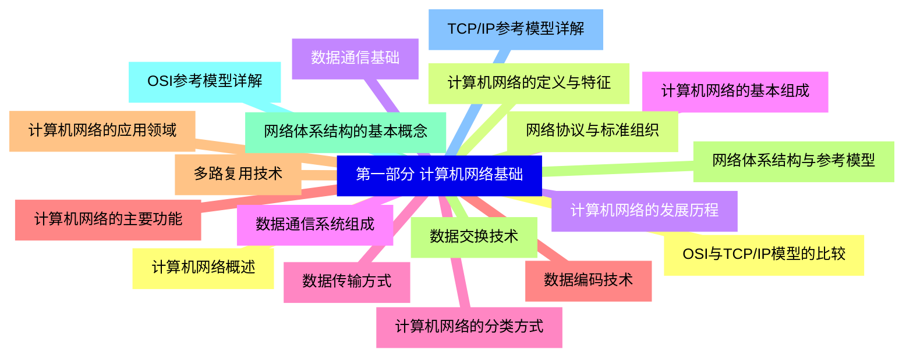
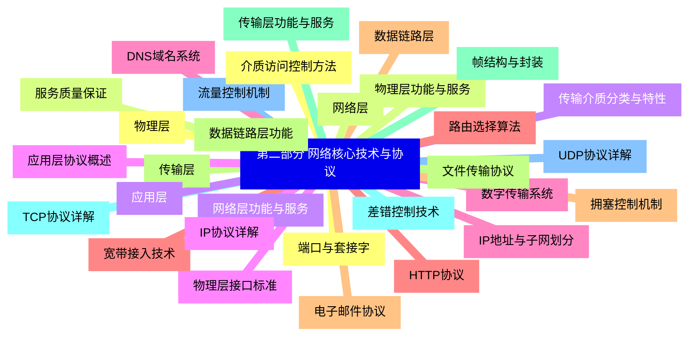
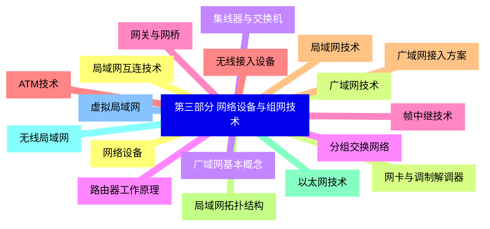
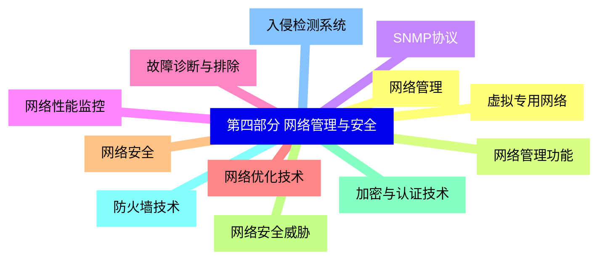
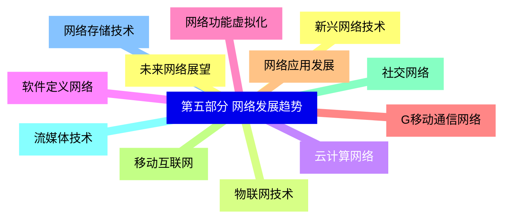


### 1 [第一部分 计算机网络基础](#1)
#### 1.1 [计算机网络概述](#1)
#### 1.2 [计算机网络的定义与特征](#1)
#### 1.3 [计算机网络的发展历程](#1)
#### 1.4 [计算机网络的基本组成](#1)
#### 1.5 [计算机网络的分类方式](#1)
#### 1.6 [计算机网络的主要功能](#1)
#### 1.7 [计算机网络的应用领域](#1)
#### 1.8 [网络体系结构与参考模型](#1)
#### 1.9 [网络体系结构的基本概念](#1)
#### 1.10 [OSI参考模型详解](#1)
#### 1.11 [TCP/IP参考模型详解](#1)
#### 1.12 [OSI与TCP/IP模型的比较](#1)
#### 1.13 [网络协议与标准组织](#1)
#### 1.14 [数据通信基础](#1)
#### 1.15 [数据通信系统组成](#1)
#### 1.16 [数据传输方式](#1)
#### 1.17 [数据编码技术](#1)
#### 1.18 [多路复用技术](#1)
#### 1.19 [数据交换技术](#1)
### 2 [第二部分 网络核心技术与协议](#2)
#### 2.1 [物理层](#2)
#### 2.2 [物理层功能与服务](#2)
#### 2.3 [传输介质分类与特性](#2)
#### 2.4 [物理层接口标准](#2)
#### 2.5 [数字传输系统](#2)
#### 2.6 [宽带接入技术](#2)
#### 2.7 [数据链路层](#2)
#### 2.8 [数据链路层功能](#2)
#### 2.9 [帧结构与封装](#2)
#### 2.10 [差错控制技术](#2)
#### 2.11 [流量控制机制](#2)
#### 2.12 [介质访问控制方法](#2)
#### 2.13 [网络层](#2)
#### 2.14 [网络层功能与服务](#2)
#### 2.15 [IP协议详解](#2)
#### 2.16 [IP地址与子网划分](#2)
#### 2.17 [路由选择算法](#2)
#### 2.18 [拥塞控制机制](#2)
#### 2.19 [传输层](#2)
#### 2.20 [传输层功能与服务](#2)
#### 2.21 [TCP协议详解](#2)
#### 2.22 [UDP协议详解](#2)
#### 2.23 [端口与套接字](#2)
#### 2.24 [服务质量保证](#2)
#### 2.25 [应用层](#2)
#### 2.26 [应用层协议概述](#2)
#### 2.27 [DNS域名系统](#2)
#### 2.28 [HTTP协议](#2)
#### 2.29 [电子邮件协议](#2)
#### 2.30 [文件传输协议](#2)
### 3 [第三部分 网络设备与组网技术](#3)
#### 3.1 [网络设备](#3)
#### 3.2 [网卡与调制解调器](#3)
#### 3.3 [集线器与交换机](#3)
#### 3.4 [路由器工作原理](#3)
#### 3.5 [网关与网桥](#3)
#### 3.6 [无线接入设备](#3)
#### 3.7 [局域网技术](#3)
#### 3.8 [局域网拓扑结构](#3)
#### 3.9 [以太网技术](#3)
#### 3.10 [无线局域网](#3)
#### 3.11 [虚拟局域网](#3)
#### 3.12 [局域网互连技术](#3)
#### 3.13 [广域网技术](#3)
#### 3.14 [广域网基本概念](#3)
#### 3.15 [分组交换网络](#3)
#### 3.16 [帧中继技术](#3)
#### 3.17 [ATM技术](#3)
#### 3.18 [广域网接入方案](#3)
### 4 [第四部分 网络管理与安全](#4)
#### 4.1 [网络管理](#4)
#### 4.2 [网络管理功能](#4)
#### 4.3 [SNMP协议](#4)
#### 4.4 [网络性能监控](#4)
#### 4.5 [故障诊断与排除](#4)
#### 4.6 [网络优化技术](#4)
#### 4.7 [网络安全](#4)
#### 4.8 [网络安全威胁](#4)
#### 4.9 [加密与认证技术](#4)
#### 4.10 [防火墙技术](#4)
#### 4.11 [入侵检测系统](#4)
#### 4.12 [虚拟专用网络](#4)
### 5 [第五部分 网络发展趋势](#5)
#### 5.1 [新兴网络技术](#5)
#### 5.2 [物联网技术](#5)
#### 5.3 [云计算网络](#5)
#### 5.4 [软件定义网络](#5)
#### 5.5 [网络功能虚拟化](#5)
#### 5.6 [G移动通信网络](#5)
#### 5.7 [网络应用发展](#5)
#### 5.8 [移动互联网](#5)
#### 5.9 [社交网络](#5)
#### 5.10 [流媒体技术](#5)
#### 5.11 [网络存储技术](#5)
#### 5.12 [未来网络展望](#5)




### 1 第一部分 计算机网络基础

---
### 1 第一部分 计算机网络基础
___
#### 1.1 计算机网络概述
___
#### 1.2 计算机网络的定义与特征
___
#### 1.3 计算机网络的发展历程
___
#### 1.4 计算机网络的基本组成
___
#### 1.5 计算机网络的分类方式
___
#### 1.6 计算机网络的主要功能
___
#### 1.7 计算机网络的应用领域
___
#### 1.8 网络体系结构与参考模型
___
#### 1.9 网络体系结构的基本概念
___
#### 1.10 OSI参考模型详解
___
#### 1.11 TCP/IP参考模型详解
___
#### 1.12 OSI与TCP/IP模型的比较
___
#### 1.13 网络协议与标准组织
___
#### 1.14 数据通信基础
___
#### 1.15 数据通信系统组成
___
#### 1.16 数据传输方式
___
#### 1.17 数据编码技术
___
#### 1.18 多路复用技术
___
#### 1.19 数据交换技术
### 2 第二部分 网络核心技术与协议

---
### 2 第二部分 网络核心技术与协议
___
#### 2.1 物理层
___
#### 2.2 物理层功能与服务
___
#### 2.3 传输介质分类与特性
___
#### 2.4 物理层接口标准
___
#### 2.5 数字传输系统
___
#### 2.6 宽带接入技术
___
#### 2.7 数据链路层
___
#### 2.8 数据链路层功能
___
#### 2.9 帧结构与封装
___
#### 2.10 差错控制技术
___
#### 2.11 流量控制机制
___
#### 2.12 介质访问控制方法
___
#### 2.13 网络层
___
#### 2.14 网络层功能与服务
___
#### 2.15 IP协议详解
___
#### 2.16 IP地址与子网划分
___
#### 2.17 路由选择算法
___
#### 2.18 拥塞控制机制
___
#### 2.19 传输层
___
#### 2.20 传输层功能与服务
___
#### 2.21 TCP协议详解
___
#### 2.22 UDP协议详解
___
#### 2.23 端口与套接字
___
#### 2.24 服务质量保证
___
#### 2.25 应用层
___
#### 2.26 应用层协议概述
___
#### 2.27 DNS域名系统
___
#### 2.28 HTTP协议
___
#### 2.29 电子邮件协议
___
#### 2.30 文件传输协议
### 3 第三部分 网络设备与组网技术

---
### 3 第三部分 网络设备与组网技术
___
#### 3.1 网络设备
___
#### 3.2 网卡与调制解调器
___
#### 3.3 集线器与交换机
___
#### 3.4 路由器工作原理
___
#### 3.5 网关与网桥
___
#### 3.6 无线接入设备
___
#### 3.7 局域网技术
___
#### 3.8 局域网拓扑结构
___
#### 3.9 以太网技术
___
#### 3.10 无线局域网
___
#### 3.11 虚拟局域网
___
#### 3.12 局域网互连技术
___
#### 3.13 广域网技术
___
#### 3.14 广域网基本概念
___
#### 3.15 分组交换网络
___
#### 3.16 帧中继技术
___
#### 3.17 ATM技术
___
#### 3.18 广域网接入方案
### 4 第四部分 网络管理与安全

---
### 4 第四部分 网络管理与安全
___
#### 4.1 网络管理
___
#### 4.2 网络管理功能
___
#### 4.3 SNMP协议
___
#### 4.4 网络性能监控
___
#### 4.5 故障诊断与排除
___
#### 4.6 网络优化技术
___
#### 4.7 网络安全
___
#### 4.8 网络安全威胁
___
#### 4.9 加密与认证技术
___
#### 4.10 防火墙技术
___
#### 4.11 入侵检测系统
___
#### 4.12 虚拟专用网络
### 5 第五部分 网络发展趋势

---
### 5 第五部分 网络发展趋势
___
#### 5.1 新兴网络技术
___
#### 5.2 物联网技术
___
#### 5.3 云计算网络
___
#### 5.4 软件定义网络
___
#### 5.5 网络功能虚拟化
___
#### 5.6 G移动通信网络
___
#### 5.7 网络应用发展
___
#### 5.8 移动互联网
___
#### 5.9 社交网络
___
#### 5.10 流媒体技术
___
#### 5.11 网络存储技术
___
#### 5.12 未来网络展望


### 1 第一部分 计算机网络基础{#1}

{}

<--->
{}
{}
{}
{}
{}
{}
{}
{}
{}
{}
{}
{}
{}
{}
{}
{}
{}
{}
{}
{}
{}
{}
{}
{}
{}
{}
{}
{}
{}
{}
{}
{}
{}
{}
{}
{}
{}
{}
{}

### 2 第二部分 网络核心技术与协议{#2}

{}
{}
{}
{}
{}
{}
{}
{}
{}
{}
{}
{}
{}
{}
{}
{}
{}
{}
{}
{}
{}
{}
{}
{}
{}
{}
{}
{}
{}
{}
{}
{}
{}
{}
{}
{}
{}
{}
{}
{}
{}
{}
{}
{}
{}
{}
{}
{}
{}
{}
{}
{}
{}
{}
{}
{}
{}
{}
{}
{}
{}
<--->

{}

### 3 第三部分 网络设备与组网技术{#3}

{}

<--->
{}
{}
{}
{}
{}
{}
{}
{}
{}
{}
{}
{}
{}
{}
{}
{}
{}
{}
{}
{}
{}
{}
{}
{}
{}
{}
{}
{}
{}
{}
{}
{}
{}
{}
{}
{}
{}

### 4 第四部分 网络管理与安全{#4}

{}
{}
{}
{}
{}
{}
{}
{}
{}
{}
{}
{}
{}
{}
{}
{}
{}
{}
{}
{}
{}
{}
{}
{}
{}
<--->

{}

### 5 第五部分 网络发展趋势{#5}

{}

<--->
{}
{}
{}
{}
{}
{}
{}
{}
{}
{}
{}
{}
{}
{}
{}
{}
{}
{}
{}
{}
{}
{}
{}
{}
{}
