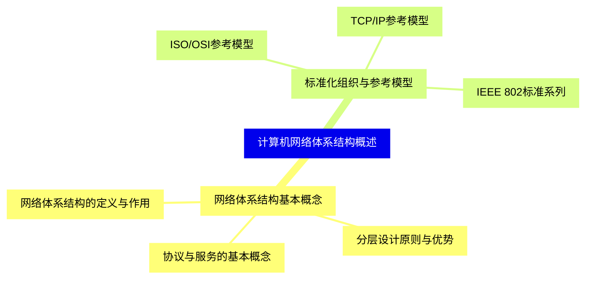
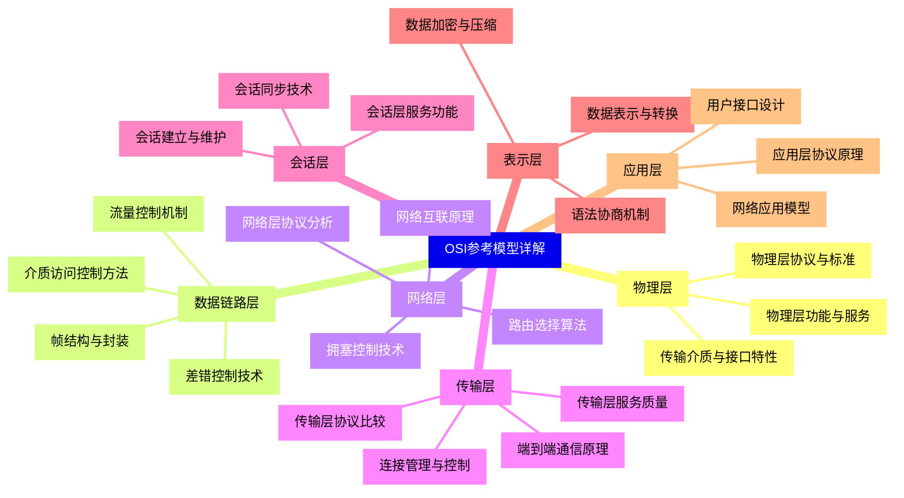
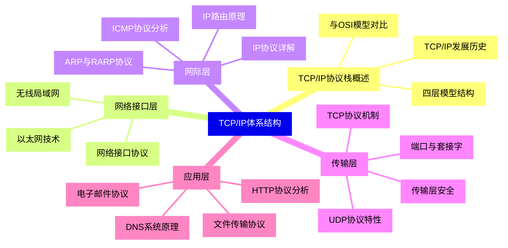
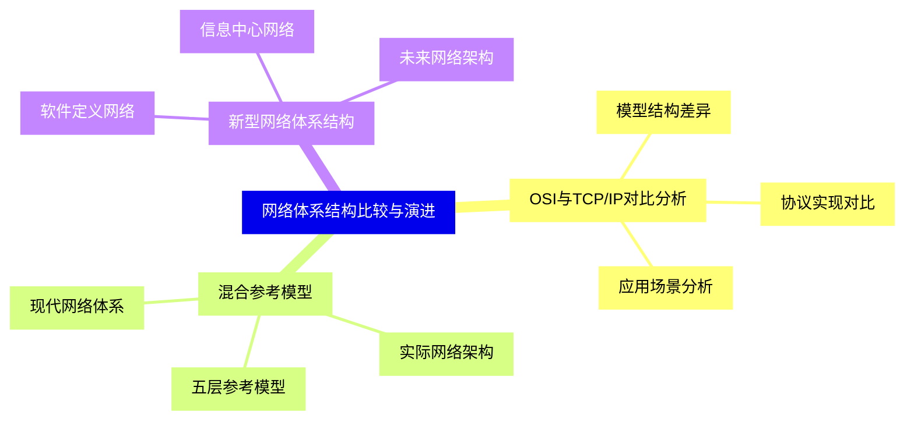
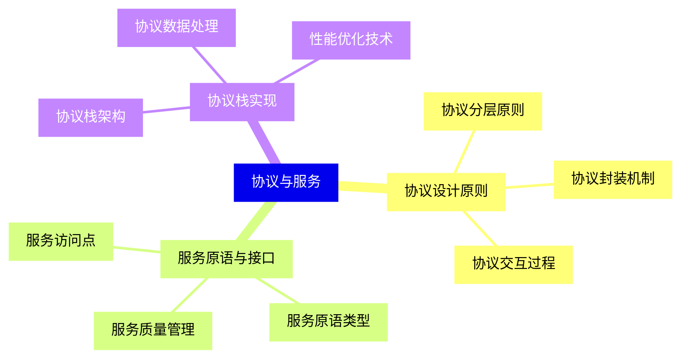
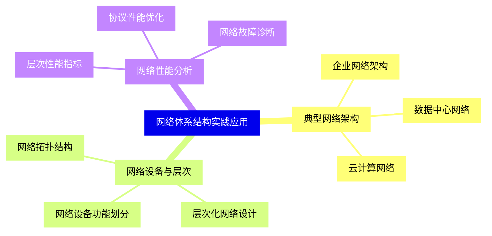


### 1 [计算机网络体系结构概述](#1)
#### 1.1 [网络体系结构基本概念](#1)
##### 1.1.1 [网络体系结构的定义与作用](#1)
##### 1.1.2 [分层设计原则与优势](#1)
##### 1.1.3 [协议与服务的基本概念](#1)
#### 1.2 [标准化组织与参考模型](#1)
##### 1.2.1 [ISO/OSI参考模型](#1)
##### 1.2.2 [TCP/IP参考模型](#1)
##### 1.2.3 [IEEE 802标准系列](#1)
### 2 [OSI参考模型详解](#2)
#### 2.1 [物理层](#2)
##### 2.1.1 [物理层功能与服务](#2)
##### 2.1.2 [传输介质与接口特性](#2)
##### 2.1.3 [物理层协议与标准](#2)
#### 2.2 [数据链路层](#2)
##### 2.2.1 [帧结构与封装](#2)
##### 2.2.2 [差错控制技术](#2)
##### 2.2.3 [流量控制机制](#2)
##### 2.2.4 [介质访问控制方法](#2)
#### 2.3 [网络层](#2)
##### 2.3.1 [路由选择算法](#2)
##### 2.3.2 [拥塞控制技术](#2)
##### 2.3.3 [网络互联原理](#2)
##### 2.3.4 [网络层协议分析](#2)
#### 2.4 [传输层](#2)
##### 2.4.1 [端到端通信原理](#2)
##### 2.4.2 [传输层服务质量](#2)
##### 2.4.3 [连接管理与控制](#2)
##### 2.4.4 [传输层协议比较](#2)
#### 2.5 [会话层](#2)
##### 2.5.1 [会话建立与维护](#2)
##### 2.5.2 [会话同步技术](#2)
##### 2.5.3 [会话层服务功能](#2)
#### 2.6 [表示层](#2)
##### 2.6.1 [数据表示与转换](#2)
##### 2.6.2 [数据加密与压缩](#2)
##### 2.6.3 [语法协商机制](#2)
#### 2.7 [应用层](#2)
##### 2.7.1 [应用层协议原理](#2)
##### 2.7.2 [网络应用模型](#2)
##### 2.7.3 [用户接口设计](#2)
### 3 [TCP/IP体系结构](#3)
#### 3.1 [TCP/IP协议栈概述](#3)
##### 3.1.1 [TCP/IP发展历史](#3)
##### 3.1.2 [四层模型结构](#3)
##### 3.1.3 [与OSI模型对比](#3)
#### 3.2 [网络接口层](#3)
##### 3.2.1 [以太网技术](#3)
##### 3.2.2 [无线局域网](#3)
##### 3.2.3 [网络接口协议](#3)
#### 3.3 [网际层](#3)
##### 3.3.1 [IP协议详解](#3)
##### 3.3.2 [ICMP协议分析](#3)
##### 3.3.3 [ARP与RARP协议](#3)
##### 3.3.4 [IP路由原理](#3)
#### 3.4 [传输层](#3)
##### 3.4.1 [TCP协议机制](#3)
##### 3.4.2 [UDP协议特性](#3)
##### 3.4.3 [端口与套接字](#3)
##### 3.4.4 [传输层安全](#3)
#### 3.5 [应用层](#3)
##### 3.5.1 [HTTP协议分析](#3)
##### 3.5.2 [DNS系统原理](#3)
##### 3.5.3 [电子邮件协议](#3)
##### 3.5.4 [文件传输协议](#3)
### 4 [网络体系结构比较与演进](#4)
#### 4.1 [OSI与TCP/IP对比分析](#4)
##### 4.1.1 [模型结构差异](#4)
##### 4.1.2 [协议实现对比](#4)
##### 4.1.3 [应用场景分析](#4)
#### 4.2 [混合参考模型](#4)
##### 4.2.1 [五层参考模型](#4)
##### 4.2.2 [实际网络架构](#4)
##### 4.2.3 [现代网络体系](#4)
#### 4.3 [新型网络体系结构](#4)
##### 4.3.1 [软件定义网络](#4)
##### 4.3.2 [信息中心网络](#4)
##### 4.3.3 [未来网络架构](#4)
### 5 [协议与服务](#5)
#### 5.1 [协议设计原则](#5)
##### 5.1.1 [协议分层原则](#5)
##### 5.1.2 [协议封装机制](#5)
##### 5.1.3 [协议交互过程](#5)
#### 5.2 [服务原语与接口](#5)
##### 5.2.1 [服务访问点](#5)
##### 5.2.2 [服务原语类型](#5)
##### 5.2.3 [服务质量管理](#5)
#### 5.3 [协议栈实现](#5)
##### 5.3.1 [协议栈架构](#5)
##### 5.3.2 [协议数据处理](#5)
##### 5.3.3 [性能优化技术](#5)
### 6 [网络体系结构实践应用](#6)
#### 6.1 [典型网络架构](#6)
##### 6.1.1 [企业网络架构](#6)
##### 6.1.2 [数据中心网络](#6)
##### 6.1.3 [云计算网络](#6)
#### 6.2 [网络设备与层次](#6)
##### 6.2.1 [网络设备功能划分](#6)
##### 6.2.2 [层次化网络设计](#6)
##### 6.2.3 [网络拓扑结构](#6)
#### 6.3 [网络性能分析](#6)
##### 6.3.1 [层次性能指标](#6)
##### 6.3.2 [协议性能优化](#6)
##### 6.3.3 [网络故障诊断](#6)




### 1 计算机网络体系结构概述

---
### 1 计算机网络体系结构概述
___
#### 1.1 网络体系结构基本概念
___
##### 1.1.1 网络体系结构的定义与作用
___
##### 1.1.2 分层设计原则与优势
___
##### 1.1.3 协议与服务的基本概念
___
#### 1.2 标准化组织与参考模型
___
##### 1.2.1 ISO/OSI参考模型
___
##### 1.2.2 TCP/IP参考模型
___
##### 1.2.3 IEEE 802标准系列
### 2 OSI参考模型详解

---
### 2 OSI参考模型详解
___
#### 2.1 物理层
___
##### 2.1.1 物理层功能与服务
___
##### 2.1.2 传输介质与接口特性
___
##### 2.1.3 物理层协议与标准
___
#### 2.2 数据链路层
___
##### 2.2.1 帧结构与封装
___
##### 2.2.2 差错控制技术
___
##### 2.2.3 流量控制机制
___
##### 2.2.4 介质访问控制方法
___
#### 2.3 网络层
___
##### 2.3.1 路由选择算法
___
##### 2.3.2 拥塞控制技术
___
##### 2.3.3 网络互联原理
___
##### 2.3.4 网络层协议分析
___
#### 2.4 传输层
___
##### 2.4.1 端到端通信原理
___
##### 2.4.2 传输层服务质量
___
##### 2.4.3 连接管理与控制
___
##### 2.4.4 传输层协议比较
___
#### 2.5 会话层
___
##### 2.5.1 会话建立与维护
___
##### 2.5.2 会话同步技术
___
##### 2.5.3 会话层服务功能
___
#### 2.6 表示层
___
##### 2.6.1 数据表示与转换
___
##### 2.6.2 数据加密与压缩
___
##### 2.6.3 语法协商机制
___
#### 2.7 应用层
___
##### 2.7.1 应用层协议原理
___
##### 2.7.2 网络应用模型
___
##### 2.7.3 用户接口设计
### 3 TCP/IP体系结构

---
### 3 TCP/IP体系结构
___
#### 3.1 TCP/IP协议栈概述
___
##### 3.1.1 TCP/IP发展历史
___
##### 3.1.2 四层模型结构
___
##### 3.1.3 与OSI模型对比
___
#### 3.2 网络接口层
___
##### 3.2.1 以太网技术
___
##### 3.2.2 无线局域网
___
##### 3.2.3 网络接口协议
___
#### 3.3 网际层
___
##### 3.3.1 IP协议详解
___
##### 3.3.2 ICMP协议分析
___
##### 3.3.3 ARP与RARP协议
___
##### 3.3.4 IP路由原理
___
#### 3.4 传输层
___
##### 3.4.1 TCP协议机制
___
##### 3.4.2 UDP协议特性
___
##### 3.4.3 端口与套接字
___
##### 3.4.4 传输层安全
___
#### 3.5 应用层
___
##### 3.5.1 HTTP协议分析
___
##### 3.5.2 DNS系统原理
___
##### 3.5.3 电子邮件协议
___
##### 3.5.4 文件传输协议
### 4 网络体系结构比较与演进

---
### 4 网络体系结构比较与演进
___
#### 4.1 OSI与TCP/IP对比分析
___
##### 4.1.1 模型结构差异
___
##### 4.1.2 协议实现对比
___
##### 4.1.3 应用场景分析
___
#### 4.2 混合参考模型
___
##### 4.2.1 五层参考模型
___
##### 4.2.2 实际网络架构
___
##### 4.2.3 现代网络体系
___
#### 4.3 新型网络体系结构
___
##### 4.3.1 软件定义网络
___
##### 4.3.2 信息中心网络
___
##### 4.3.3 未来网络架构
### 5 协议与服务

---
### 5 协议与服务
___
#### 5.1 协议设计原则
___
##### 5.1.1 协议分层原则
___
##### 5.1.2 协议封装机制
___
##### 5.1.3 协议交互过程
___
#### 5.2 服务原语与接口
___
##### 5.2.1 服务访问点
___
##### 5.2.2 服务原语类型
___
##### 5.2.3 服务质量管理
___
#### 5.3 协议栈实现
___
##### 5.3.1 协议栈架构
___
##### 5.3.2 协议数据处理
___
##### 5.3.3 性能优化技术
### 6 网络体系结构实践应用

---
### 6 网络体系结构实践应用
___
#### 6.1 典型网络架构
___
##### 6.1.1 企业网络架构
___
##### 6.1.2 数据中心网络
___
##### 6.1.3 云计算网络
___
#### 6.2 网络设备与层次
___
##### 6.2.1 网络设备功能划分
___
##### 6.2.2 层次化网络设计
___
##### 6.2.3 网络拓扑结构
___
#### 6.3 网络性能分析
___
##### 6.3.1 层次性能指标
___
##### 6.3.2 协议性能优化
___
##### 6.3.3 网络故障诊断


### 1 计算机网络体系结构概述{#1}

{}

<--->
{}
{}
{}
{}
{}
{}
{}
{}
{}
{}
{}
{}
{}
{}
{}
{}
{}

### 2 OSI参考模型详解{#2}

{}
{}
{}
{}
{}
{}
{}
{}
{}
{}
{}
{}
{}
{}
{}
{}
{}
{}
{}
{}
{}
{}
{}
{}
{}
{}
{}
{}
{}
{}
{}
{}
{}
{}
{}
{}
{}
{}
{}
{}
{}
{}
{}
{}
{}
{}
{}
{}
{}
{}
{}
{}
{}
{}
{}
{}
{}
{}
{}
{}
{}
{}
{}
<--->

{}

### 3 TCP/IP体系结构{#3}

{}

<--->
{}
{}
{}
{}
{}
{}
{}
{}
{}
{}
{}
{}
{}
{}
{}
{}
{}
{}
{}
{}
{}
{}
{}
{}
{}
{}
{}
{}
{}
{}
{}
{}
{}
{}
{}
{}
{}
{}
{}
{}
{}
{}
{}
{}
{}
{}
{}

### 4 网络体系结构比较与演进{#4}

{}
{}
{}
{}
{}
{}
{}
{}
{}
{}
{}
{}
{}
{}
{}
{}
{}
{}
{}
{}
{}
{}
{}
{}
{}
<--->

{}

### 5 协议与服务{#5}

{}

<--->
{}
{}
{}
{}
{}
{}
{}
{}
{}
{}
{}
{}
{}
{}
{}
{}
{}
{}
{}
{}
{}
{}
{}
{}
{}

### 6 网络体系结构实践应用{#6}

{}
{}
{}
{}
{}
{}
{}
{}
{}
{}
{}
{}
{}
{}
{}
{}
{}
{}
{}
{}
{}
{}
{}
{}
{}
<--->

{}
