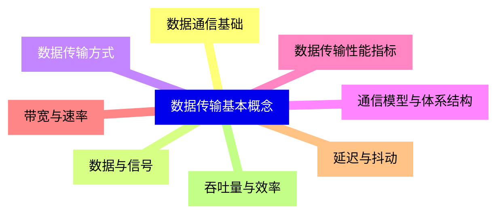
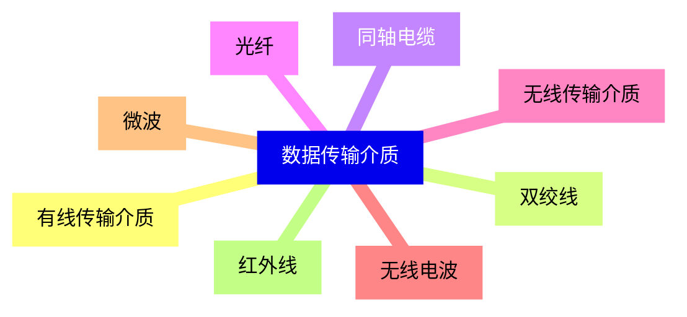
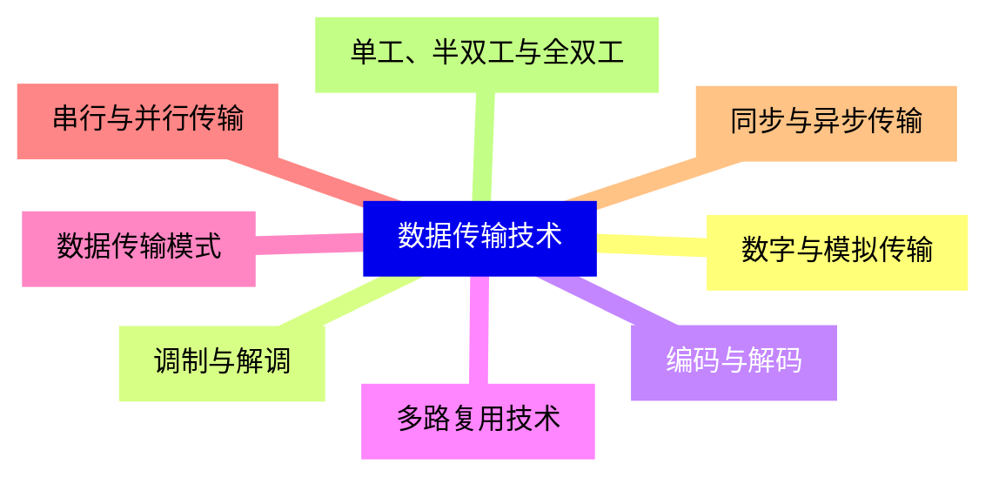
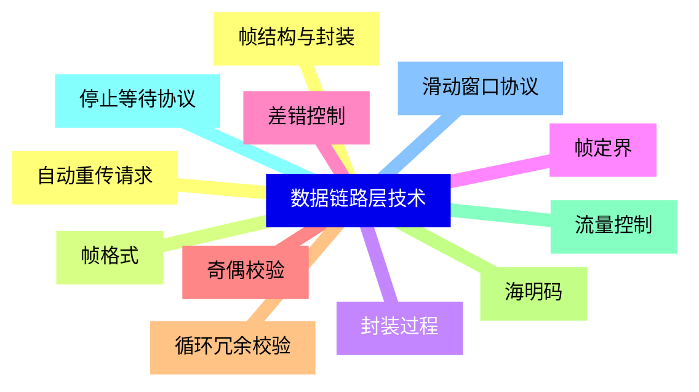
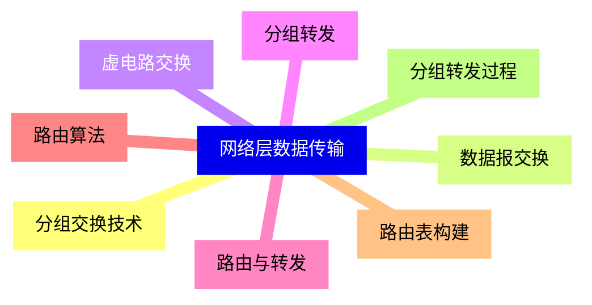
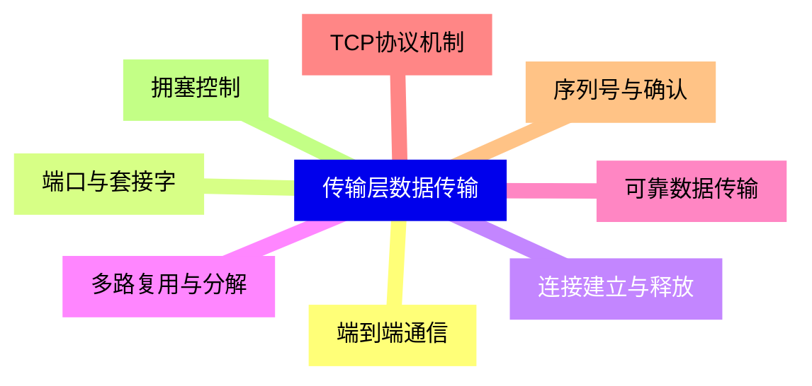
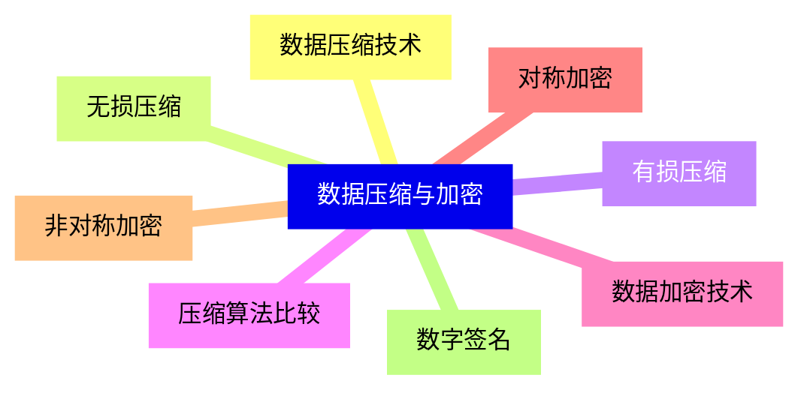
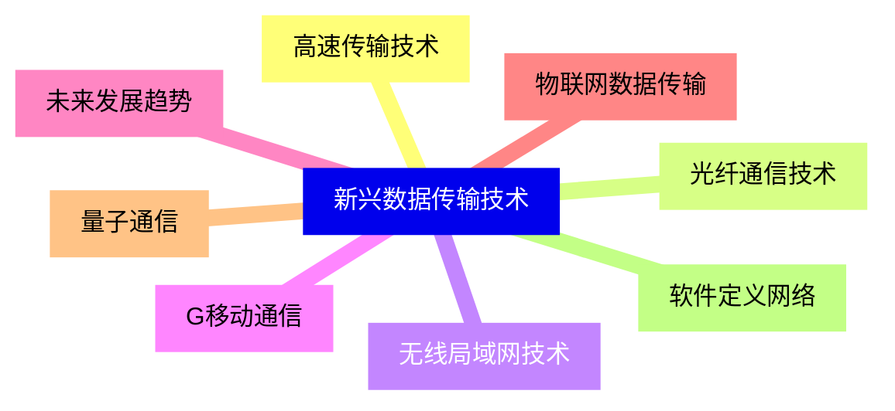


### 1 [数据传输基本概念](#1)
#### 1.1 [数据通信基础](#1)
#### 1.2 [数据与信号](#1)
#### 1.3 [数据传输方式](#1)
#### 1.4 [通信模型与体系结构](#1)
#### 1.5 [数据传输性能指标](#1)
#### 1.6 [带宽与速率](#1)
#### 1.7 [延迟与抖动](#1)
#### 1.8 [吞吐量与效率](#1)
### 2 [数据传输介质](#2)
#### 2.1 [有线传输介质](#2)
#### 2.2 [双绞线](#2)
#### 2.3 [同轴电缆](#2)
#### 2.4 [光纤](#2)
#### 2.5 [无线传输介质](#2)
#### 2.6 [无线电波](#2)
#### 2.7 [微波](#2)
#### 2.8 [红外线](#2)
### 3 [数据传输技术](#3)
#### 3.1 [数字与模拟传输](#3)
#### 3.2 [调制与解调](#3)
#### 3.3 [编码与解码](#3)
#### 3.4 [多路复用技术](#3)
#### 3.5 [数据传输模式](#3)
#### 3.6 [串行与并行传输](#3)
#### 3.7 [同步与异步传输](#3)
#### 3.8 [单工、半双工与全双工](#3)
### 4 [数据链路层技术](#4)
#### 4.1 [帧结构与封装](#4)
#### 4.2 [帧格式](#4)
#### 4.3 [封装过程](#4)
#### 4.4 [帧定界](#4)
#### 4.5 [差错控制](#4)
#### 4.6 [奇偶校验](#4)
#### 4.7 [循环冗余校验](#4)
#### 4.8 [海明码](#4)
#### 4.9 [流量控制](#4)
#### 4.10 [停止等待协议](#4)
#### 4.11 [滑动窗口协议](#4)
#### 4.12 [自动重传请求](#4)
### 5 [网络层数据传输](#5)
#### 5.1 [分组交换技术](#5)
#### 5.2 [数据报交换](#5)
#### 5.3 [虚电路交换](#5)
#### 5.4 [分组转发](#5)
#### 5.5 [路由与转发](#5)
#### 5.6 [路由算法](#5)
#### 5.7 [路由表构建](#5)
#### 5.8 [分组转发过程](#5)
### 6 [传输层数据传输](#6)
#### 6.1 [端到端通信](#6)
#### 6.2 [端口与套接字](#6)
#### 6.3 [连接建立与释放](#6)
#### 6.4 [多路复用与分解](#6)
#### 6.5 [可靠数据传输](#6)
#### 6.6 [TCP协议机制](#6)
#### 6.7 [序列号与确认](#6)
#### 6.8 [拥塞控制](#6)
### 7 [数据压缩与加密](#7)
#### 7.1 [数据压缩技术](#7)
#### 7.2 [无损压缩](#7)
#### 7.3 [有损压缩](#7)
#### 7.4 [压缩算法比较](#7)
#### 7.5 [数据加密技术](#7)
#### 7.6 [对称加密](#7)
#### 7.7 [非对称加密](#7)
#### 7.8 [数字签名](#7)
### 8 [新兴数据传输技术](#8)
#### 8.1 [高速传输技术](#8)
#### 8.2 [光纤通信技术](#8)
#### 8.3 [无线局域网技术](#8)
#### 8.4 [G移动通信](#8)
#### 8.5 [未来发展趋势](#8)
#### 8.6 [物联网数据传输](#8)
#### 8.7 [量子通信](#8)
#### 8.8 [软件定义网络](#8)




### 1 数据传输基本概念

---
### 1 数据传输基本概念
___
#### 1.1 数据通信基础
___
#### 1.2 数据与信号
___
#### 1.3 数据传输方式
___
#### 1.4 通信模型与体系结构
___
#### 1.5 数据传输性能指标
___
#### 1.6 带宽与速率
___
#### 1.7 延迟与抖动
___
#### 1.8 吞吐量与效率
### 2 数据传输介质

---
### 2 数据传输介质
___
#### 2.1 有线传输介质
___
#### 2.2 双绞线
___
#### 2.3 同轴电缆
___
#### 2.4 光纤
___
#### 2.5 无线传输介质
___
#### 2.6 无线电波
___
#### 2.7 微波
___
#### 2.8 红外线
### 3 数据传输技术

---
### 3 数据传输技术
___
#### 3.1 数字与模拟传输
___
#### 3.2 调制与解调
___
#### 3.3 编码与解码
___
#### 3.4 多路复用技术
___
#### 3.5 数据传输模式
___
#### 3.6 串行与并行传输
___
#### 3.7 同步与异步传输
___
#### 3.8 单工、半双工与全双工
### 4 数据链路层技术

---
### 4 数据链路层技术
___
#### 4.1 帧结构与封装
___
#### 4.2 帧格式
___
#### 4.3 封装过程
___
#### 4.4 帧定界
___
#### 4.5 差错控制
___
#### 4.6 奇偶校验
___
#### 4.7 循环冗余校验
___
#### 4.8 海明码
___
#### 4.9 流量控制
___
#### 4.10 停止等待协议
___
#### 4.11 滑动窗口协议
___
#### 4.12 自动重传请求
### 5 网络层数据传输

---
### 5 网络层数据传输
___
#### 5.1 分组交换技术
___
#### 5.2 数据报交换
___
#### 5.3 虚电路交换
___
#### 5.4 分组转发
___
#### 5.5 路由与转发
___
#### 5.6 路由算法
___
#### 5.7 路由表构建
___
#### 5.8 分组转发过程
### 6 传输层数据传输

---
### 6 传输层数据传输
___
#### 6.1 端到端通信
___
#### 6.2 端口与套接字
___
#### 6.3 连接建立与释放
___
#### 6.4 多路复用与分解
___
#### 6.5 可靠数据传输
___
#### 6.6 TCP协议机制
___
#### 6.7 序列号与确认
___
#### 6.8 拥塞控制
### 7 数据压缩与加密

---
### 7 数据压缩与加密
___
#### 7.1 数据压缩技术
___
#### 7.2 无损压缩
___
#### 7.3 有损压缩
___
#### 7.4 压缩算法比较
___
#### 7.5 数据加密技术
___
#### 7.6 对称加密
___
#### 7.7 非对称加密
___
#### 7.8 数字签名
### 8 新兴数据传输技术

---
### 8 新兴数据传输技术
___
#### 8.1 高速传输技术
___
#### 8.2 光纤通信技术
___
#### 8.3 无线局域网技术
___
#### 8.4 G移动通信
___
#### 8.5 未来发展趋势
___
#### 8.6 物联网数据传输
___
#### 8.7 量子通信
___
#### 8.8 软件定义网络


### 1 数据传输基本概念{#1}

{}

<--->
{}
{}
{}
{}
{}
{}
{}
{}
{}
{}
{}
{}
{}
{}
{}
{}
{}

### 2 数据传输介质{#2}

{}
{}
{}
{}
{}
{}
{}
{}
{}
{}
{}
{}
{}
{}
{}
{}
{}
<--->

{}

### 3 数据传输技术{#3}

{}

<--->
{}
{}
{}
{}
{}
{}
{}
{}
{}
{}
{}
{}
{}
{}
{}
{}
{}

### 4 数据链路层技术{#4}

{}
{}
{}
{}
{}
{}
{}
{}
{}
{}
{}
{}
{}
{}
{}
{}
{}
{}
{}
{}
{}
{}
{}
{}
{}
<--->

{}

### 5 网络层数据传输{#5}

{}

<--->
{}
{}
{}
{}
{}
{}
{}
{}
{}
{}
{}
{}
{}
{}
{}
{}
{}

### 6 传输层数据传输{#6}

{}
{}
{}
{}
{}
{}
{}
{}
{}
{}
{}
{}
{}
{}
{}
{}
{}
<--->

{}

### 7 数据压缩与加密{#7}

{}

<--->
{}
{}
{}
{}
{}
{}
{}
{}
{}
{}
{}
{}
{}
{}
{}
{}
{}

### 8 新兴数据传输技术{#8}

{}
{}
{}
{}
{}
{}
{}
{}
{}
{}
{}
{}
{}
{}
{}
{}
{}
<--->

{}
