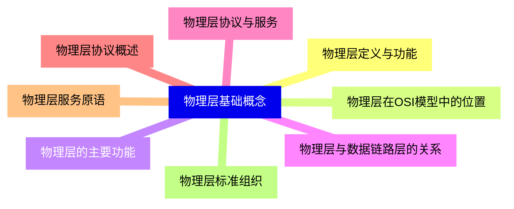
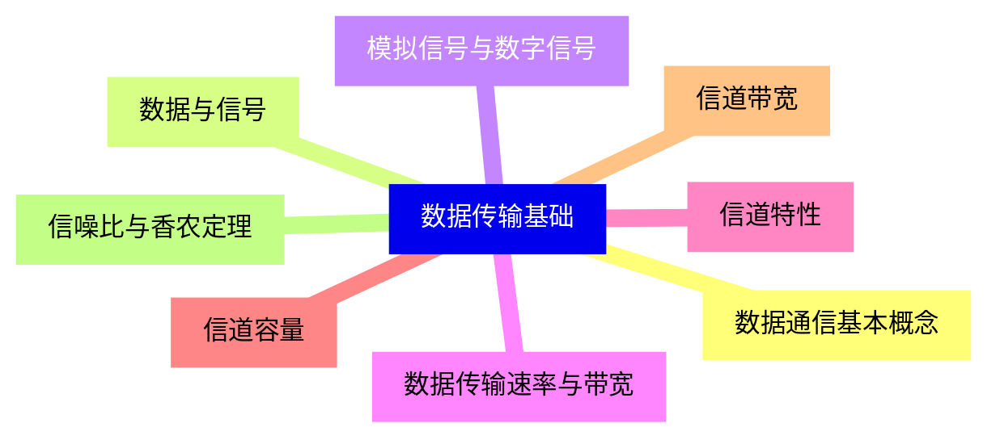
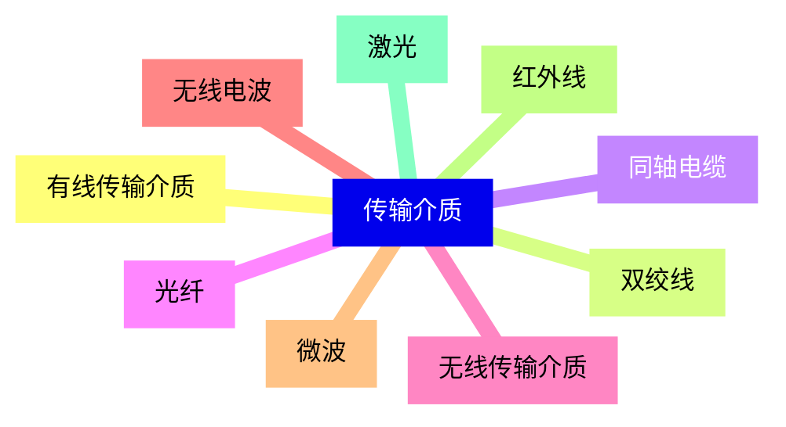
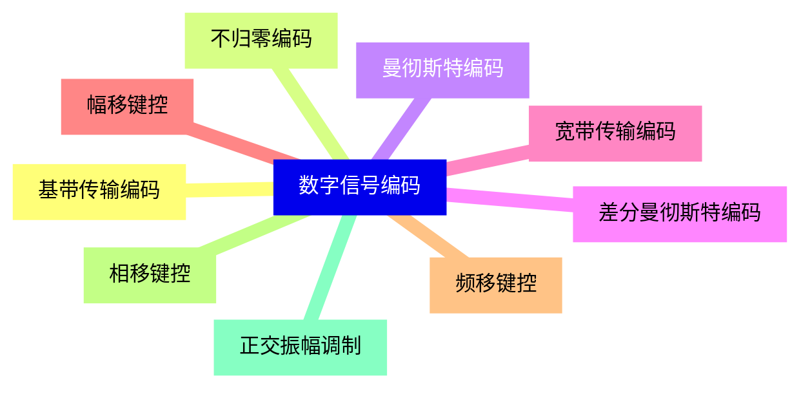
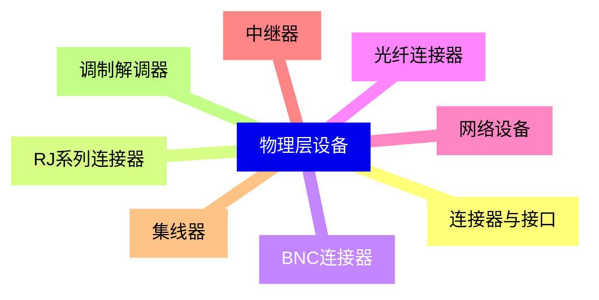
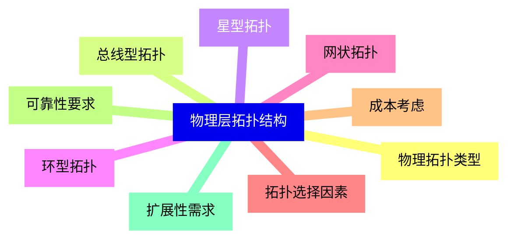
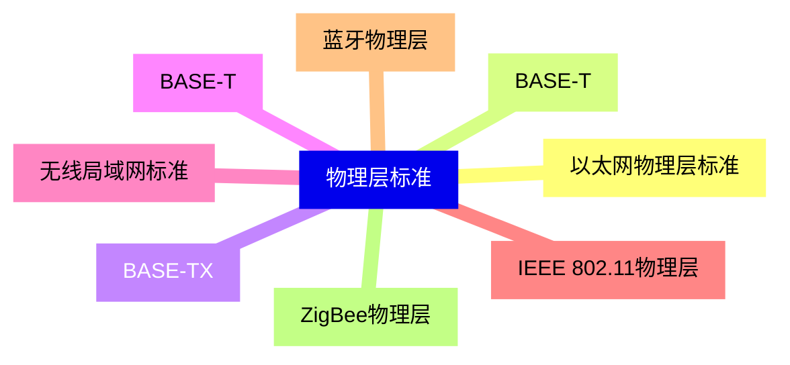
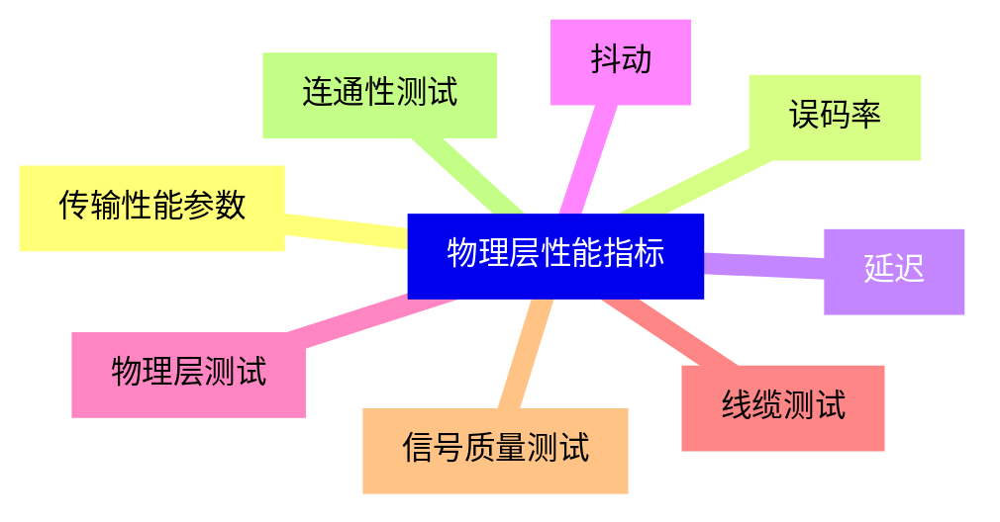
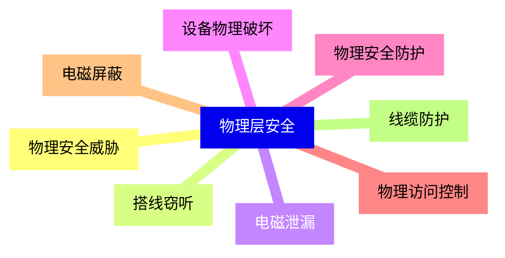
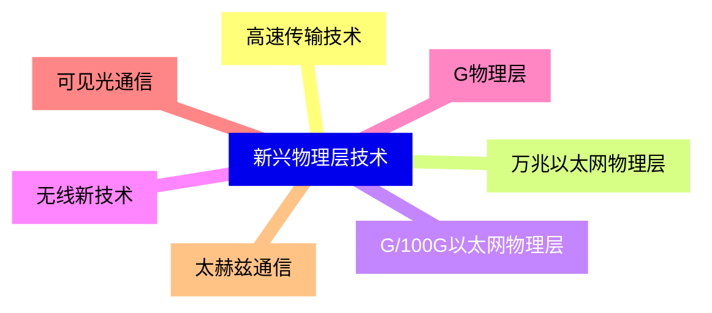


### 1 [物理层基础概念](#1)
#### 1.1 [物理层定义与功能](#1)
#### 1.2 [物理层在OSI模型中的位置](#1)
#### 1.3 [物理层的主要功能](#1)
#### 1.4 [物理层与数据链路层的关系](#1)
#### 1.5 [物理层协议与服务](#1)
#### 1.6 [物理层协议概述](#1)
#### 1.7 [物理层服务原语](#1)
#### 1.8 [物理层标准组织](#1)
### 2 [数据传输基础](#2)
#### 2.1 [数据通信基本概念](#2)
#### 2.2 [数据与信号](#2)
#### 2.3 [模拟信号与数字信号](#2)
#### 2.4 [数据传输速率与带宽](#2)
#### 2.5 [信道特性](#2)
#### 2.6 [信道容量](#2)
#### 2.7 [信道带宽](#2)
#### 2.8 [信噪比与香农定理](#2)
### 3 [传输介质](#3)
#### 3.1 [有线传输介质](#3)
#### 3.2 [双绞线](#3)
#### 3.3 [同轴电缆](#3)
#### 3.4 [光纤](#3)
#### 3.5 [无线传输介质](#3)
#### 3.6 [无线电波](#3)
#### 3.7 [微波](#3)
#### 3.8 [红外线](#3)
#### 3.9 [激光](#3)
### 4 [数字信号编码](#4)
#### 4.1 [基带传输编码](#4)
#### 4.2 [不归零编码](#4)
#### 4.3 [曼彻斯特编码](#4)
#### 4.4 [差分曼彻斯特编码](#4)
#### 4.5 [宽带传输编码](#4)
#### 4.6 [幅移键控](#4)
#### 4.7 [频移键控](#4)
#### 4.8 [相移键控](#4)
#### 4.9 [正交振幅调制](#4)
### 5 [物理层设备](#5)
#### 5.1 [连接器与接口](#5)
#### 5.2 [RJ系列连接器](#5)
#### 5.3 [BNC连接器](#5)
#### 5.4 [光纤连接器](#5)
#### 5.5 [网络设备](#5)
#### 5.6 [中继器](#5)
#### 5.7 [集线器](#5)
#### 5.8 [调制解调器](#5)
### 6 [物理层拓扑结构](#6)
#### 6.1 [物理拓扑类型](#6)
#### 6.2 [总线型拓扑](#6)
#### 6.3 [星型拓扑](#6)
#### 6.4 [环型拓扑](#6)
#### 6.5 [网状拓扑](#6)
#### 6.6 [拓扑选择因素](#6)
#### 6.7 [成本考虑](#6)
#### 6.8 [可靠性要求](#6)
#### 6.9 [扩展性需求](#6)
### 7 [物理层标准](#7)
#### 7.1 [以太网物理层标准](#7)
#### 7.2 [BASE-T](#7)
#### 7.3 [BASE-TX](#7)
#### 7.4 [BASE-T](#7)
#### 7.5 [无线局域网标准](#7)
#### 7.6 [IEEE 802.11物理层](#7)
#### 7.7 [蓝牙物理层](#7)
#### 7.8 [ZigBee物理层](#7)
### 8 [物理层性能指标](#8)
#### 8.1 [传输性能参数](#8)
#### 8.2 [误码率](#8)
#### 8.3 [延迟](#8)
#### 8.4 [抖动](#8)
#### 8.5 [物理层测试](#8)
#### 8.6 [线缆测试](#8)
#### 8.7 [信号质量测试](#8)
#### 8.8 [连通性测试](#8)
### 9 [物理层安全](#9)
#### 9.1 [物理安全威胁](#9)
#### 9.2 [搭线窃听](#9)
#### 9.3 [电磁泄漏](#9)
#### 9.4 [设备物理破坏](#9)
#### 9.5 [物理安全防护](#9)
#### 9.6 [物理访问控制](#9)
#### 9.7 [电磁屏蔽](#9)
#### 9.8 [线缆防护](#9)
### 10 [新兴物理层技术](#10)
#### 10.1 [高速传输技术](#10)
#### 10.2 [万兆以太网物理层](#10)
#### 10.3 [G/100G以太网物理层](#10)
#### 10.4 [无线新技术](#10)
#### 10.5 [G物理层](#10)
#### 10.6 [可见光通信](#10)
#### 10.7 [太赫兹通信](#10)




### 1 物理层基础概念

---
### 1 物理层基础概念
___
#### 1.1 物理层定义与功能
___
#### 1.2 物理层在OSI模型中的位置
___
#### 1.3 物理层的主要功能
___
#### 1.4 物理层与数据链路层的关系
___
#### 1.5 物理层协议与服务
___
#### 1.6 物理层协议概述
___
#### 1.7 物理层服务原语
___
#### 1.8 物理层标准组织
### 2 数据传输基础

---
### 2 数据传输基础
___
#### 2.1 数据通信基本概念
___
#### 2.2 数据与信号
___
#### 2.3 模拟信号与数字信号
___
#### 2.4 数据传输速率与带宽
___
#### 2.5 信道特性
___
#### 2.6 信道容量
___
#### 2.7 信道带宽
___
#### 2.8 信噪比与香农定理
### 3 传输介质

---
### 3 传输介质
___
#### 3.1 有线传输介质
___
#### 3.2 双绞线
___
#### 3.3 同轴电缆
___
#### 3.4 光纤
___
#### 3.5 无线传输介质
___
#### 3.6 无线电波
___
#### 3.7 微波
___
#### 3.8 红外线
___
#### 3.9 激光
### 4 数字信号编码

---
### 4 数字信号编码
___
#### 4.1 基带传输编码
___
#### 4.2 不归零编码
___
#### 4.3 曼彻斯特编码
___
#### 4.4 差分曼彻斯特编码
___
#### 4.5 宽带传输编码
___
#### 4.6 幅移键控
___
#### 4.7 频移键控
___
#### 4.8 相移键控
___
#### 4.9 正交振幅调制
### 5 物理层设备

---
### 5 物理层设备
___
#### 5.1 连接器与接口
___
#### 5.2 RJ系列连接器
___
#### 5.3 BNC连接器
___
#### 5.4 光纤连接器
___
#### 5.5 网络设备
___
#### 5.6 中继器
___
#### 5.7 集线器
___
#### 5.8 调制解调器
### 6 物理层拓扑结构

---
### 6 物理层拓扑结构
___
#### 6.1 物理拓扑类型
___
#### 6.2 总线型拓扑
___
#### 6.3 星型拓扑
___
#### 6.4 环型拓扑
___
#### 6.5 网状拓扑
___
#### 6.6 拓扑选择因素
___
#### 6.7 成本考虑
___
#### 6.8 可靠性要求
___
#### 6.9 扩展性需求
### 7 物理层标准

---
### 7 物理层标准
___
#### 7.1 以太网物理层标准
___
#### 7.2 BASE-T
___
#### 7.3 BASE-TX
___
#### 7.4 BASE-T
___
#### 7.5 无线局域网标准
___
#### 7.6 IEEE 802.11物理层
___
#### 7.7 蓝牙物理层
___
#### 7.8 ZigBee物理层
### 8 物理层性能指标

---
### 8 物理层性能指标
___
#### 8.1 传输性能参数
___
#### 8.2 误码率
___
#### 8.3 延迟
___
#### 8.4 抖动
___
#### 8.5 物理层测试
___
#### 8.6 线缆测试
___
#### 8.7 信号质量测试
___
#### 8.8 连通性测试
### 9 物理层安全

---
### 9 物理层安全
___
#### 9.1 物理安全威胁
___
#### 9.2 搭线窃听
___
#### 9.3 电磁泄漏
___
#### 9.4 设备物理破坏
___
#### 9.5 物理安全防护
___
#### 9.6 物理访问控制
___
#### 9.7 电磁屏蔽
___
#### 9.8 线缆防护
### 10 新兴物理层技术

---
### 10 新兴物理层技术
___
#### 10.1 高速传输技术
___
#### 10.2 万兆以太网物理层
___
#### 10.3 G/100G以太网物理层
___
#### 10.4 无线新技术
___
#### 10.5 G物理层
___
#### 10.6 可见光通信
___
#### 10.7 太赫兹通信


### 1 物理层基础概念{#1}

{}

<--->
{}
{}
{}
{}
{}
{}
{}
{}
{}
{}
{}
{}
{}
{}
{}
{}
{}

### 2 数据传输基础{#2}

{}
{}
{}
{}
{}
{}
{}
{}
{}
{}
{}
{}
{}
{}
{}
{}
{}
<--->

{}

### 3 传输介质{#3}

{}

<--->
{}
{}
{}
{}
{}
{}
{}
{}
{}
{}
{}
{}
{}
{}
{}
{}
{}
{}
{}

### 4 数字信号编码{#4}

{}
{}
{}
{}
{}
{}
{}
{}
{}
{}
{}
{}
{}
{}
{}
{}
{}
{}
{}
<--->

{}

### 5 物理层设备{#5}

{}

<--->
{}
{}
{}
{}
{}
{}
{}
{}
{}
{}
{}
{}
{}
{}
{}
{}
{}

### 6 物理层拓扑结构{#6}

{}
{}
{}
{}
{}
{}
{}
{}
{}
{}
{}
{}
{}
{}
{}
{}
{}
{}
{}
<--->

{}

### 7 物理层标准{#7}

{}

<--->
{}
{}
{}
{}
{}
{}
{}
{}
{}
{}
{}
{}
{}
{}
{}
{}
{}

### 8 物理层性能指标{#8}

{}
{}
{}
{}
{}
{}
{}
{}
{}
{}
{}
{}
{}
{}
{}
{}
{}
<--->

{}

### 9 物理层安全{#9}

{}

<--->
{}
{}
{}
{}
{}
{}
{}
{}
{}
{}
{}
{}
{}
{}
{}
{}
{}

### 10 新兴物理层技术{#10}

{}
{}
{}
{}
{}
{}
{}
{}
{}
{}
{}
{}
{}
{}
{}
<--->

{}
