
### 1 [数据链路层概述](#1)
#### 1.1 [数据链路层的基本概念](#1)
#### 1.2 [定义与功能](#1)
#### 1.3 [在OSI和TCP/IP模型中的位置](#1)
#### 1.4 [与物理层和网络层的关系](#1)
#### 1.5 [数据链路层的作用](#1)
#### 1.6 [帧封装与解封装](#1)
#### 1.7 [错误检测与纠正](#1)
#### 1.8 [流量控制](#1)
#### 1.9 [介质访问控制](#1)
#### 1.10 [数据链路层的服务](#1)
#### 1.11 [无确认无连接服务](#1)
#### 1.12 [有确认无连接服务](#1)
#### 1.13 [面向连接服务](#1)
### 2 [成帧技术](#2)
#### 2.1 [成帧的基本原理](#2)
#### 2.2 [帧的结构：头部、数据部分、尾部](#2)
#### 2.3 [帧同步的重要性](#2)
#### 2.4 [常见的成帧方法](#2)
#### 2.5 [字符计数法](#2)
#### 2.6 [字节填充法 字符填充法](#2)
#### 2.7 [比特填充法 位填充法](#2)
#### 2.8 [物理层编码违例法](#2)
#### 2.9 [帧的定界与同步](#2)
#### 2.10 [起始和结束标志](#2)
#### 2.11 [帧间间隔处理](#2)
### 3 [错误控制](#3)
#### 3.1 [错误类型与原因](#3)
#### 3.2 [单比特错误](#3)
#### 3.3 [突发错误](#3)
#### 3.4 [噪声与干扰的影响](#3)
#### 3.5 [错误检测技术](#3)
#### 3.6 [奇偶校验](#3)
#### 3.7 [校验和](#3)
#### 3.8 [循环冗余校验 CRC](#3)
#### 3.9 [哈希函数在错误检测中的应用](#3)
#### 3.10 [错误纠正技术](#3)
#### 3.11 [前向纠错 FEC](#3)
#### 3.12 [海明码](#3)
#### 3.13 [自动重传请求 ARQ 机制](#3)
### 4 [流量控制](#4)
#### 4.1 [流量控制的基本概念](#4)
#### 4.2 [发送方与接收方速度不匹配问题](#4)
#### 4.3 [缓冲区管理](#4)
#### 4.4 [流量控制协议](#4)
#### 4.5 [停止等待协议](#4)
#### 4.6 [滑动窗口协议](#4)
#### 4.7 [回退N帧 GBN 协议](#4)
#### 4.8 [选择性重传 SR 协议](#4)
#### 4.9 [流量控制实现机制](#4)
#### 4.10 [窗口大小调整](#4)
#### 4.11 [确认机制](#4)
#### 4.12 [超时与重传](#4)
### 5 [介质访问控制 MAC 子层](#5)
#### 5.1 [MAC子层概述](#5)
#### 5.2 [MAC地址与帧格式](#5)
#### 5.3 [MAC子层功能](#5)
#### 5.4 [信道分配问题](#5)
#### 5.5 [静态信道分配](#5)
#### 5.6 [动态信道分配](#5)
#### 5.7 [多路访问协议](#5)
#### 5.8 [ALOHA协议](#5)
#### 5.9 [载波侦听多路访问 CSMA](#5)
#### 5.10 [带冲突检测的CSMA CSMA/CD](#5)
#### 5.11 [带冲突避免的CSMA CSMA/CA](#5)
#### 5.12 [轮询协议](#5)
#### 5.13 [令牌传递协议](#5)
#### 5.14 [以太网MAC协议](#5)
#### 5.15 [IEEE 802.3标准](#5)
#### 5.16 [以太网帧结构](#5)
#### 5.17 [MAC地址格式与分配](#5)
### 6 [数据链路层协议实例](#6)
#### 6.1 [高级数据链路控制 HDLC](#6)
#### 6.2 [HDLC帧结构](#6)
#### 6.3 [HDLC操作模式](#6)
#### 6.4 [HDLC在广域网中的应用](#6)
#### 6.5 [点对点协议 PPP](#6)
#### 6.6 [PPP帧格式](#6)
#### 6.7 [PPP链路建立过程](#6)
#### 6.8 [PPP认证协议 PAP和CHAP](#6)
#### 6.9 [PPP在多协议环境中的应用](#6)
#### 6.10 [其他数据链路层协议](#6)
#### 6.11 [帧中继](#6)
#### 6.12 [异步传输模式 ATM](#6)
#### 6.13 [无线局域网 WLAN 协议](#6)
### 7 [局域网技术](#7)
#### 7.1 [局域网概述](#7)
#### 7.2 [局域网拓扑结构](#7)
#### 7.3 [局域网标准 IEEE 802系列](#7)
#### 7.4 [以太网技术](#7)
#### 7.5 [传统以太网](#7)
#### 7.6 [快速以太网](#7)
#### 7.7 [千兆以太网](#7)
#### 7.8 [万兆以太网](#7)
#### 7.9 [无线局域网](#7)
#### 7.10 [IEEE 802.11标准](#7)
#### 7.11 [Wi-Fi技术](#7)
#### 7.12 [无线MAC协议](#7)
#### 7.13 [虚拟局域网 VLAN](#7)
#### 7.14 [VLAN概念与优势](#7)
#### 7.15 [VLAN划分方法](#7)
#### 7.16 [VLAN间路由](#7)
### 8 [数据链路层交换](#8)
#### 8.1 [网桥工作原理](#8)
#### 8.2 [透明网桥](#8)
#### 8.3 [源路由网桥](#8)
#### 8.4 [生成树协议 STP](#8)
#### 8.5 [交换机技术](#8)
#### 8.6 [交换机工作原理](#8)
#### 8.7 [交换机与集线器的区别](#8)
#### 8.8 [交换机转发方式：存储转发、直通转发](#8)
#### 8.9 [二层交换与三层交换](#8)
#### 8.10 [层交换机功能](#8)
#### 8.11 [层交换机功能](#8)
#### 8.12 [交换机的VLAN支持](#8)
### 9 [数据链路层安全](#9)
#### 9.1 [数据链路层安全威胁](#9)
#### 9.2 [MAC地址欺骗](#9)
#### 9.3 [ARP欺骗](#9)
#### 9.4 [VLAN跳跃攻击](#9)
#### 9.5 [安全机制与协议](#9)
#### 9.6 [端口安全](#9)
#### 9.7 [X认证](#9)
#### 9.8 [数据链路层加密](#9)
#### 9.9 [安全最佳实践](#9)
#### 9.10 [网络分段](#9)
#### 9.11 [交换机安全配置](#9)
#### 9.12 [监控与审计](#9)
### 10 [数据链路层性能分析](#10)
#### 10.1 [性能指标](#10)
#### 10.2 [吞吐量](#10)
#### 10.3 [延迟](#10)
#### 10.4 [带宽利用率](#10)
#### 10.5 [帧丢失率](#10)
#### 10.6 [性能优化技术](#10)
#### 10.7 [帧大小优化](#10)
#### 10.8 [流量整形](#10)
#### 10.9 [拥塞控制](#10)
#### 10.10 [性能监控工具](#10)
#### 10.11 [网络分析器](#10)
#### 10.12 [协议分析器](#10)
#### 10.13 [性能监控软件](#10)
### 11 [新兴技术与趋势](#11)
#### 11.1 [软件定义网络 SDN](#11)
#### 11.2 [SDN对数据链路层的影响](#11)
#### 11.3 [OpenFlow协议](#11)
#### 11.4 [网络功能虚拟化 NFV](#11)
#### 11.5 [NFV在数据链路层的应用](#11)
#### 11.6 [虚拟交换机技术](#11)
#### 11.7 [物联网 IoT 中的数据链路层](#11)
#### 11.8 [低功耗广域网 LPWAN](#11)
#### 11.9 [物联网专用协议 如LoRaWAN、NB-IoT](#11)
#### 11.10 [G网络中的数据链路层](#11)
#### 11.11 [G新空口技术](#11)
#### 11.12 [G数据链路层特点](#11)




### 1 数据链路层概述

---
### 1 数据链路层概述
___
#### 1.1 数据链路层的基本概念
___
#### 1.2 定义与功能
___
#### 1.3 在OSI和TCP/IP模型中的位置
___
#### 1.4 与物理层和网络层的关系
___
#### 1.5 数据链路层的作用
___
#### 1.6 帧封装与解封装
___
#### 1.7 错误检测与纠正
___
#### 1.8 流量控制
___
#### 1.9 介质访问控制
___
#### 1.10 数据链路层的服务
___
#### 1.11 无确认无连接服务
___
#### 1.12 有确认无连接服务
___
#### 1.13 面向连接服务
### 2 成帧技术

---
### 2 成帧技术
___
#### 2.1 成帧的基本原理
___
#### 2.2 帧的结构：头部、数据部分、尾部
___
#### 2.3 帧同步的重要性
___
#### 2.4 常见的成帧方法
___
#### 2.5 字符计数法
___
#### 2.6 字节填充法 字符填充法
___
#### 2.7 比特填充法 位填充法
___
#### 2.8 物理层编码违例法
___
#### 2.9 帧的定界与同步
___
#### 2.10 起始和结束标志
___
#### 2.11 帧间间隔处理
### 3 错误控制

---
### 3 错误控制
___
#### 3.1 错误类型与原因
___
#### 3.2 单比特错误
___
#### 3.3 突发错误
___
#### 3.4 噪声与干扰的影响
___
#### 3.5 错误检测技术
___
#### 3.6 奇偶校验
___
#### 3.7 校验和
___
#### 3.8 循环冗余校验 CRC
___
#### 3.9 哈希函数在错误检测中的应用
___
#### 3.10 错误纠正技术
___
#### 3.11 前向纠错 FEC
___
#### 3.12 海明码
___
#### 3.13 自动重传请求 ARQ 机制
### 4 流量控制

---
### 4 流量控制
___
#### 4.1 流量控制的基本概念
___
#### 4.2 发送方与接收方速度不匹配问题
___
#### 4.3 缓冲区管理
___
#### 4.4 流量控制协议
___
#### 4.5 停止等待协议
___
#### 4.6 滑动窗口协议
___
#### 4.7 回退N帧 GBN 协议
___
#### 4.8 选择性重传 SR 协议
___
#### 4.9 流量控制实现机制
___
#### 4.10 窗口大小调整
___
#### 4.11 确认机制
___
#### 4.12 超时与重传
### 5 介质访问控制 MAC 子层

---
### 5 介质访问控制 MAC 子层
___
#### 5.1 MAC子层概述
___
#### 5.2 MAC地址与帧格式
___
#### 5.3 MAC子层功能
___
#### 5.4 信道分配问题
___
#### 5.5 静态信道分配
___
#### 5.6 动态信道分配
___
#### 5.7 多路访问协议
___
#### 5.8 ALOHA协议
___
#### 5.9 载波侦听多路访问 CSMA
___
#### 5.10 带冲突检测的CSMA CSMA/CD
___
#### 5.11 带冲突避免的CSMA CSMA/CA
___
#### 5.12 轮询协议
___
#### 5.13 令牌传递协议
___
#### 5.14 以太网MAC协议
___
#### 5.15 IEEE 802.3标准
___
#### 5.16 以太网帧结构
___
#### 5.17 MAC地址格式与分配
### 6 数据链路层协议实例

---
### 6 数据链路层协议实例
___
#### 6.1 高级数据链路控制 HDLC
___
#### 6.2 HDLC帧结构
___
#### 6.3 HDLC操作模式
___
#### 6.4 HDLC在广域网中的应用
___
#### 6.5 点对点协议 PPP
___
#### 6.6 PPP帧格式
___
#### 6.7 PPP链路建立过程
___
#### 6.8 PPP认证协议 PAP和CHAP
___
#### 6.9 PPP在多协议环境中的应用
___
#### 6.10 其他数据链路层协议
___
#### 6.11 帧中继
___
#### 6.12 异步传输模式 ATM
___
#### 6.13 无线局域网 WLAN 协议
### 7 局域网技术

---
### 7 局域网技术
___
#### 7.1 局域网概述
___
#### 7.2 局域网拓扑结构
___
#### 7.3 局域网标准 IEEE 802系列
___
#### 7.4 以太网技术
___
#### 7.5 传统以太网
___
#### 7.6 快速以太网
___
#### 7.7 千兆以太网
___
#### 7.8 万兆以太网
___
#### 7.9 无线局域网
___
#### 7.10 IEEE 802.11标准
___
#### 7.11 Wi-Fi技术
___
#### 7.12 无线MAC协议
___
#### 7.13 虚拟局域网 VLAN
___
#### 7.14 VLAN概念与优势
___
#### 7.15 VLAN划分方法
___
#### 7.16 VLAN间路由
### 8 数据链路层交换

---
### 8 数据链路层交换
___
#### 8.1 网桥工作原理
___
#### 8.2 透明网桥
___
#### 8.3 源路由网桥
___
#### 8.4 生成树协议 STP
___
#### 8.5 交换机技术
___
#### 8.6 交换机工作原理
___
#### 8.7 交换机与集线器的区别
___
#### 8.8 交换机转发方式：存储转发、直通转发
___
#### 8.9 二层交换与三层交换
___
#### 8.10 层交换机功能
___
#### 8.11 层交换机功能
___
#### 8.12 交换机的VLAN支持
### 9 数据链路层安全

---
### 9 数据链路层安全
___
#### 9.1 数据链路层安全威胁
___
#### 9.2 MAC地址欺骗
___
#### 9.3 ARP欺骗
___
#### 9.4 VLAN跳跃攻击
___
#### 9.5 安全机制与协议
___
#### 9.6 端口安全
___
#### 9.7 X认证
___
#### 9.8 数据链路层加密
___
#### 9.9 安全最佳实践
___
#### 9.10 网络分段
___
#### 9.11 交换机安全配置
___
#### 9.12 监控与审计
### 10 数据链路层性能分析

---
### 10 数据链路层性能分析
___
#### 10.1 性能指标
___
#### 10.2 吞吐量
___
#### 10.3 延迟
___
#### 10.4 带宽利用率
___
#### 10.5 帧丢失率
___
#### 10.6 性能优化技术
___
#### 10.7 帧大小优化
___
#### 10.8 流量整形
___
#### 10.9 拥塞控制
___
#### 10.10 性能监控工具
___
#### 10.11 网络分析器
___
#### 10.12 协议分析器
___
#### 10.13 性能监控软件
### 11 新兴技术与趋势

---
### 11 新兴技术与趋势
___
#### 11.1 软件定义网络 SDN
___
#### 11.2 SDN对数据链路层的影响
___
#### 11.3 OpenFlow协议
___
#### 11.4 网络功能虚拟化 NFV
___
#### 11.5 NFV在数据链路层的应用
___
#### 11.6 虚拟交换机技术
___
#### 11.7 物联网 IoT 中的数据链路层
___
#### 11.8 低功耗广域网 LPWAN
___
#### 11.9 物联网专用协议 如LoRaWAN、NB-IoT
___
#### 11.10 G网络中的数据链路层
___
#### 11.11 G新空口技术
___
#### 11.12 G数据链路层特点


### 1 数据链路层概述{#1}

{}
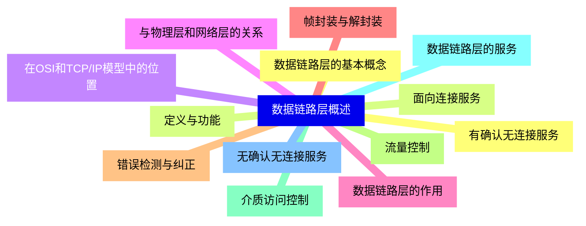

<--->
{}
{}
{}
{}
{}
{}
{}
{}
{}
{}
{}
{}
{}
{}
{}
{}
{}
{}
{}
{}
{}
{}
{}
{}
{}
{}
{}

### 2 成帧技术{#2}

{}
{}
{}
{}
{}
{}
{}
{}
{}
{}
{}
{}
{}
{}
{}
{}
{}
{}
{}
{}
{}
{}
{}
<--->
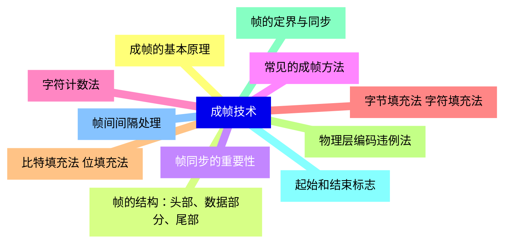

{}

### 3 错误控制{#3}

{}
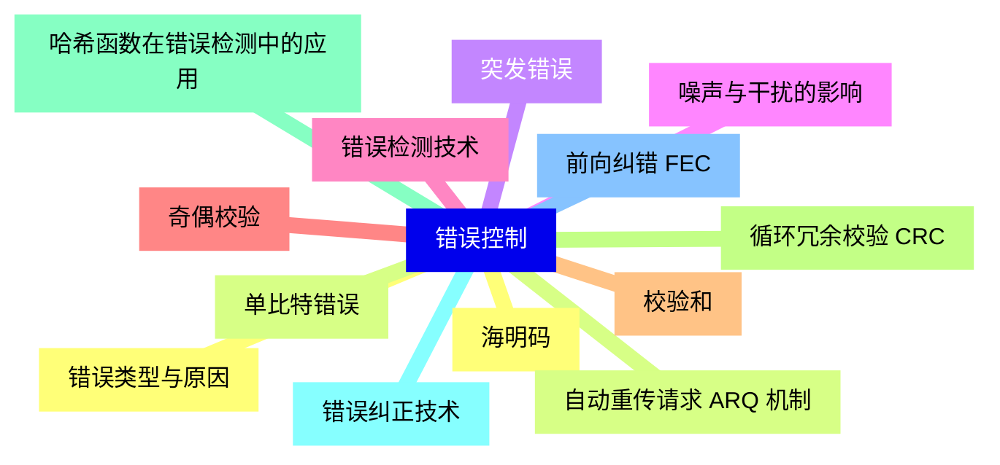

<--->
{}
{}
{}
{}
{}
{}
{}
{}
{}
{}
{}
{}
{}
{}
{}
{}
{}
{}
{}
{}
{}
{}
{}
{}
{}
{}
{}

### 4 流量控制{#4}

{}
{}
{}
{}
{}
{}
{}
{}
{}
{}
{}
{}
{}
{}
{}
{}
{}
{}
{}
{}
{}
{}
{}
{}
{}
<--->
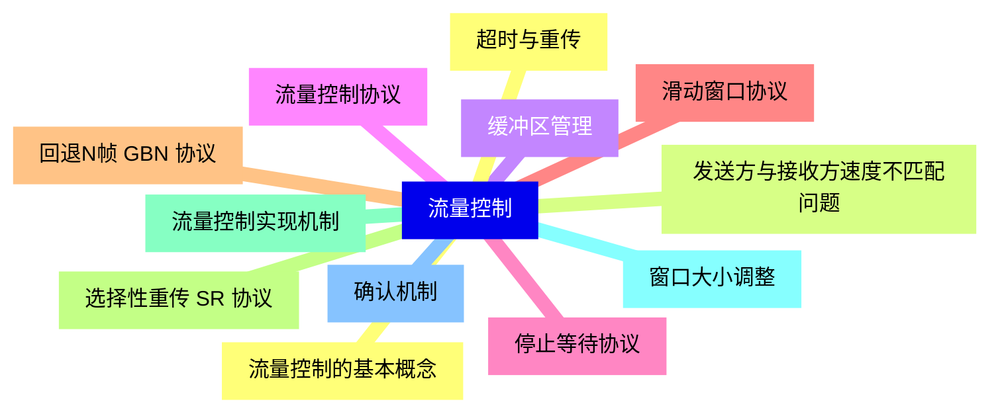

{}

### 5 介质访问控制 MAC 子层{#5}

{}
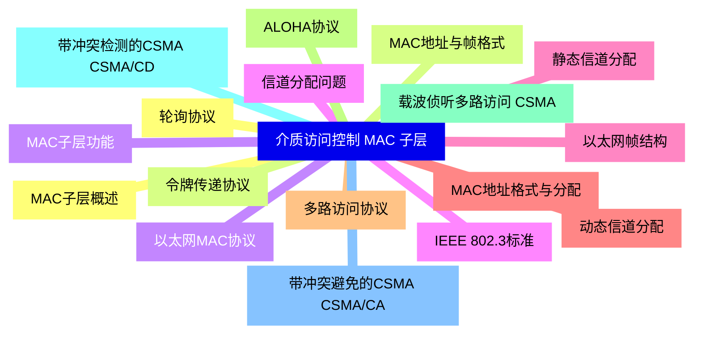

<--->
{}
{}
{}
{}
{}
{}
{}
{}
{}
{}
{}
{}
{}
{}
{}
{}
{}
{}
{}
{}
{}
{}
{}
{}
{}
{}
{}
{}
{}
{}
{}
{}
{}
{}
{}

### 6 数据链路层协议实例{#6}

{}
{}
{}
{}
{}
{}
{}
{}
{}
{}
{}
{}
{}
{}
{}
{}
{}
{}
{}
{}
{}
{}
{}
{}
{}
{}
{}
<--->
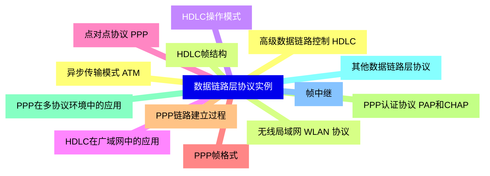

{}

### 7 局域网技术{#7}

{}
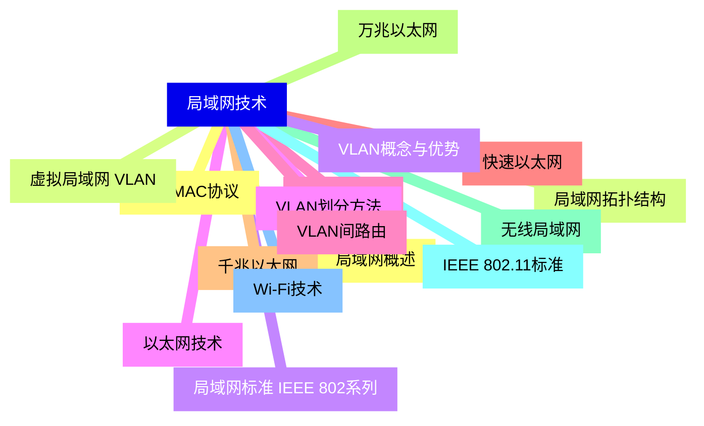

<--->
{}
{}
{}
{}
{}
{}
{}
{}
{}
{}
{}
{}
{}
{}
{}
{}
{}
{}
{}
{}
{}
{}
{}
{}
{}
{}
{}
{}
{}
{}
{}
{}
{}

### 8 数据链路层交换{#8}

{}
{}
{}
{}
{}
{}
{}
{}
{}
{}
{}
{}
{}
{}
{}
{}
{}
{}
{}
{}
{}
{}
{}
{}
{}
<--->
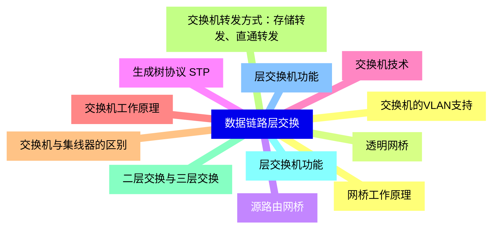

{}

### 9 数据链路层安全{#9}

{}
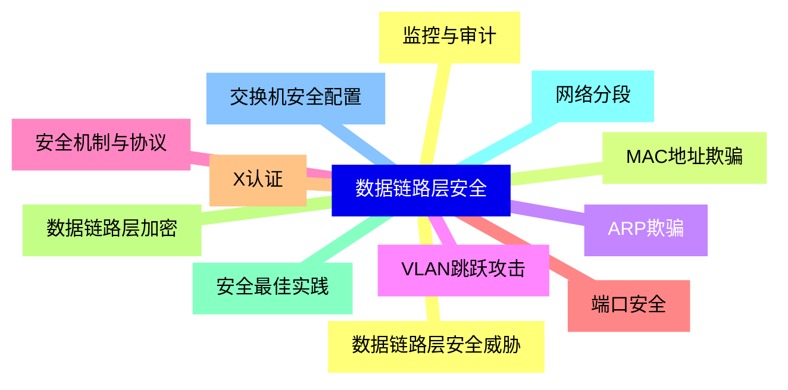

<--->
{}
{}
{}
{}
{}
{}
{}
{}
{}
{}
{}
{}
{}
{}
{}
{}
{}
{}
{}
{}
{}
{}
{}
{}
{}

### 10 数据链路层性能分析{#10}

{}
{}
{}
{}
{}
{}
{}
{}
{}
{}
{}
{}
{}
{}
{}
{}
{}
{}
{}
{}
{}
{}
{}
{}
{}
{}
{}
<--->
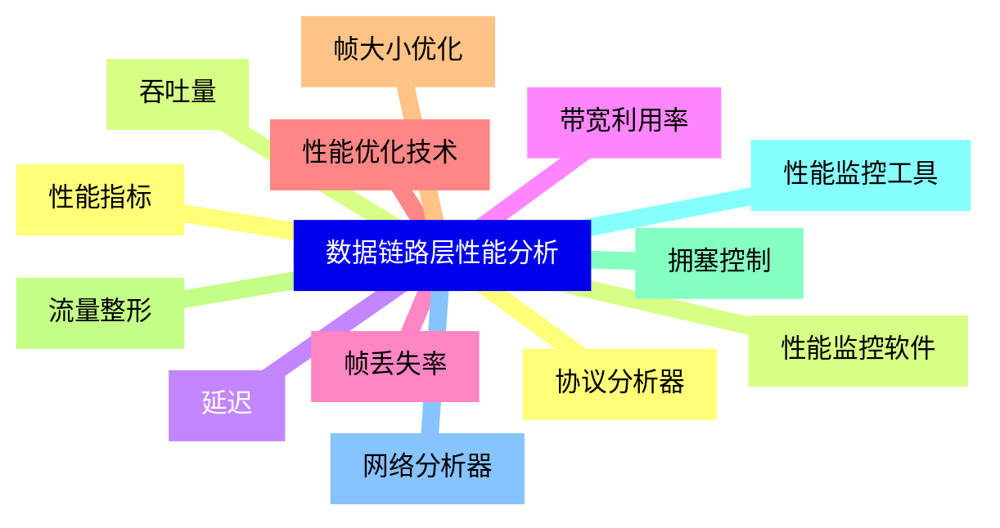

{}

### 11 新兴技术与趋势{#11}

{}
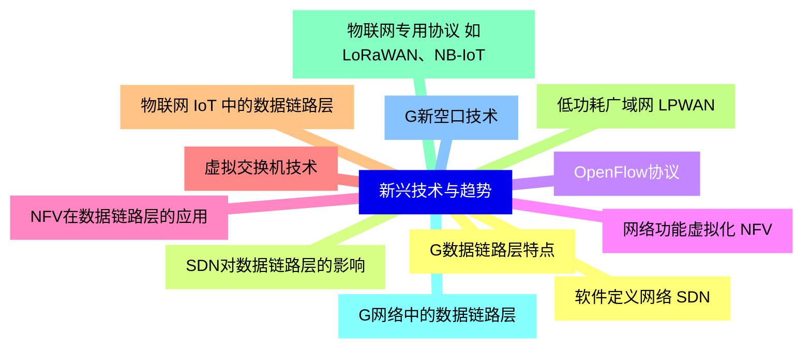

<--->
{}
{}
{}
{}
{}
{}
{}
{}
{}
{}
{}
{}
{}
{}
{}
{}
{}
{}
{}
{}
{}
{}
{}
{}
{}
