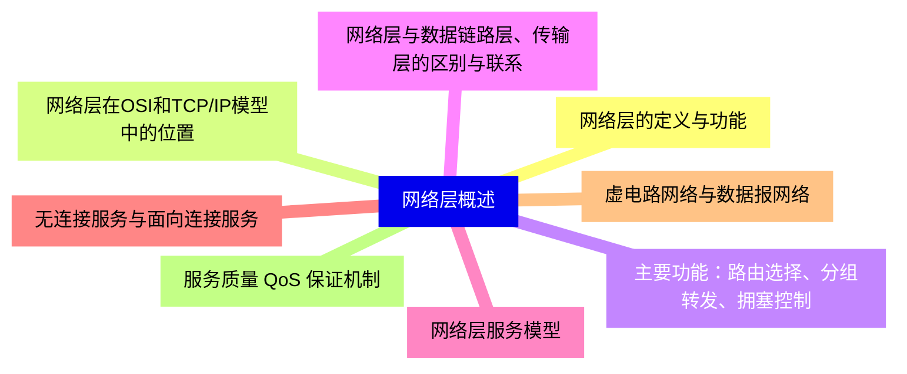
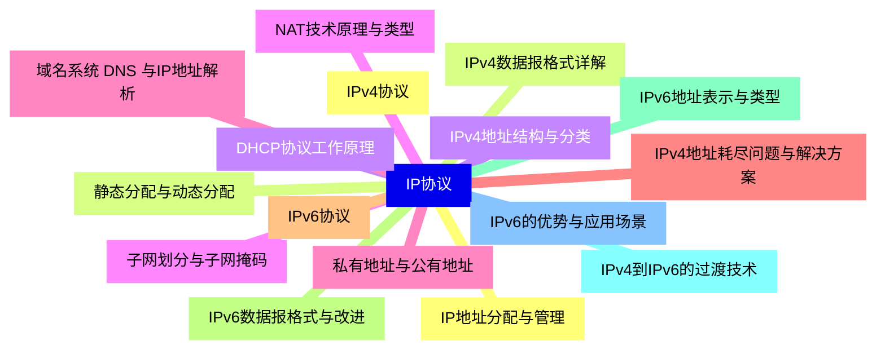
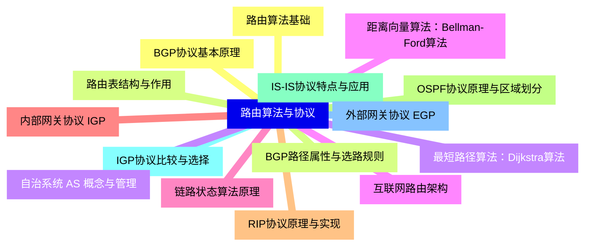
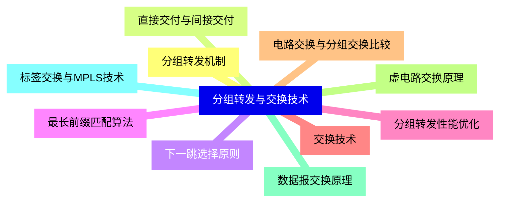
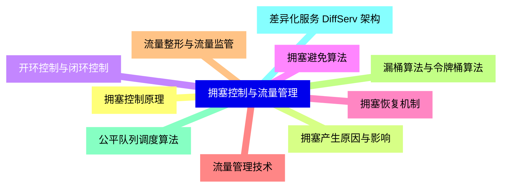
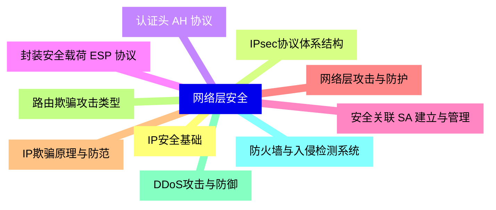
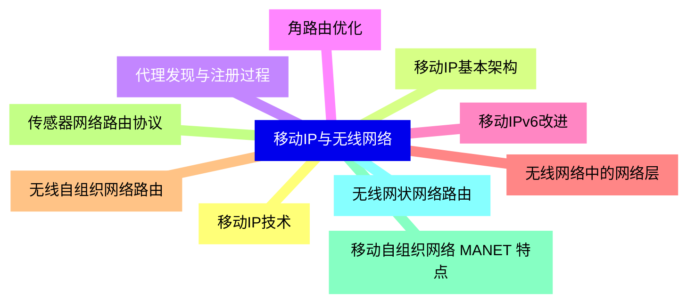
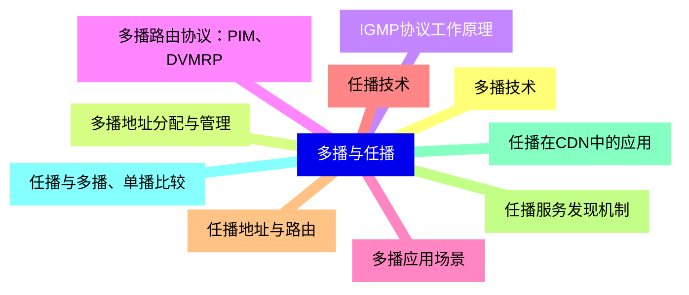
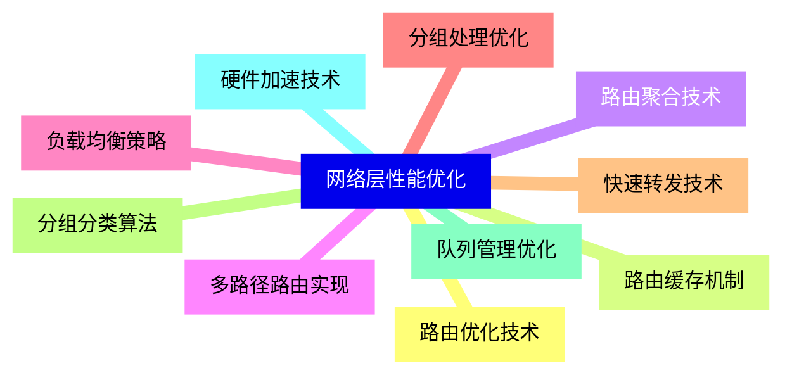
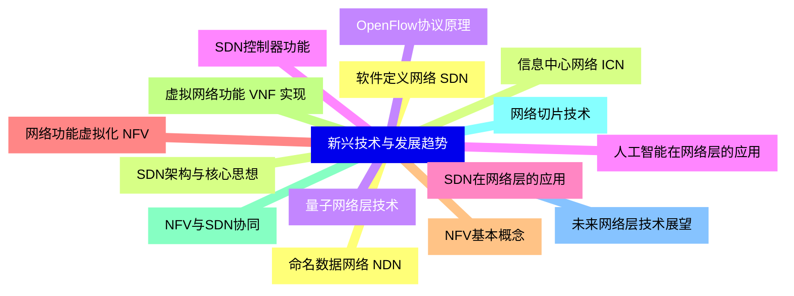


### 1 [网络层概述](#1)
#### 1.1 [网络层的定义与功能](#1)
#### 1.2 [网络层在OSI和TCP/IP模型中的位置](#1)
#### 1.3 [主要功能：路由选择、分组转发、拥塞控制](#1)
#### 1.4 [网络层与数据链路层、传输层的区别与联系](#1)
#### 1.5 [网络层服务模型](#1)
#### 1.6 [无连接服务与面向连接服务](#1)
#### 1.7 [虚电路网络与数据报网络](#1)
#### 1.8 [服务质量 QoS 保证机制](#1)
### 2 [IP协议](#2)
#### 2.1 [IPv4协议](#2)
#### 2.2 [IPv4数据报格式详解](#2)
#### 2.3 [IPv4地址结构与分类](#2)
#### 2.4 [子网划分与子网掩码](#2)
#### 2.5 [私有地址与公有地址](#2)
#### 2.6 [IPv4地址耗尽问题与解决方案](#2)
#### 2.7 [IPv6协议](#2)
#### 2.8 [IPv6数据报格式与改进](#2)
#### 2.9 [IPv6地址表示与类型](#2)
#### 2.10 [IPv4到IPv6的过渡技术](#2)
#### 2.11 [IPv6的优势与应用场景](#2)
#### 2.12 [IP地址分配与管理](#2)
#### 2.13 [静态分配与动态分配](#2)
#### 2.14 [DHCP协议工作原理](#2)
#### 2.15 [NAT技术原理与类型](#2)
#### 2.16 [域名系统 DNS 与IP地址解析](#2)
### 3 [路由算法与协议](#3)
#### 3.1 [路由算法基础](#3)
#### 3.2 [路由表结构与作用](#3)
#### 3.3 [最短路径算法：Dijkstra算法](#3)
#### 3.4 [距离向量算法：Bellman-Ford算法](#3)
#### 3.5 [链路状态算法原理](#3)
#### 3.6 [内部网关协议 IGP](#3)
#### 3.7 [RIP协议原理与实现](#3)
#### 3.8 [OSPF协议原理与区域划分](#3)
#### 3.9 [IS-IS协议特点与应用](#3)
#### 3.10 [IGP协议比较与选择](#3)
#### 3.11 [外部网关协议 EGP](#3)
#### 3.12 [BGP协议基本原理](#3)
#### 3.13 [BGP路径属性与选路规则](#3)
#### 3.14 [自治系统 AS 概念与管理](#3)
#### 3.15 [互联网路由架构](#3)
### 4 [分组转发与交换技术](#4)
#### 4.1 [分组转发机制](#4)
#### 4.2 [直接交付与间接交付](#4)
#### 4.3 [下一跳选择原则](#4)
#### 4.4 [最长前缀匹配算法](#4)
#### 4.5 [分组转发性能优化](#4)
#### 4.6 [交换技术](#4)
#### 4.7 [电路交换与分组交换比较](#4)
#### 4.8 [虚电路交换原理](#4)
#### 4.9 [数据报交换原理](#4)
#### 4.10 [标签交换与MPLS技术](#4)
### 5 [拥塞控制与流量管理](#5)
#### 5.1 [拥塞控制原理](#5)
#### 5.2 [拥塞产生原因与影响](#5)
#### 5.3 [开环控制与闭环控制](#5)
#### 5.4 [拥塞避免算法](#5)
#### 5.5 [拥塞恢复机制](#5)
#### 5.6 [流量管理技术](#5)
#### 5.7 [流量整形与流量监管](#5)
#### 5.8 [漏桶算法与令牌桶算法](#5)
#### 5.9 [公平队列调度算法](#5)
#### 5.10 [差异化服务 DiffServ 架构](#5)
### 6 [网络层安全](#6)
#### 6.1 [IP安全基础](#6)
#### 6.2 [IPsec协议体系结构](#6)
#### 6.3 [认证头 AH 协议](#6)
#### 6.4 [封装安全载荷 ESP 协议](#6)
#### 6.5 [安全关联 SA 建立与管理](#6)
#### 6.6 [网络层攻击与防护](#6)
#### 6.7 [IP欺骗原理与防范](#6)
#### 6.8 [路由欺骗攻击类型](#6)
#### 6.9 [DDoS攻击与防御](#6)
#### 6.10 [防火墙与入侵检测系统](#6)
### 7 [移动IP与无线网络](#7)
#### 7.1 [移动IP技术](#7)
#### 7.2 [移动IP基本架构](#7)
#### 7.3 [代理发现与注册过程](#7)
#### 7.4 [角路由优化](#7)
#### 7.5 [移动IPv6改进](#7)
#### 7.6 [无线网络中的网络层](#7)
#### 7.7 [无线自组织网络路由](#7)
#### 7.8 [传感器网络路由协议](#7)
#### 7.9 [移动自组织网络 MANET 特点](#7)
#### 7.10 [无线网状网络路由](#7)
### 8 [多播与任播](#8)
#### 8.1 [多播技术](#8)
#### 8.2 [多播地址分配与管理](#8)
#### 8.3 [IGMP协议工作原理](#8)
#### 8.4 [多播路由协议：PIM、DVMRP](#8)
#### 8.5 [多播应用场景](#8)
#### 8.6 [任播技术](#8)
#### 8.7 [任播地址与路由](#8)
#### 8.8 [任播服务发现机制](#8)
#### 8.9 [任播在CDN中的应用](#8)
#### 8.10 [任播与多播、单播比较](#8)
### 9 [网络层性能优化](#9)
#### 9.1 [路由优化技术](#9)
#### 9.2 [路由缓存机制](#9)
#### 9.3 [路由聚合技术](#9)
#### 9.4 [多路径路由实现](#9)
#### 9.5 [负载均衡策略](#9)
#### 9.6 [分组处理优化](#9)
#### 9.7 [快速转发技术](#9)
#### 9.8 [分组分类算法](#9)
#### 9.9 [队列管理优化](#9)
#### 9.10 [硬件加速技术](#9)
### 10 [新兴技术与发展趋势](#10)
#### 10.1 [软件定义网络 SDN](#10)
#### 10.2 [SDN架构与核心思想](#10)
#### 10.3 [OpenFlow协议原理](#10)
#### 10.4 [SDN控制器功能](#10)
#### 10.5 [SDN在网络层的应用](#10)
#### 10.6 [网络功能虚拟化 NFV](#10)
#### 10.7 [NFV基本概念](#10)
#### 10.8 [虚拟网络功能 VNF 实现](#10)
#### 10.9 [NFV与SDN协同](#10)
#### 10.10 [网络切片技术](#10)
#### 10.11 [未来网络层技术展望](#10)
#### 10.12 [命名数据网络 NDN](#10)
#### 10.13 [信息中心网络 ICN](#10)
#### 10.14 [量子网络层技术](#10)
#### 10.15 [人工智能在网络层的应用](#10)




### 1 网络层概述

---
### 1 网络层概述
___
#### 1.1 网络层的定义与功能
___
#### 1.2 网络层在OSI和TCP/IP模型中的位置
___
#### 1.3 主要功能：路由选择、分组转发、拥塞控制
___
#### 1.4 网络层与数据链路层、传输层的区别与联系
___
#### 1.5 网络层服务模型
___
#### 1.6 无连接服务与面向连接服务
___
#### 1.7 虚电路网络与数据报网络
___
#### 1.8 服务质量 QoS 保证机制
### 2 IP协议

---
### 2 IP协议
___
#### 2.1 IPv4协议
___
#### 2.2 IPv4数据报格式详解
___
#### 2.3 IPv4地址结构与分类
___
#### 2.4 子网划分与子网掩码
___
#### 2.5 私有地址与公有地址
___
#### 2.6 IPv4地址耗尽问题与解决方案
___
#### 2.7 IPv6协议
___
#### 2.8 IPv6数据报格式与改进
___
#### 2.9 IPv6地址表示与类型
___
#### 2.10 IPv4到IPv6的过渡技术
___
#### 2.11 IPv6的优势与应用场景
___
#### 2.12 IP地址分配与管理
___
#### 2.13 静态分配与动态分配
___
#### 2.14 DHCP协议工作原理
___
#### 2.15 NAT技术原理与类型
___
#### 2.16 域名系统 DNS 与IP地址解析
### 3 路由算法与协议

---
### 3 路由算法与协议
___
#### 3.1 路由算法基础
___
#### 3.2 路由表结构与作用
___
#### 3.3 最短路径算法：Dijkstra算法
___
#### 3.4 距离向量算法：Bellman-Ford算法
___
#### 3.5 链路状态算法原理
___
#### 3.6 内部网关协议 IGP
___
#### 3.7 RIP协议原理与实现
___
#### 3.8 OSPF协议原理与区域划分
___
#### 3.9 IS-IS协议特点与应用
___
#### 3.10 IGP协议比较与选择
___
#### 3.11 外部网关协议 EGP
___
#### 3.12 BGP协议基本原理
___
#### 3.13 BGP路径属性与选路规则
___
#### 3.14 自治系统 AS 概念与管理
___
#### 3.15 互联网路由架构
### 4 分组转发与交换技术

---
### 4 分组转发与交换技术
___
#### 4.1 分组转发机制
___
#### 4.2 直接交付与间接交付
___
#### 4.3 下一跳选择原则
___
#### 4.4 最长前缀匹配算法
___
#### 4.5 分组转发性能优化
___
#### 4.6 交换技术
___
#### 4.7 电路交换与分组交换比较
___
#### 4.8 虚电路交换原理
___
#### 4.9 数据报交换原理
___
#### 4.10 标签交换与MPLS技术
### 5 拥塞控制与流量管理

---
### 5 拥塞控制与流量管理
___
#### 5.1 拥塞控制原理
___
#### 5.2 拥塞产生原因与影响
___
#### 5.3 开环控制与闭环控制
___
#### 5.4 拥塞避免算法
___
#### 5.5 拥塞恢复机制
___
#### 5.6 流量管理技术
___
#### 5.7 流量整形与流量监管
___
#### 5.8 漏桶算法与令牌桶算法
___
#### 5.9 公平队列调度算法
___
#### 5.10 差异化服务 DiffServ 架构
### 6 网络层安全

---
### 6 网络层安全
___
#### 6.1 IP安全基础
___
#### 6.2 IPsec协议体系结构
___
#### 6.3 认证头 AH 协议
___
#### 6.4 封装安全载荷 ESP 协议
___
#### 6.5 安全关联 SA 建立与管理
___
#### 6.6 网络层攻击与防护
___
#### 6.7 IP欺骗原理与防范
___
#### 6.8 路由欺骗攻击类型
___
#### 6.9 DDoS攻击与防御
___
#### 6.10 防火墙与入侵检测系统
### 7 移动IP与无线网络

---
### 7 移动IP与无线网络
___
#### 7.1 移动IP技术
___
#### 7.2 移动IP基本架构
___
#### 7.3 代理发现与注册过程
___
#### 7.4 角路由优化
___
#### 7.5 移动IPv6改进
___
#### 7.6 无线网络中的网络层
___
#### 7.7 无线自组织网络路由
___
#### 7.8 传感器网络路由协议
___
#### 7.9 移动自组织网络 MANET 特点
___
#### 7.10 无线网状网络路由
### 8 多播与任播

---
### 8 多播与任播
___
#### 8.1 多播技术
___
#### 8.2 多播地址分配与管理
___
#### 8.3 IGMP协议工作原理
___
#### 8.4 多播路由协议：PIM、DVMRP
___
#### 8.5 多播应用场景
___
#### 8.6 任播技术
___
#### 8.7 任播地址与路由
___
#### 8.8 任播服务发现机制
___
#### 8.9 任播在CDN中的应用
___
#### 8.10 任播与多播、单播比较
### 9 网络层性能优化

---
### 9 网络层性能优化
___
#### 9.1 路由优化技术
___
#### 9.2 路由缓存机制
___
#### 9.3 路由聚合技术
___
#### 9.4 多路径路由实现
___
#### 9.5 负载均衡策略
___
#### 9.6 分组处理优化
___
#### 9.7 快速转发技术
___
#### 9.8 分组分类算法
___
#### 9.9 队列管理优化
___
#### 9.10 硬件加速技术
### 10 新兴技术与发展趋势

---
### 10 新兴技术与发展趋势
___
#### 10.1 软件定义网络 SDN
___
#### 10.2 SDN架构与核心思想
___
#### 10.3 OpenFlow协议原理
___
#### 10.4 SDN控制器功能
___
#### 10.5 SDN在网络层的应用
___
#### 10.6 网络功能虚拟化 NFV
___
#### 10.7 NFV基本概念
___
#### 10.8 虚拟网络功能 VNF 实现
___
#### 10.9 NFV与SDN协同
___
#### 10.10 网络切片技术
___
#### 10.11 未来网络层技术展望
___
#### 10.12 命名数据网络 NDN
___
#### 10.13 信息中心网络 ICN
___
#### 10.14 量子网络层技术
___
#### 10.15 人工智能在网络层的应用


### 1 网络层概述{#1}

{}

<--->
{}
{}
{}
{}
{}
{}
{}
{}
{}
{}
{}
{}
{}
{}
{}
{}
{}

### 2 IP协议{#2}

{}
{}
{}
{}
{}
{}
{}
{}
{}
{}
{}
{}
{}
{}
{}
{}
{}
{}
{}
{}
{}
{}
{}
{}
{}
{}
{}
{}
{}
{}
{}
{}
{}
<--->

{}

### 3 路由算法与协议{#3}

{}

<--->
{}
{}
{}
{}
{}
{}
{}
{}
{}
{}
{}
{}
{}
{}
{}
{}
{}
{}
{}
{}
{}
{}
{}
{}
{}
{}
{}
{}
{}
{}
{}

### 4 分组转发与交换技术{#4}

{}
{}
{}
{}
{}
{}
{}
{}
{}
{}
{}
{}
{}
{}
{}
{}
{}
{}
{}
{}
{}
<--->

{}

### 5 拥塞控制与流量管理{#5}

{}

<--->
{}
{}
{}
{}
{}
{}
{}
{}
{}
{}
{}
{}
{}
{}
{}
{}
{}
{}
{}
{}
{}

### 6 网络层安全{#6}

{}
{}
{}
{}
{}
{}
{}
{}
{}
{}
{}
{}
{}
{}
{}
{}
{}
{}
{}
{}
{}
<--->

{}

### 7 移动IP与无线网络{#7}

{}

<--->
{}
{}
{}
{}
{}
{}
{}
{}
{}
{}
{}
{}
{}
{}
{}
{}
{}
{}
{}
{}
{}

### 8 多播与任播{#8}

{}
{}
{}
{}
{}
{}
{}
{}
{}
{}
{}
{}
{}
{}
{}
{}
{}
{}
{}
{}
{}
<--->

{}

### 9 网络层性能优化{#9}

{}

<--->
{}
{}
{}
{}
{}
{}
{}
{}
{}
{}
{}
{}
{}
{}
{}
{}
{}
{}
{}
{}
{}

### 10 新兴技术与发展趋势{#10}

{}
{}
{}
{}
{}
{}
{}
{}
{}
{}
{}
{}
{}
{}
{}
{}
{}
{}
{}
{}
{}
{}
{}
{}
{}
{}
{}
{}
{}
{}
{}
<--->

{}
