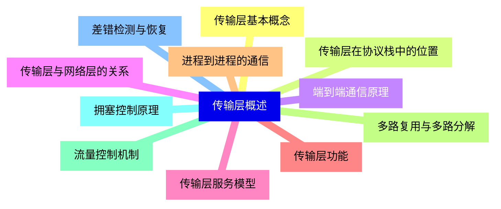
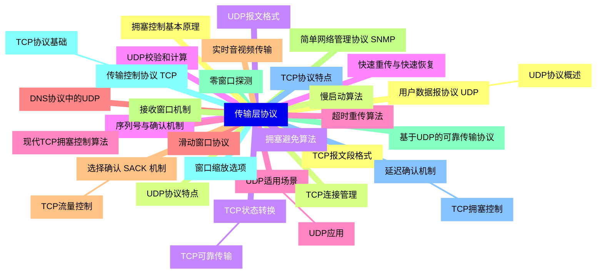
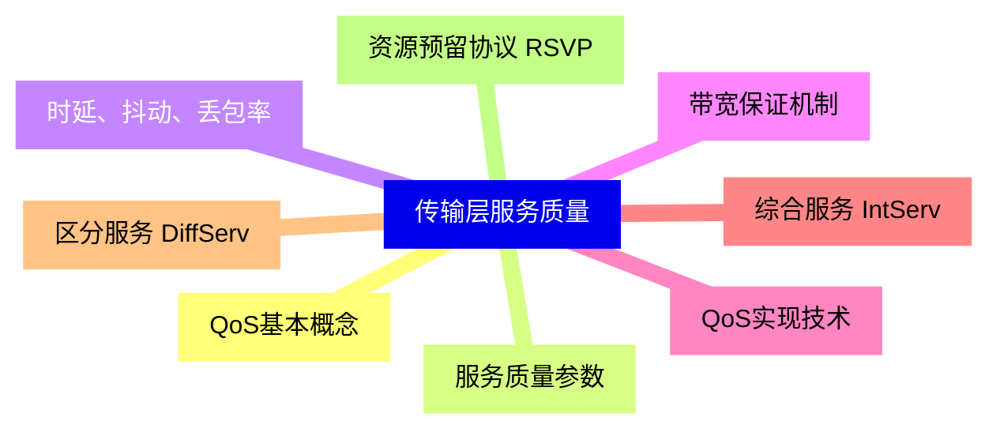
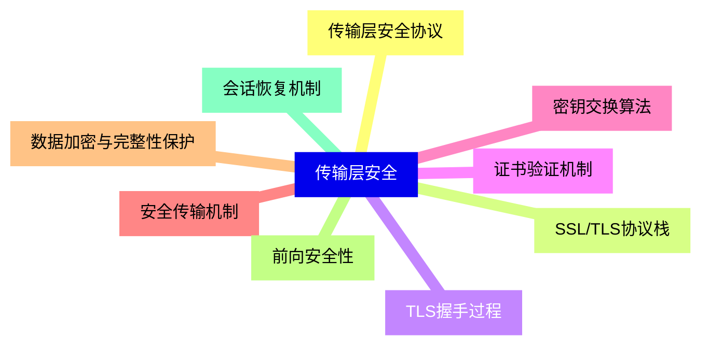
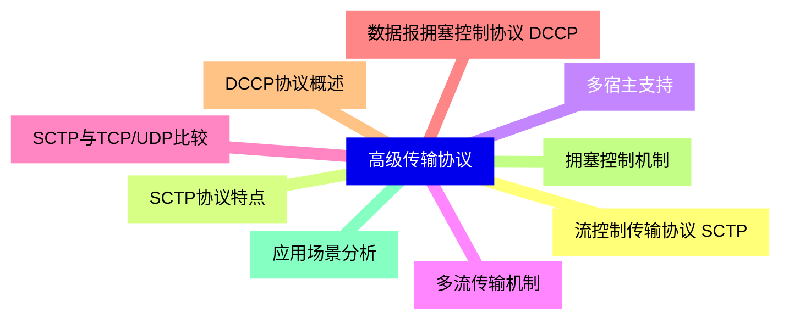
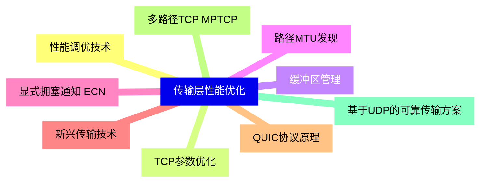
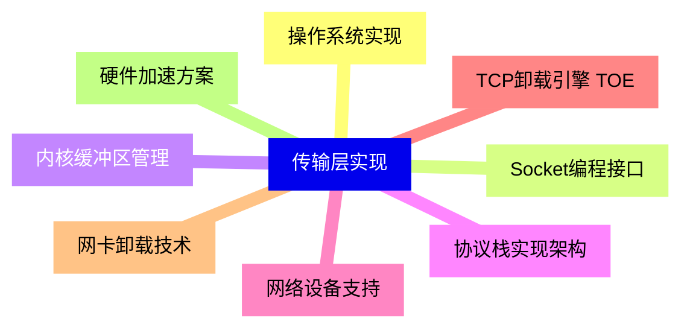
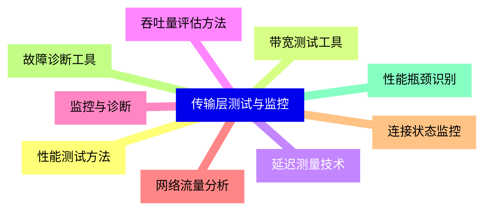


### 1 [传输层概述](#1)
#### 1.1 [传输层基本概念](#1)
#### 1.2 [传输层在协议栈中的位置](#1)
#### 1.3 [端到端通信原理](#1)
#### 1.4 [传输层与网络层的关系](#1)
#### 1.5 [传输层服务模型](#1)
#### 1.6 [传输层功能](#1)
#### 1.7 [进程到进程的通信](#1)
#### 1.8 [多路复用与多路分解](#1)
#### 1.9 [流量控制机制](#1)
#### 1.10 [拥塞控制原理](#1)
#### 1.11 [差错检测与恢复](#1)
### 2 [传输层协议](#2)
#### 2.1 [用户数据报协议 UDP](#2)
##### 2.1.1 [UDP协议概述](#2)
#### 2.2 [UDP协议特点](#2)
#### 2.3 [UDP报文格式](#2)
#### 2.4 [UDP校验和计算](#2)
#### 2.5 [UDP适用场景](#2)
##### 2.5.1 [UDP应用](#2)
#### 2.6 [DNS协议中的UDP](#2)
#### 2.7 [实时音视频传输](#2)
#### 2.8 [简单网络管理协议 SNMP](#2)
#### 2.9 [基于UDP的可靠传输协议](#2)
#### 2.10 [传输控制协议 TCP](#2)
##### 2.10.1 [TCP协议基础](#2)
#### 2.11 [TCP协议特点](#2)
#### 2.12 [TCP报文段格式](#2)
#### 2.13 [TCP连接管理](#2)
#### 2.14 [TCP状态转换](#2)
##### 2.14.1 [TCP可靠传输](#2)
#### 2.15 [序列号与确认机制](#2)
#### 2.16 [超时重传算法](#2)
#### 2.17 [滑动窗口协议](#2)
#### 2.18 [选择确认 SACK 机制](#2)
##### 2.18.1 [TCP流量控制](#2)
#### 2.19 [接收窗口机制](#2)
#### 2.20 [零窗口探测](#2)
#### 2.21 [窗口缩放选项](#2)
#### 2.22 [延迟确认机制](#2)
##### 2.22.1 [TCP拥塞控制](#2)
#### 2.23 [拥塞控制基本原理](#2)
#### 2.24 [慢启动算法](#2)
#### 2.25 [拥塞避免算法](#2)
#### 2.26 [快速重传与快速恢复](#2)
#### 2.27 [现代TCP拥塞控制算法](#2)
### 3 [传输层服务质量](#3)
#### 3.1 [QoS基本概念](#3)
#### 3.2 [服务质量参数](#3)
#### 3.3 [时延、抖动、丢包率](#3)
#### 3.4 [带宽保证机制](#3)
#### 3.5 [QoS实现技术](#3)
#### 3.6 [综合服务 IntServ](#3)
#### 3.7 [区分服务 DiffServ](#3)
#### 3.8 [资源预留协议 RSVP](#3)
### 4 [传输层安全](#4)
#### 4.1 [传输层安全协议](#4)
#### 4.2 [SSL/TLS协议栈](#4)
#### 4.3 [TLS握手过程](#4)
#### 4.4 [证书验证机制](#4)
#### 4.5 [密钥交换算法](#4)
#### 4.6 [安全传输机制](#4)
#### 4.7 [数据加密与完整性保护](#4)
#### 4.8 [前向安全性](#4)
#### 4.9 [会话恢复机制](#4)
### 5 [高级传输协议](#5)
#### 5.1 [流控制传输协议 SCTP](#5)
#### 5.2 [SCTP协议特点](#5)
#### 5.3 [多宿主支持](#5)
#### 5.4 [多流传输机制](#5)
#### 5.5 [SCTP与TCP/UDP比较](#5)
#### 5.6 [数据报拥塞控制协议 DCCP](#5)
#### 5.7 [DCCP协议概述](#5)
#### 5.8 [拥塞控制机制](#5)
#### 5.9 [应用场景分析](#5)
### 6 [传输层性能优化](#6)
#### 6.1 [性能调优技术](#6)
#### 6.2 [TCP参数优化](#6)
#### 6.3 [缓冲区管理](#6)
#### 6.4 [路径MTU发现](#6)
#### 6.5 [显式拥塞通知 ECN](#6)
#### 6.6 [新兴传输技术](#6)
#### 6.7 [QUIC协议原理](#6)
#### 6.8 [多路径TCP MPTCP](#6)
#### 6.9 [基于UDP的可靠传输方案](#6)
### 7 [传输层实现](#7)
#### 7.1 [操作系统实现](#7)
#### 7.2 [Socket编程接口](#7)
#### 7.3 [内核缓冲区管理](#7)
#### 7.4 [协议栈实现架构](#7)
#### 7.5 [网络设备支持](#7)
#### 7.6 [TCP卸载引擎 TOE](#7)
#### 7.7 [网卡卸载技术](#7)
#### 7.8 [硬件加速方案](#7)
### 8 [传输层测试与监控](#8)
#### 8.1 [性能测试方法](#8)
#### 8.2 [带宽测试工具](#8)
#### 8.3 [延迟测量技术](#8)
#### 8.4 [吞吐量评估方法](#8)
#### 8.5 [监控与诊断](#8)
#### 8.6 [网络流量分析](#8)
#### 8.7 [连接状态监控](#8)
#### 8.8 [故障诊断工具](#8)
#### 8.9 [性能瓶颈识别](#8)




### 1 传输层概述

---
### 1 传输层概述
___
#### 1.1 传输层基本概念
___
#### 1.2 传输层在协议栈中的位置
___
#### 1.3 端到端通信原理
___
#### 1.4 传输层与网络层的关系
___
#### 1.5 传输层服务模型
___
#### 1.6 传输层功能
___
#### 1.7 进程到进程的通信
___
#### 1.8 多路复用与多路分解
___
#### 1.9 流量控制机制
___
#### 1.10 拥塞控制原理
___
#### 1.11 差错检测与恢复
### 2 传输层协议

---
### 2 传输层协议
___
#### 2.1 用户数据报协议 UDP
___
##### 2.1.1 UDP协议概述
___
#### 2.2 UDP协议特点
___
#### 2.3 UDP报文格式
___
#### 2.4 UDP校验和计算
___
#### 2.5 UDP适用场景
___
##### 2.5.1 UDP应用
___
#### 2.6 DNS协议中的UDP
___
#### 2.7 实时音视频传输
___
#### 2.8 简单网络管理协议 SNMP
___
#### 2.9 基于UDP的可靠传输协议
___
#### 2.10 传输控制协议 TCP
___
##### 2.10.1 TCP协议基础
___
#### 2.11 TCP协议特点
___
#### 2.12 TCP报文段格式
___
#### 2.13 TCP连接管理
___
#### 2.14 TCP状态转换
___
##### 2.14.1 TCP可靠传输
___
#### 2.15 序列号与确认机制
___
#### 2.16 超时重传算法
___
#### 2.17 滑动窗口协议
___
#### 2.18 选择确认 SACK 机制
___
##### 2.18.1 TCP流量控制
___
#### 2.19 接收窗口机制
___
#### 2.20 零窗口探测
___
#### 2.21 窗口缩放选项
___
#### 2.22 延迟确认机制
___
##### 2.22.1 TCP拥塞控制
___
#### 2.23 拥塞控制基本原理
___
#### 2.24 慢启动算法
___
#### 2.25 拥塞避免算法
___
#### 2.26 快速重传与快速恢复
___
#### 2.27 现代TCP拥塞控制算法
### 3 传输层服务质量

---
### 3 传输层服务质量
___
#### 3.1 QoS基本概念
___
#### 3.2 服务质量参数
___
#### 3.3 时延、抖动、丢包率
___
#### 3.4 带宽保证机制
___
#### 3.5 QoS实现技术
___
#### 3.6 综合服务 IntServ
___
#### 3.7 区分服务 DiffServ
___
#### 3.8 资源预留协议 RSVP
### 4 传输层安全

---
### 4 传输层安全
___
#### 4.1 传输层安全协议
___
#### 4.2 SSL/TLS协议栈
___
#### 4.3 TLS握手过程
___
#### 4.4 证书验证机制
___
#### 4.5 密钥交换算法
___
#### 4.6 安全传输机制
___
#### 4.7 数据加密与完整性保护
___
#### 4.8 前向安全性
___
#### 4.9 会话恢复机制
### 5 高级传输协议

---
### 5 高级传输协议
___
#### 5.1 流控制传输协议 SCTP
___
#### 5.2 SCTP协议特点
___
#### 5.3 多宿主支持
___
#### 5.4 多流传输机制
___
#### 5.5 SCTP与TCP/UDP比较
___
#### 5.6 数据报拥塞控制协议 DCCP
___
#### 5.7 DCCP协议概述
___
#### 5.8 拥塞控制机制
___
#### 5.9 应用场景分析
### 6 传输层性能优化

---
### 6 传输层性能优化
___
#### 6.1 性能调优技术
___
#### 6.2 TCP参数优化
___
#### 6.3 缓冲区管理
___
#### 6.4 路径MTU发现
___
#### 6.5 显式拥塞通知 ECN
___
#### 6.6 新兴传输技术
___
#### 6.7 QUIC协议原理
___
#### 6.8 多路径TCP MPTCP
___
#### 6.9 基于UDP的可靠传输方案
### 7 传输层实现

---
### 7 传输层实现
___
#### 7.1 操作系统实现
___
#### 7.2 Socket编程接口
___
#### 7.3 内核缓冲区管理
___
#### 7.4 协议栈实现架构
___
#### 7.5 网络设备支持
___
#### 7.6 TCP卸载引擎 TOE
___
#### 7.7 网卡卸载技术
___
#### 7.8 硬件加速方案
### 8 传输层测试与监控

---
### 8 传输层测试与监控
___
#### 8.1 性能测试方法
___
#### 8.2 带宽测试工具
___
#### 8.3 延迟测量技术
___
#### 8.4 吞吐量评估方法
___
#### 8.5 监控与诊断
___
#### 8.6 网络流量分析
___
#### 8.7 连接状态监控
___
#### 8.8 故障诊断工具
___
#### 8.9 性能瓶颈识别


### 1 传输层概述{#1}

{}

<--->
{}
{}
{}
{}
{}
{}
{}
{}
{}
{}
{}
{}
{}
{}
{}
{}
{}
{}
{}
{}
{}
{}
{}

### 2 传输层协议{#2}

{}
{}
{}
{}
{}
{}
{}
{}
{}
{}
{}
{}
{}
{}
{}
{}
{}
{}
{}
{}
{}
{}
{}
{}
{}
{}
{}
{}
{}
{}
{}
{}
{}
{}
{}
{}
{}
{}
{}
{}
{}
{}
{}
{}
{}
{}
{}
{}
{}
{}
{}
{}
{}
{}
{}
{}
{}
{}
{}
{}
{}
{}
{}
{}
{}
{}
{}
<--->

{}

### 3 传输层服务质量{#3}

{}

<--->
{}
{}
{}
{}
{}
{}
{}
{}
{}
{}
{}
{}
{}
{}
{}
{}
{}

### 4 传输层安全{#4}

{}
{}
{}
{}
{}
{}
{}
{}
{}
{}
{}
{}
{}
{}
{}
{}
{}
{}
{}
<--->

{}

### 5 高级传输协议{#5}

{}

<--->
{}
{}
{}
{}
{}
{}
{}
{}
{}
{}
{}
{}
{}
{}
{}
{}
{}
{}
{}

### 6 传输层性能优化{#6}

{}
{}
{}
{}
{}
{}
{}
{}
{}
{}
{}
{}
{}
{}
{}
{}
{}
{}
{}
<--->

{}

### 7 传输层实现{#7}

{}

<--->
{}
{}
{}
{}
{}
{}
{}
{}
{}
{}
{}
{}
{}
{}
{}
{}
{}

### 8 传输层测试与监控{#8}

{}
{}
{}
{}
{}
{}
{}
{}
{}
{}
{}
{}
{}
{}
{}
{}
{}
{}
{}
<--->

{}
