
### 1 [应用层概述](#1)
#### 1.1 [应用层的基本概念](#1)
#### 1.2 [应用层在OSI和TCP/IP模型中的位置](#1)
#### 1.3 [应用层的主要功能和作用](#1)
#### 1.4 [应用层与下层协议的关系](#1)
#### 1.5 [应用层协议的特点](#1)
#### 1.6 [应用层协议的通用结构](#1)
#### 1.7 [客户端-服务器模型](#1)
#### 1.8 [对等网络模型](#1)
#### 1.9 [应用层的发展历程](#1)
#### 1.10 [早期应用层协议](#1)
#### 1.11 [现代应用层协议的演进](#1)
#### 1.12 [未来发展趋势](#1)
### 2 [域名系统 DNS](#2)
#### 2.1 [DNS的基本原理](#2)
#### 2.2 [域名空间结构](#2)
#### 2.3 [域名解析过程](#2)
#### 2.4 [DNS查询类型](#2)
#### 2.5 [DNS服务器架构](#2)
#### 2.6 [根域名服务器](#2)
#### 2.7 [顶级域名服务器](#2)
#### 2.8 [权威域名服务器](#2)
#### 2.9 [本地域名服务器](#2)
#### 2.10 [DNS记录类型](#2)
#### 2.11 [A记录和AAAA记录](#2)
#### 2.12 [CNAME记录](#2)
#### 2.13 [MX记录](#2)
#### 2.14 [NS记录](#2)
#### 2.15 [PTR记录](#2)
#### 2.16 [DNS安全](#2)
#### 2.17 [DNS缓存投毒](#2)
#### 2.18 [DNSSEC原理](#2)
#### 2.19 [DNS over HTTPS](#2)
### 3 [万维网 WWW 与HTTP协议](#3)
#### 3.1 [Web基础架构](#3)
#### 3.2 [统一资源定位符 URL](#3)
#### 3.3 [超文本传输协议 HTTP](#3)
#### 3.4 [Web服务器和浏览器](#3)
#### 3.5 [HTTP协议详解](#3)
#### 3.6 [HTTP请求方法](#3)
#### 3.7 [HTTP状态码](#3)
#### 3.8 [HTTP头部字段](#3)
#### 3.9 [Cookie和Session机制](#3)
#### 3.10 [HTTP进阶特性](#3)
#### 3.11 [持久连接](#3)
#### 3.12 [管道化](#3)
#### 3.13 [内容协商](#3)
#### 3.14 [缓存控制](#3)
#### 3.15 [HTTPS安全协议](#3)
#### 3.16 [SSL/TLS握手过程](#3)
#### 3.17 [数字证书](#3)
#### 3.18 [混合加密机制](#3)
### 4 [电子邮件系统](#4)
#### 4.1 [电子邮件系统架构](#4)
#### 4.2 [邮件传输代理 MTA](#4)
#### 4.3 [邮件投递代理 MDA](#4)
#### 4.4 [邮件用户代理 MUA](#4)
#### 4.5 [SMTP协议](#4)
#### 4.6 [SMTP命令和响应](#4)
#### 4.7 [邮件传输过程](#4)
#### 4.8 [SMTP扩展](#4)
#### 4.9 [邮件访问协议](#4)
#### 4.10 [POP3协议](#4)
#### 4.11 [IMAP协议](#4)
#### 4.12 [Webmail系统](#4)
#### 4.13 [邮件格式与安全](#4)
#### 4.14 [MIME多媒体邮件扩展](#4)
#### 4.15 [邮件头结构](#4)
#### 4.16 [垃圾邮件过滤](#4)
#### 4.17 [PGP加密邮件](#4)
### 5 [文件传输协议](#5)
#### 5.1 [FTP协议](#5)
#### 5.2 [FTP连接模式](#5)
#### 5.3 [FTP命令和响应](#5)
#### 5.4 [匿名FTP](#5)
#### 5.5 [TFTP协议](#5)
#### 5.6 [TFTP工作原理](#5)
#### 5.7 [TFTP数据包格式](#5)
#### 5.8 [TFTP应用场景](#5)
#### 5.9 [现代文件传输](#5)
#### 5.10 [SFTP安全文件传输](#5)
#### 5.11 [HTTP文件下载](#5)
#### 5.12 [BitTorrent协议](#5)
### 6 [远程登录与终端服务](#6)
#### 6.1 [Telnet协议](#6)
#### 6.2 [Telnet工作原理](#6)
#### 6.3 [网络虚拟终端 NVT](#6)
#### 6.4 [Telnet选项协商](#6)
#### 6.5 [SSH协议](#6)
#### 6.6 [SSH加密机制](#6)
#### 6.7 [SSH认证方式](#6)
#### 6.8 [SSH端口转发](#6)
#### 6.9 [远程桌面协议](#6)
#### 6.10 [RDP协议](#6)
#### 6.11 [VNC协议](#6)
#### 6.12 [其他远程访问技术](#6)
### 7 [网络管理协议](#7)
#### 7.1 [SNMP协议](#7)
#### 7.2 [SNMP体系结构](#7)
#### 7.3 [管理信息库 MIB](#7)
#### 7.4 [SNMP操作类型](#7)
#### 7.5 [网络监控](#7)
#### 7.6 [网络性能监测](#7)
#### 7.7 [故障管理](#7)
#### 7.8 [配置管理](#7)
### 8 [实时通信协议](#8)
#### 8.1 [即时消息协议](#8)
#### 8.2 [XMPP协议](#8)
#### 8.3 [IRC协议](#8)
#### 8.4 [现代即时通信架构](#8)
#### 8.5 [音视频通信](#8)
#### 8.6 [SIP协议](#8)
#### 8.7 [RTP/RTCP协议](#8)
#### 8.8 [WebRTC技术](#8)
### 9 [应用层安全](#9)
#### 9.1 [Web安全](#9)
#### 9.2 [跨站脚本 XSS](#9)
#### 9.3 [SQL注入](#9)
#### 9.4 [CSRF攻击](#9)
#### 9.5 [Web应用防火墙](#9)
#### 9.6 [身份认证](#9)
#### 9.7 [基本认证](#9)
#### 9.8 [摘要认证](#9)
#### 9.9 [OAuth授权](#9)
#### 9.10 [单点登录](#9)
#### 9.11 [数据保护](#9)
#### 9.12 [数据加密](#9)
#### 9.13 [数字签名](#9)
#### 9.14 [安全传输层](#9)
### 10 [新兴应用层技术](#10)
#### 10.1 [云计算服务](#10)
#### 10.2 [RESTful API](#10)
#### 10.3 [微服务架构](#10)
#### 10.4 [服务网格](#10)
#### 10.5 [物联网协议](#10)
#### 10.6 [MQTT协议](#10)
#### 10.7 [CoAP协议](#10)
#### 10.8 [LoRaWAN协议](#10)
#### 10.9 [区块链网络](#10)
#### 10.10 [分布式账本技术](#10)
#### 10.11 [智能合约](#10)
#### 10.12 [去中心化应用](#10)
### 11 [应用层性能优化](#11)
#### 11.1 [缓存技术](#11)
#### 11.2 [CDN内容分发网络](#11)
#### 11.3 [浏览器缓存](#11)
#### 11.4 [代理服务器缓存](#11)
#### 11.5 [负载均衡](#11)
#### 11.6 [负载均衡算法](#11)
#### 11.7 [应用层负载均衡](#11)
#### 11.8 [全局负载均衡](#11)
#### 11.9 [协议优化](#11)
#### 11.10 [HTTP/2协议特性](#11)
#### 11.11 [QUIC协议](#11)
#### 11.12 [协议压缩技术](#11)
### 12 [应用层协议开发](#12)
#### 12.1 [协议设计原则](#12)
#### 12.2 [协议格式设计](#12)
#### 12.3 [错误处理机制](#12)
#### 12.4 [版本兼容性](#12)
#### 12.5 [实现技术](#12)
#### 12.6 [Socket编程](#12)
#### 12.7 [协议解析库](#12)
#### 12.8 [测试与调试](#12)
#### 12.9 [性能考量](#12)
#### 12.10 [并发处理](#12)
#### 12.11 [内存管理](#12)
#### 12.12 [网络延迟优化](#12)




### 1 应用层概述

---
### 1 应用层概述
___
#### 1.1 应用层的基本概念
___
#### 1.2 应用层在OSI和TCP/IP模型中的位置
___
#### 1.3 应用层的主要功能和作用
___
#### 1.4 应用层与下层协议的关系
___
#### 1.5 应用层协议的特点
___
#### 1.6 应用层协议的通用结构
___
#### 1.7 客户端-服务器模型
___
#### 1.8 对等网络模型
___
#### 1.9 应用层的发展历程
___
#### 1.10 早期应用层协议
___
#### 1.11 现代应用层协议的演进
___
#### 1.12 未来发展趋势
### 2 域名系统 DNS

---
### 2 域名系统 DNS
___
#### 2.1 DNS的基本原理
___
#### 2.2 域名空间结构
___
#### 2.3 域名解析过程
___
#### 2.4 DNS查询类型
___
#### 2.5 DNS服务器架构
___
#### 2.6 根域名服务器
___
#### 2.7 顶级域名服务器
___
#### 2.8 权威域名服务器
___
#### 2.9 本地域名服务器
___
#### 2.10 DNS记录类型
___
#### 2.11 A记录和AAAA记录
___
#### 2.12 CNAME记录
___
#### 2.13 MX记录
___
#### 2.14 NS记录
___
#### 2.15 PTR记录
___
#### 2.16 DNS安全
___
#### 2.17 DNS缓存投毒
___
#### 2.18 DNSSEC原理
___
#### 2.19 DNS over HTTPS
### 3 万维网 WWW 与HTTP协议

---
### 3 万维网 WWW 与HTTP协议
___
#### 3.1 Web基础架构
___
#### 3.2 统一资源定位符 URL
___
#### 3.3 超文本传输协议 HTTP
___
#### 3.4 Web服务器和浏览器
___
#### 3.5 HTTP协议详解
___
#### 3.6 HTTP请求方法
___
#### 3.7 HTTP状态码
___
#### 3.8 HTTP头部字段
___
#### 3.9 Cookie和Session机制
___
#### 3.10 HTTP进阶特性
___
#### 3.11 持久连接
___
#### 3.12 管道化
___
#### 3.13 内容协商
___
#### 3.14 缓存控制
___
#### 3.15 HTTPS安全协议
___
#### 3.16 SSL/TLS握手过程
___
#### 3.17 数字证书
___
#### 3.18 混合加密机制
### 4 电子邮件系统

---
### 4 电子邮件系统
___
#### 4.1 电子邮件系统架构
___
#### 4.2 邮件传输代理 MTA
___
#### 4.3 邮件投递代理 MDA
___
#### 4.4 邮件用户代理 MUA
___
#### 4.5 SMTP协议
___
#### 4.6 SMTP命令和响应
___
#### 4.7 邮件传输过程
___
#### 4.8 SMTP扩展
___
#### 4.9 邮件访问协议
___
#### 4.10 POP3协议
___
#### 4.11 IMAP协议
___
#### 4.12 Webmail系统
___
#### 4.13 邮件格式与安全
___
#### 4.14 MIME多媒体邮件扩展
___
#### 4.15 邮件头结构
___
#### 4.16 垃圾邮件过滤
___
#### 4.17 PGP加密邮件
### 5 文件传输协议

---
### 5 文件传输协议
___
#### 5.1 FTP协议
___
#### 5.2 FTP连接模式
___
#### 5.3 FTP命令和响应
___
#### 5.4 匿名FTP
___
#### 5.5 TFTP协议
___
#### 5.6 TFTP工作原理
___
#### 5.7 TFTP数据包格式
___
#### 5.8 TFTP应用场景
___
#### 5.9 现代文件传输
___
#### 5.10 SFTP安全文件传输
___
#### 5.11 HTTP文件下载
___
#### 5.12 BitTorrent协议
### 6 远程登录与终端服务

---
### 6 远程登录与终端服务
___
#### 6.1 Telnet协议
___
#### 6.2 Telnet工作原理
___
#### 6.3 网络虚拟终端 NVT
___
#### 6.4 Telnet选项协商
___
#### 6.5 SSH协议
___
#### 6.6 SSH加密机制
___
#### 6.7 SSH认证方式
___
#### 6.8 SSH端口转发
___
#### 6.9 远程桌面协议
___
#### 6.10 RDP协议
___
#### 6.11 VNC协议
___
#### 6.12 其他远程访问技术
### 7 网络管理协议

---
### 7 网络管理协议
___
#### 7.1 SNMP协议
___
#### 7.2 SNMP体系结构
___
#### 7.3 管理信息库 MIB
___
#### 7.4 SNMP操作类型
___
#### 7.5 网络监控
___
#### 7.6 网络性能监测
___
#### 7.7 故障管理
___
#### 7.8 配置管理
### 8 实时通信协议

---
### 8 实时通信协议
___
#### 8.1 即时消息协议
___
#### 8.2 XMPP协议
___
#### 8.3 IRC协议
___
#### 8.4 现代即时通信架构
___
#### 8.5 音视频通信
___
#### 8.6 SIP协议
___
#### 8.7 RTP/RTCP协议
___
#### 8.8 WebRTC技术
### 9 应用层安全

---
### 9 应用层安全
___
#### 9.1 Web安全
___
#### 9.2 跨站脚本 XSS
___
#### 9.3 SQL注入
___
#### 9.4 CSRF攻击
___
#### 9.5 Web应用防火墙
___
#### 9.6 身份认证
___
#### 9.7 基本认证
___
#### 9.8 摘要认证
___
#### 9.9 OAuth授权
___
#### 9.10 单点登录
___
#### 9.11 数据保护
___
#### 9.12 数据加密
___
#### 9.13 数字签名
___
#### 9.14 安全传输层
### 10 新兴应用层技术

---
### 10 新兴应用层技术
___
#### 10.1 云计算服务
___
#### 10.2 RESTful API
___
#### 10.3 微服务架构
___
#### 10.4 服务网格
___
#### 10.5 物联网协议
___
#### 10.6 MQTT协议
___
#### 10.7 CoAP协议
___
#### 10.8 LoRaWAN协议
___
#### 10.9 区块链网络
___
#### 10.10 分布式账本技术
___
#### 10.11 智能合约
___
#### 10.12 去中心化应用
### 11 应用层性能优化

---
### 11 应用层性能优化
___
#### 11.1 缓存技术
___
#### 11.2 CDN内容分发网络
___
#### 11.3 浏览器缓存
___
#### 11.4 代理服务器缓存
___
#### 11.5 负载均衡
___
#### 11.6 负载均衡算法
___
#### 11.7 应用层负载均衡
___
#### 11.8 全局负载均衡
___
#### 11.9 协议优化
___
#### 11.10 HTTP/2协议特性
___
#### 11.11 QUIC协议
___
#### 11.12 协议压缩技术
### 12 应用层协议开发

---
### 12 应用层协议开发
___
#### 12.1 协议设计原则
___
#### 12.2 协议格式设计
___
#### 12.3 错误处理机制
___
#### 12.4 版本兼容性
___
#### 12.5 实现技术
___
#### 12.6 Socket编程
___
#### 12.7 协议解析库
___
#### 12.8 测试与调试
___
#### 12.9 性能考量
___
#### 12.10 并发处理
___
#### 12.11 内存管理
___
#### 12.12 网络延迟优化


### 1 应用层概述{#1}

{}
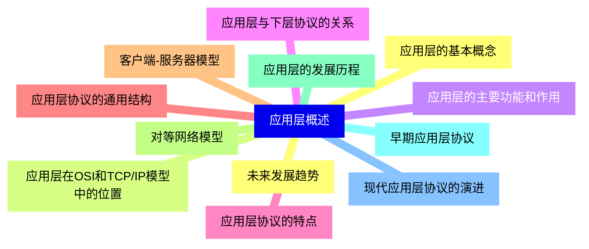

<--->
{}
{}
{}
{}
{}
{}
{}
{}
{}
{}
{}
{}
{}
{}
{}
{}
{}
{}
{}
{}
{}
{}
{}
{}
{}

### 2 域名系统 DNS{#2}

{}
{}
{}
{}
{}
{}
{}
{}
{}
{}
{}
{}
{}
{}
{}
{}
{}
{}
{}
{}
{}
{}
{}
{}
{}
{}
{}
{}
{}
{}
{}
{}
{}
{}
{}
{}
{}
{}
{}
<--->
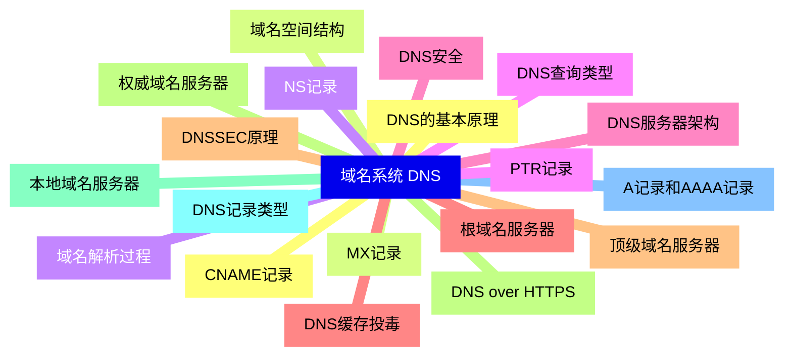

{}

### 3 万维网 WWW 与HTTP协议{#3}

{}
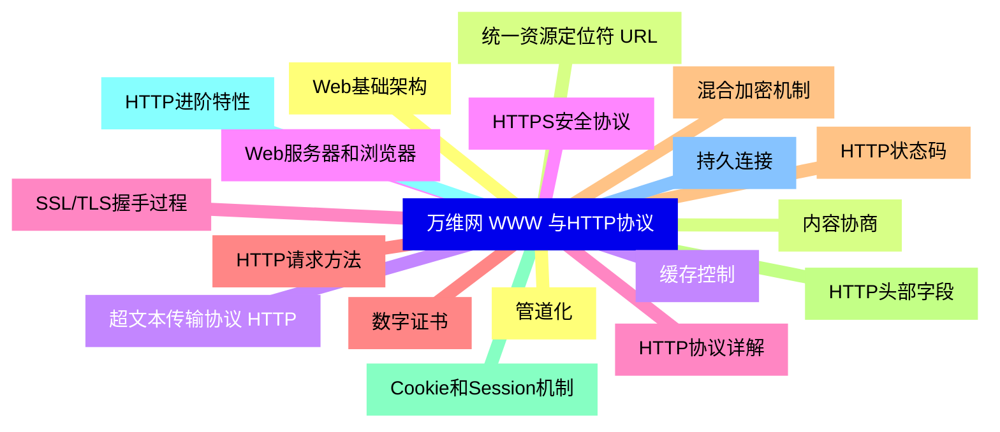

<--->
{}
{}
{}
{}
{}
{}
{}
{}
{}
{}
{}
{}
{}
{}
{}
{}
{}
{}
{}
{}
{}
{}
{}
{}
{}
{}
{}
{}
{}
{}
{}
{}
{}
{}
{}
{}
{}

### 4 电子邮件系统{#4}

{}
{}
{}
{}
{}
{}
{}
{}
{}
{}
{}
{}
{}
{}
{}
{}
{}
{}
{}
{}
{}
{}
{}
{}
{}
{}
{}
{}
{}
{}
{}
{}
{}
{}
{}
<--->
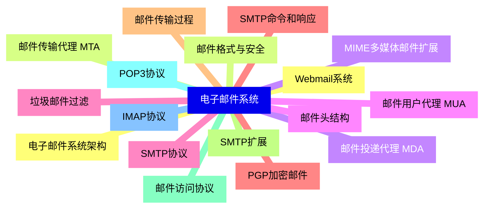

{}

### 5 文件传输协议{#5}

{}
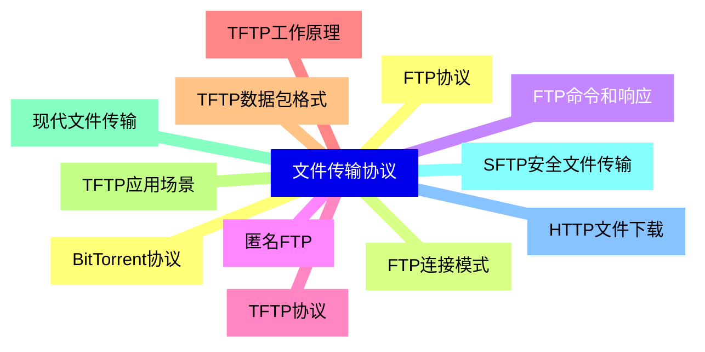

<--->
{}
{}
{}
{}
{}
{}
{}
{}
{}
{}
{}
{}
{}
{}
{}
{}
{}
{}
{}
{}
{}
{}
{}
{}
{}

### 6 远程登录与终端服务{#6}

{}
{}
{}
{}
{}
{}
{}
{}
{}
{}
{}
{}
{}
{}
{}
{}
{}
{}
{}
{}
{}
{}
{}
{}
{}
<--->
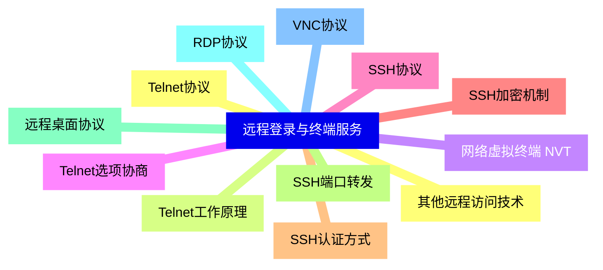

{}

### 7 网络管理协议{#7}

{}
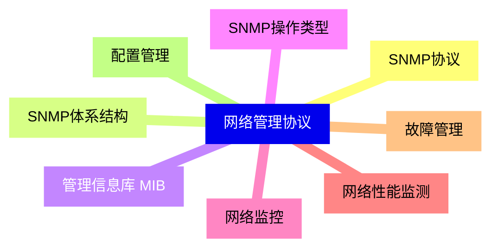

<--->
{}
{}
{}
{}
{}
{}
{}
{}
{}
{}
{}
{}
{}
{}
{}
{}
{}

### 8 实时通信协议{#8}

{}
{}
{}
{}
{}
{}
{}
{}
{}
{}
{}
{}
{}
{}
{}
{}
{}
<--->
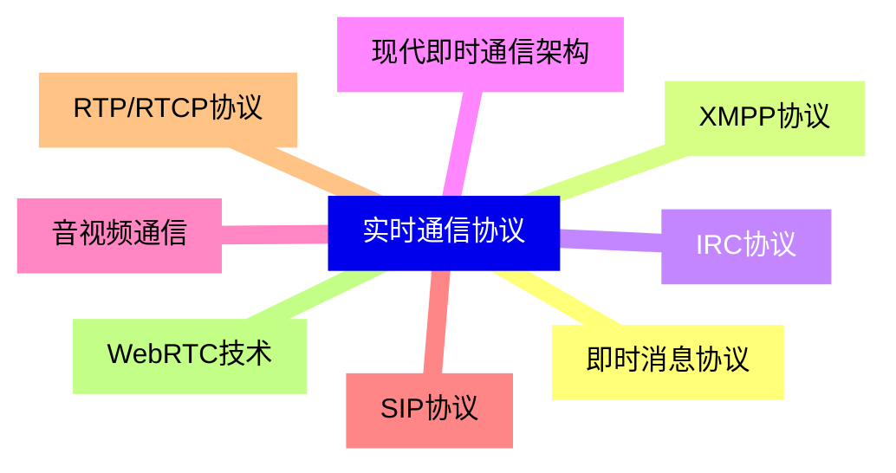

{}

### 9 应用层安全{#9}

{}
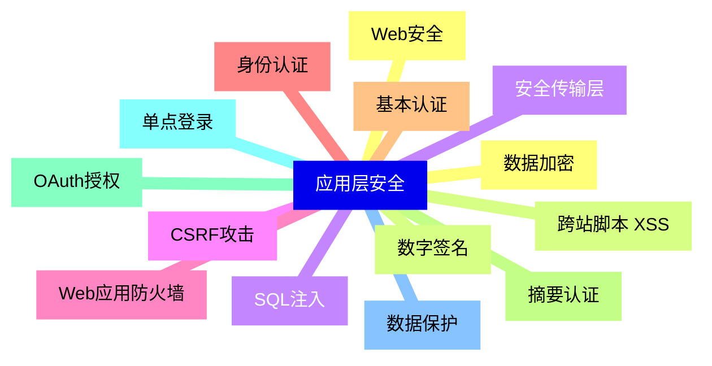

<--->
{}
{}
{}
{}
{}
{}
{}
{}
{}
{}
{}
{}
{}
{}
{}
{}
{}
{}
{}
{}
{}
{}
{}
{}
{}
{}
{}
{}
{}

### 10 新兴应用层技术{#10}

{}
{}
{}
{}
{}
{}
{}
{}
{}
{}
{}
{}
{}
{}
{}
{}
{}
{}
{}
{}
{}
{}
{}
{}
{}
<--->
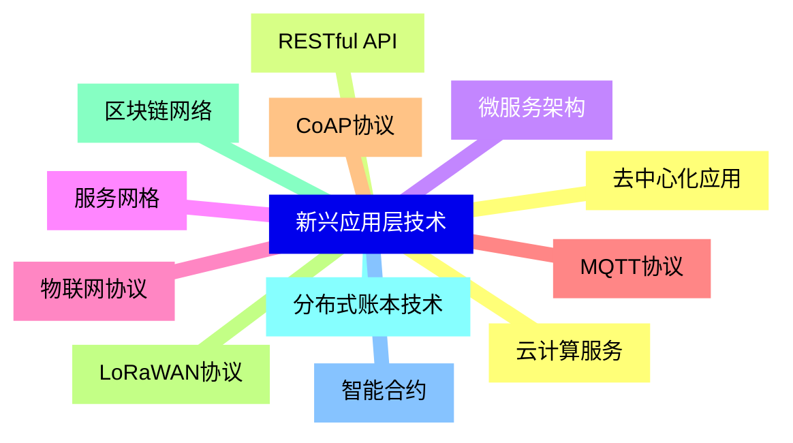

{}

### 11 应用层性能优化{#11}

{}
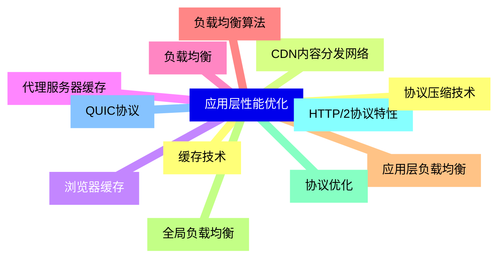

<--->
{}
{}
{}
{}
{}
{}
{}
{}
{}
{}
{}
{}
{}
{}
{}
{}
{}
{}
{}
{}
{}
{}
{}
{}
{}

### 12 应用层协议开发{#12}

{}
{}
{}
{}
{}
{}
{}
{}
{}
{}
{}
{}
{}
{}
{}
{}
{}
{}
{}
{}
{}
{}
{}
{}
{}
<--->
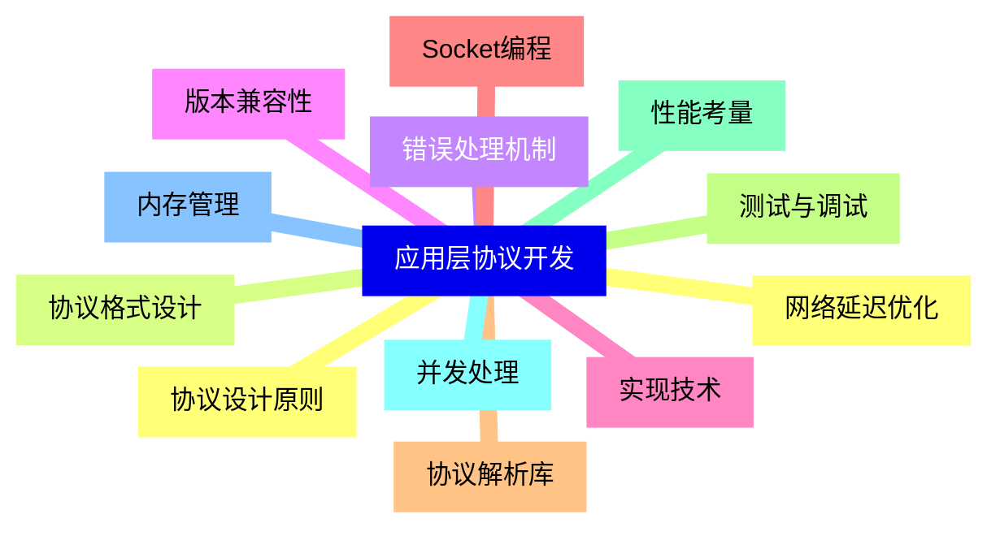

{}
