
### 1 [网络安全基础](#1)
#### 1.1 [网络安全概述](#1)
#### 1.2 [网络安全定义与重要性](#1)
#### 1.3 [网络安全目标：机密性、完整性、可用性](#1)
#### 1.4 [网络安全威胁与挑战](#1)
#### 1.5 [网络安全发展历程](#1)
#### 1.6 [网络安全模型](#1)
#### 1.7 [OSI安全体系结构](#1)
#### 1.8 [TCP/IP安全模型](#1)
#### 1.9 [纵深防御模型](#1)
#### 1.10 [零信任安全模型](#1)
#### 1.11 [安全策略与管理](#1)
#### 1.12 [安全策略制定与实施](#1)
#### 1.13 [风险管理框架](#1)
#### 1.14 [安全标准与法规](#1)
#### 1.15 [安全意识培训](#1)
### 2 [密码学基础](#2)
#### 2.1 [密码学概述](#2)
#### 2.2 [密码学基本概念](#2)
#### 2.3 [密码系统组成要素](#2)
#### 2.4 [密码分析技术](#2)
#### 2.5 [对称加密算法](#2)
#### 2.6 [DES算法原理](#2)
#### 2.7 [AES算法详解](#2)
#### 2.8 [流密码与分组密码](#2)
#### 2.9 [对称密钥管理](#2)
#### 2.10 [非对称加密算法](#2)
#### 2.11 [RSA算法原理](#2)
#### 2.12 [椭圆曲线密码学](#2)
#### 2.13 [数字签名原理](#2)
#### 2.14 [公钥基础设施](#2)
#### 2.15 [哈希函数与消息认证](#2)
#### 2.16 [MD5与SHA算法](#2)
#### 2.17 [HMAC技术](#2)
#### 2.18 [数字证书与CA](#2)
#### 2.19 [密钥交换协议](#2)
### 3 [网络层安全](#3)
#### 3.1 [IP安全协议](#3)
#### 3.2 [IPSec协议架构](#3)
#### 3.3 [AH协议与ESP协议](#3)
#### 3.4 [安全关联与密钥管理](#3)
#### 3.5 [IPSec工作模式](#3)
#### 3.6 [虚拟专用网络](#3)
#### 3.7 [VPN技术概述](#3)
#### 3.8 [SSL VPN与IPSec VPN](#3)
#### 3.9 [站点到站点VPN](#3)
#### 3.10 [远程访问VPN](#3)
### 4 [传输层安全](#4)
#### 4.1 [SSL/TLS协议](#4)
#### 4.2 [SSL协议架构](#4)
#### 4.3 [TLS协议改进](#4)
#### 4.4 [握手协议详解](#4)
#### 4.5 [记录协议与警报协议](#4)
#### 4.6 [安全套接字层](#4)
#### 4.7 [证书验证过程](#4)
#### 4.8 [密钥交换机制](#4)
#### 4.9 [加密套件选择](#4)
#### 4.10 [会话恢复机制](#4)
### 5 [应用层安全](#5)
#### 5.1 [电子邮件安全](#5)
#### 5.2 [PGP加密技术](#5)
#### 5.3 [S/MIME协议](#5)
#### 5.4 [邮件安全威胁](#5)
#### 5.5 [反垃圾邮件技术](#5)
#### 5.6 [Web安全](#5)
#### 5.7 [HTTPS协议](#5)
#### 5.8 [跨站脚本攻击](#5)
#### 5.9 [SQL注入攻击](#5)
#### 5.10 [跨站请求伪造](#5)
#### 5.11 [DNS安全](#5)
#### 5.12 [DNSSEC技术](#5)
#### 5.13 [DNS缓存投毒](#5)
#### 5.14 [DNS劫持防护](#5)
#### 5.15 [安全DNS解析](#5)
### 6 [无线网络安全](#6)
#### 6.1 [无线安全基础](#6)
#### 6.2 [无线网络威胁](#6)
#### 6.3 [无线加密标准](#6)
#### 6.4 [无线认证机制](#6)
#### 6.5 [WLAN安全协议](#6)
#### 6.6 [WEP协议缺陷](#6)
#### 6.7 [WPA/WPA2协议](#6)
#### 6.8 [WPA3安全增强](#6)
#### 6.9 [X认证](#6)
### 7 [入侵检测与防御](#7)
#### 7.1 [入侵检测系统](#7)
#### 7.2 [IDS分类与架构](#7)
#### 7.3 [特征检测技术](#7)
#### 7.4 [异常检测技术](#7)
#### 7.5 [分布式IDS](#7)
#### 7.6 [入侵防御系统](#7)
#### 7.7 [IPS工作原理](#7)
#### 7.8 [深度包检测](#7)
#### 7.9 [行为分析技术](#7)
#### 7.10 [响应机制](#7)
### 8 [防火墙技术](#8)
#### 8.1 [防火墙基础](#8)
#### 8.2 [防火墙分类](#8)
#### 8.3 [包过滤防火墙](#8)
#### 8.4 [状态检测防火墙](#8)
#### 8.5 [应用层网关](#8)
#### 8.6 [防火墙部署](#8)
#### 8.7 [边界防火墙](#8)
#### 8.8 [分布式防火墙](#8)
#### 8.9 [下一代防火墙](#8)
#### 8.10 [防火墙策略管理](#8)
### 9 [恶意软件防护](#9)
#### 9.1 [恶意软件分类](#9)
#### 9.2 [病毒与蠕虫](#9)
#### 9.3 [特洛伊木马](#9)
#### 9.4 [勒索软件](#9)
#### 9.5 [间谍软件](#9)
#### 9.6 [防护技术](#9)
#### 9.7 [反病毒技术](#9)
#### 9.8 [沙箱技术](#9)
#### 9.9 [行为监控](#9)
#### 9.10 [恶意代码分析](#9)
### 10 [安全审计与取证](#10)
#### 10.1 [安全审计](#10)
#### 10.2 [日志收集与分析](#10)
#### 10.3 [安全事件管理](#10)
#### 10.4 [合规性审计](#10)
#### 10.5 [持续监控](#10)
#### 10.6 [数字取证](#10)
#### 10.7 [取证流程与方法](#10)
#### 10.8 [证据保全技术](#10)
#### 10.9 [网络取证技术](#10)
#### 10.10 [取证工具使用](#10)
### 11 [新兴安全技术](#11)
#### 11.1 [云安全](#11)
#### 11.2 [云安全架构](#11)
#### 11.3 [数据安全保护](#11)
#### 11.4 [身份与访问管理](#11)
#### 11.5 [云安全合规](#11)
#### 11.6 [物联网安全](#11)
#### 11.7 [物联网安全挑战](#11)
#### 11.8 [设备认证技术](#11)
#### 11.9 [数据加密传输](#11)
#### 11.10 [固件安全更新](#11)
#### 11.11 [区块链安全](#11)
#### 11.12 [区块链安全特性](#11)
#### 11.13 [智能合约安全](#11)
#### 11.14 [共识机制安全](#11)
#### 11.15 [隐私保护技术](#11)




### 1 网络安全基础

---
### 1 网络安全基础
___
#### 1.1 网络安全概述
___
#### 1.2 网络安全定义与重要性
___
#### 1.3 网络安全目标：机密性、完整性、可用性
___
#### 1.4 网络安全威胁与挑战
___
#### 1.5 网络安全发展历程
___
#### 1.6 网络安全模型
___
#### 1.7 OSI安全体系结构
___
#### 1.8 TCP/IP安全模型
___
#### 1.9 纵深防御模型
___
#### 1.10 零信任安全模型
___
#### 1.11 安全策略与管理
___
#### 1.12 安全策略制定与实施
___
#### 1.13 风险管理框架
___
#### 1.14 安全标准与法规
___
#### 1.15 安全意识培训
### 2 密码学基础

---
### 2 密码学基础
___
#### 2.1 密码学概述
___
#### 2.2 密码学基本概念
___
#### 2.3 密码系统组成要素
___
#### 2.4 密码分析技术
___
#### 2.5 对称加密算法
___
#### 2.6 DES算法原理
___
#### 2.7 AES算法详解
___
#### 2.8 流密码与分组密码
___
#### 2.9 对称密钥管理
___
#### 2.10 非对称加密算法
___
#### 2.11 RSA算法原理
___
#### 2.12 椭圆曲线密码学
___
#### 2.13 数字签名原理
___
#### 2.14 公钥基础设施
___
#### 2.15 哈希函数与消息认证
___
#### 2.16 MD5与SHA算法
___
#### 2.17 HMAC技术
___
#### 2.18 数字证书与CA
___
#### 2.19 密钥交换协议
### 3 网络层安全

---
### 3 网络层安全
___
#### 3.1 IP安全协议
___
#### 3.2 IPSec协议架构
___
#### 3.3 AH协议与ESP协议
___
#### 3.4 安全关联与密钥管理
___
#### 3.5 IPSec工作模式
___
#### 3.6 虚拟专用网络
___
#### 3.7 VPN技术概述
___
#### 3.8 SSL VPN与IPSec VPN
___
#### 3.9 站点到站点VPN
___
#### 3.10 远程访问VPN
### 4 传输层安全

---
### 4 传输层安全
___
#### 4.1 SSL/TLS协议
___
#### 4.2 SSL协议架构
___
#### 4.3 TLS协议改进
___
#### 4.4 握手协议详解
___
#### 4.5 记录协议与警报协议
___
#### 4.6 安全套接字层
___
#### 4.7 证书验证过程
___
#### 4.8 密钥交换机制
___
#### 4.9 加密套件选择
___
#### 4.10 会话恢复机制
### 5 应用层安全

---
### 5 应用层安全
___
#### 5.1 电子邮件安全
___
#### 5.2 PGP加密技术
___
#### 5.3 S/MIME协议
___
#### 5.4 邮件安全威胁
___
#### 5.5 反垃圾邮件技术
___
#### 5.6 Web安全
___
#### 5.7 HTTPS协议
___
#### 5.8 跨站脚本攻击
___
#### 5.9 SQL注入攻击
___
#### 5.10 跨站请求伪造
___
#### 5.11 DNS安全
___
#### 5.12 DNSSEC技术
___
#### 5.13 DNS缓存投毒
___
#### 5.14 DNS劫持防护
___
#### 5.15 安全DNS解析
### 6 无线网络安全

---
### 6 无线网络安全
___
#### 6.1 无线安全基础
___
#### 6.2 无线网络威胁
___
#### 6.3 无线加密标准
___
#### 6.4 无线认证机制
___
#### 6.5 WLAN安全协议
___
#### 6.6 WEP协议缺陷
___
#### 6.7 WPA/WPA2协议
___
#### 6.8 WPA3安全增强
___
#### 6.9 X认证
### 7 入侵检测与防御

---
### 7 入侵检测与防御
___
#### 7.1 入侵检测系统
___
#### 7.2 IDS分类与架构
___
#### 7.3 特征检测技术
___
#### 7.4 异常检测技术
___
#### 7.5 分布式IDS
___
#### 7.6 入侵防御系统
___
#### 7.7 IPS工作原理
___
#### 7.8 深度包检测
___
#### 7.9 行为分析技术
___
#### 7.10 响应机制
### 8 防火墙技术

---
### 8 防火墙技术
___
#### 8.1 防火墙基础
___
#### 8.2 防火墙分类
___
#### 8.3 包过滤防火墙
___
#### 8.4 状态检测防火墙
___
#### 8.5 应用层网关
___
#### 8.6 防火墙部署
___
#### 8.7 边界防火墙
___
#### 8.8 分布式防火墙
___
#### 8.9 下一代防火墙
___
#### 8.10 防火墙策略管理
### 9 恶意软件防护

---
### 9 恶意软件防护
___
#### 9.1 恶意软件分类
___
#### 9.2 病毒与蠕虫
___
#### 9.3 特洛伊木马
___
#### 9.4 勒索软件
___
#### 9.5 间谍软件
___
#### 9.6 防护技术
___
#### 9.7 反病毒技术
___
#### 9.8 沙箱技术
___
#### 9.9 行为监控
___
#### 9.10 恶意代码分析
### 10 安全审计与取证

---
### 10 安全审计与取证
___
#### 10.1 安全审计
___
#### 10.2 日志收集与分析
___
#### 10.3 安全事件管理
___
#### 10.4 合规性审计
___
#### 10.5 持续监控
___
#### 10.6 数字取证
___
#### 10.7 取证流程与方法
___
#### 10.8 证据保全技术
___
#### 10.9 网络取证技术
___
#### 10.10 取证工具使用
### 11 新兴安全技术

---
### 11 新兴安全技术
___
#### 11.1 云安全
___
#### 11.2 云安全架构
___
#### 11.3 数据安全保护
___
#### 11.4 身份与访问管理
___
#### 11.5 云安全合规
___
#### 11.6 物联网安全
___
#### 11.7 物联网安全挑战
___
#### 11.8 设备认证技术
___
#### 11.9 数据加密传输
___
#### 11.10 固件安全更新
___
#### 11.11 区块链安全
___
#### 11.12 区块链安全特性
___
#### 11.13 智能合约安全
___
#### 11.14 共识机制安全
___
#### 11.15 隐私保护技术


### 1 网络安全基础{#1}

{}
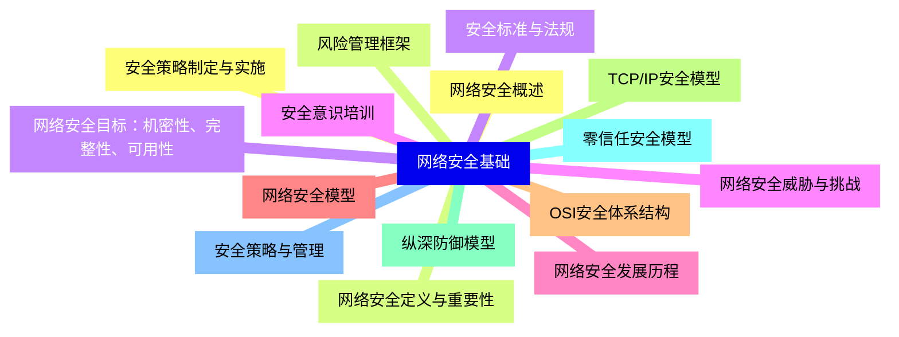

<--->
{}
{}
{}
{}
{}
{}
{}
{}
{}
{}
{}
{}
{}
{}
{}
{}
{}
{}
{}
{}
{}
{}
{}
{}
{}
{}
{}
{}
{}
{}
{}

### 2 密码学基础{#2}

{}
{}
{}
{}
{}
{}
{}
{}
{}
{}
{}
{}
{}
{}
{}
{}
{}
{}
{}
{}
{}
{}
{}
{}
{}
{}
{}
{}
{}
{}
{}
{}
{}
{}
{}
{}
{}
{}
{}
<--->
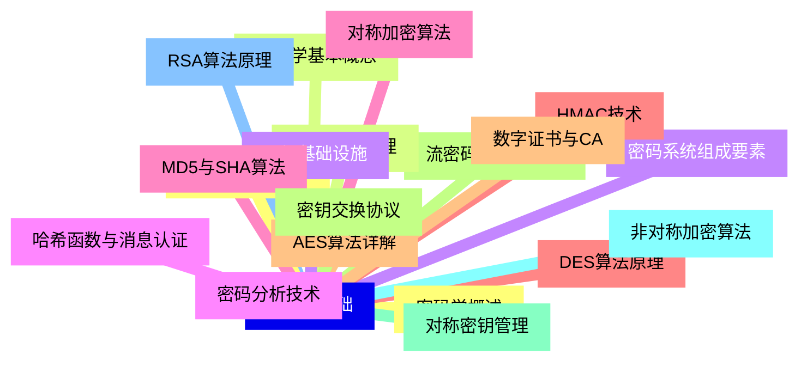

{}

### 3 网络层安全{#3}

{}
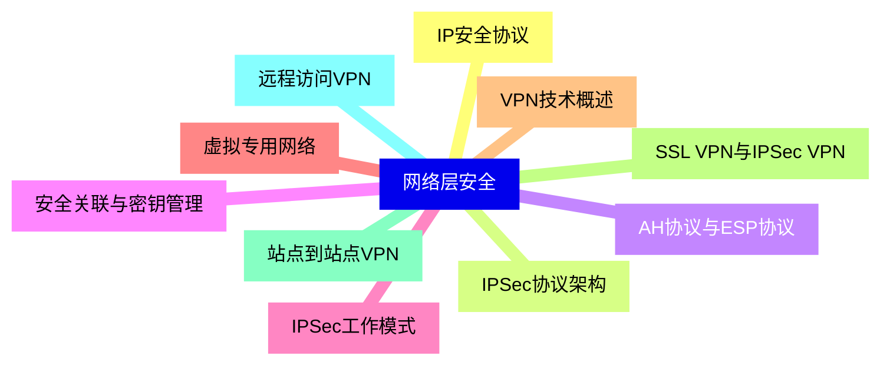

<--->
{}
{}
{}
{}
{}
{}
{}
{}
{}
{}
{}
{}
{}
{}
{}
{}
{}
{}
{}
{}
{}

### 4 传输层安全{#4}

{}
{}
{}
{}
{}
{}
{}
{}
{}
{}
{}
{}
{}
{}
{}
{}
{}
{}
{}
{}
{}
<--->
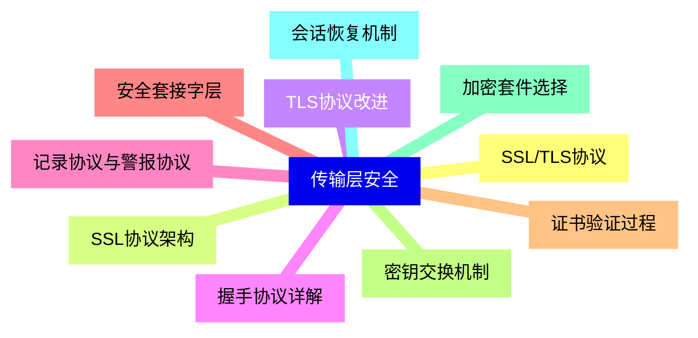

{}

### 5 应用层安全{#5}

{}
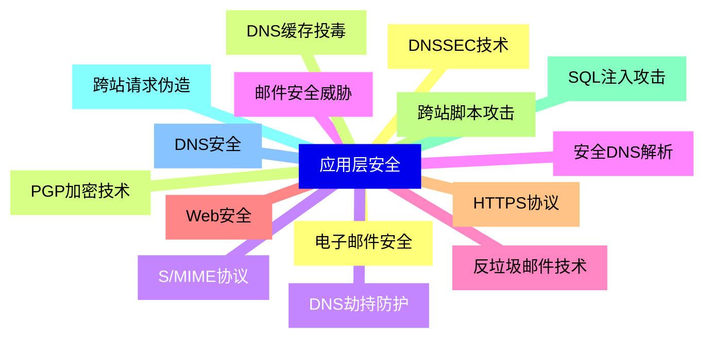

<--->
{}
{}
{}
{}
{}
{}
{}
{}
{}
{}
{}
{}
{}
{}
{}
{}
{}
{}
{}
{}
{}
{}
{}
{}
{}
{}
{}
{}
{}
{}
{}

### 6 无线网络安全{#6}

{}
{}
{}
{}
{}
{}
{}
{}
{}
{}
{}
{}
{}
{}
{}
{}
{}
{}
{}
<--->
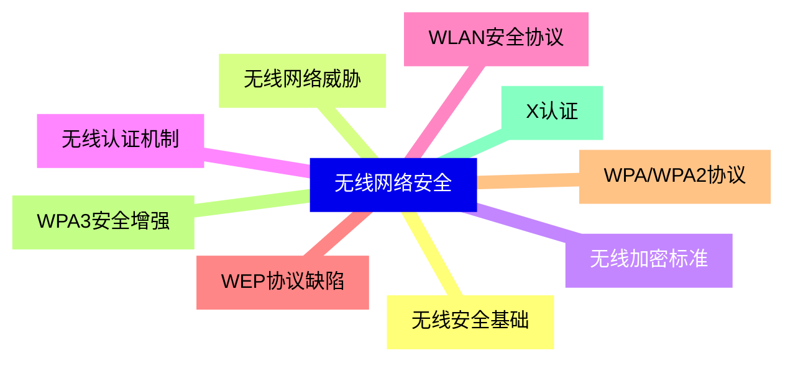

{}

### 7 入侵检测与防御{#7}

{}
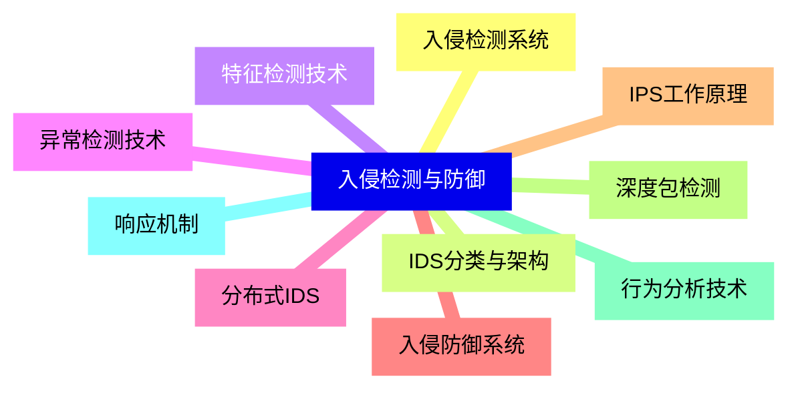

<--->
{}
{}
{}
{}
{}
{}
{}
{}
{}
{}
{}
{}
{}
{}
{}
{}
{}
{}
{}
{}
{}

### 8 防火墙技术{#8}

{}
{}
{}
{}
{}
{}
{}
{}
{}
{}
{}
{}
{}
{}
{}
{}
{}
{}
{}
{}
{}
<--->
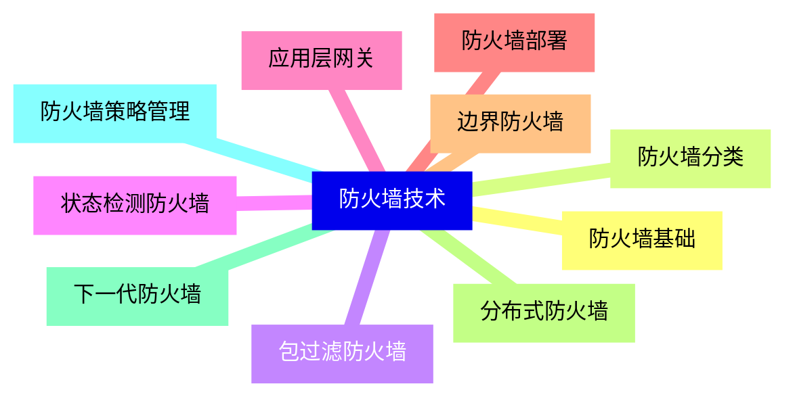

{}

### 9 恶意软件防护{#9}

{}
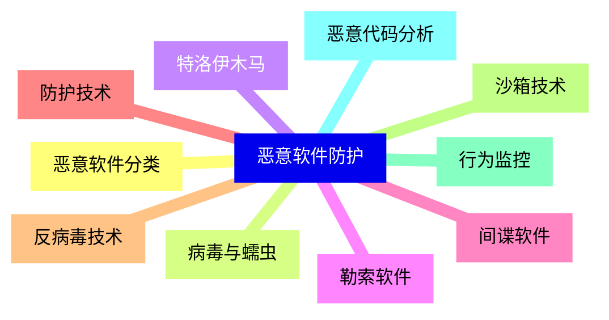

<--->
{}
{}
{}
{}
{}
{}
{}
{}
{}
{}
{}
{}
{}
{}
{}
{}
{}
{}
{}
{}
{}

### 10 安全审计与取证{#10}

{}
{}
{}
{}
{}
{}
{}
{}
{}
{}
{}
{}
{}
{}
{}
{}
{}
{}
{}
{}
{}
<--->
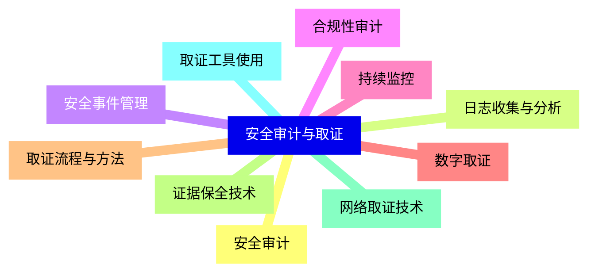

{}

### 11 新兴安全技术{#11}

{}
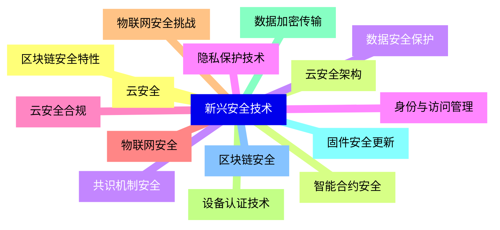

<--->
{}
{}
{}
{}
{}
{}
{}
{}
{}
{}
{}
{}
{}
{}
{}
{}
{}
{}
{}
{}
{}
{}
{}
{}
{}
{}
{}
{}
{}
{}
{}
